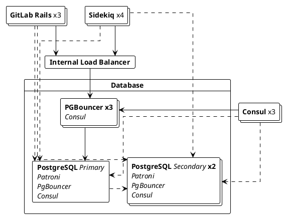



- プラン: Free、Premium、Ultimate
- 提供形態: GitLab Self-Managed



データベースのロードバランシングを使用すると、読み取り専用のクエリを複数のPostgreSQLノードに分散させ、パフォーマンスを向上させることができます。

この機能はGitLab RailsおよびSidekiqにネイティブで提供されており、外部依存関係なしに、ラウンドロビン方式でデータベースの読み取りクエリの負荷を分散するように設定できます:



## データベースのロードバランシングを有効にするための要件 {#requirements-to-enable-database-load-balancing}

データベースのロードバランシングを有効にするには、以下を確認してください:

- HA PostgreSQLセットアップには、プライマリをレプリケートする1つ以上のセカンダリノードが必要です。
- 各PostgreSQLノードは、同じ認証情報とポートで接続されている必要があります。

Linuxパッケージインストールの場合、[設定されたマルチノードセットアップ](replication_and_failover.md)のすべてのロードバランシングされた接続をプールするために、各PostgreSQLノードにPgBouncerを設定する必要があります。

## データベースのロードバランシングの設定 {#configuring-database-load-balancing}

データベースのロードバランシングは、次の2つの方法のいずれかで設定できます:

- （推奨）[ホスト](#hosts): PostgreSQLホストのリスト。
- [サービスディスカバリ](#service-discovery): PostgreSQLホストのリストを返すDNSレコード。

### ホスト {#hosts}

<!-- Including the Primary host in Database Load Balancing is now recommended for improved performance - Approved by the Reference Architecture and Database groups. -->

ホストのリストを設定するには、負荷分散を行う各環境のすべてのGitLab RailsおよびSidekiqノードで以下の手順を実行します:

1. `/etc/gitlab/gitlab.rb`ファイルを編集します。
1. `gitlab_rails['db_load_balancing']`で、負荷分散するデータベースホストの配列を作成します。たとえば、`primary.example.com`、`secondary1.example.com`、`secondary2.example.com`のホストでPostgreSQLが実行されている環境では:

   ```ruby
   gitlab_rails['db_load_balancing'] = { 'hosts' => ['primary.example.com', 'secondary1.example.com', 'secondary2.example.com'] }
   ```

   これらのホストは、`gitlab_rails['db_port']`で設定された同じポートで到達可能である必要があります。

1. ファイルを保存して[GitLabを再設定](../restart_gitlab.md#reconfigure-a-linux-package-installation)します。

> [!note]
> プライマリをホストリストに追加することは任意ですが、推奨されます。これにより、プライマリがこれらのクエリに対応できる場合、プライマリがロードバランシングされた読み取りクエリの対象となり、システムパフォーマンスが向上します。非常にトラフィックが多いインスタンスでは、プライマリが読み取りレプリカとして機能するための容量がない場合があります。このリストにプライマリが存在するかどうかにかかわらず、書き込みクエリにはプライマリが使用されます。

### サービスディスカバリ {#service-discovery}

サービスディスカバリにより、GitLabは使用するPostgreSQLホストのリストを自動的に取得できます。これは定期的にDNS `A`レコードをチェックし、このレコードによって返されるIPをセカンダリのアドレスとして使用します。サービスディスカバリを機能させるには、DNSサーバーと、セカンダリのIPアドレスを含む`A`レコードが必要です。

Linuxパッケージインストールを使用している場合、提供されている[Consul](../consul.md)サービスはDNSサーバーとして機能し、`postgresql-ha.service.consul`レコードを介してPostgreSQLアドレスを返します。例: 

1. 各GitLab Rails/Sidekiqノードで、`/etc/gitlab/gitlab.rb`を編集して以下を追加します:

   ```ruby
   gitlab_rails['db_load_balancing'] = { 'discover' => {
       'nameserver' => 'localhost'
       'record' => 'postgresql-ha.service.consul'
       'record_type' => 'A'
       'port' => '8600'
       'interval' => '60'
       'disconnect_timeout' => '120'
     }
   }
   ```

1. ファイルを保存して、[GitLabを再設定](../restart_gitlab.md#reconfigure-a-linux-package-installation)し、変更を有効にします。

| オプション               | 説明                                                                                       | デフォルト   |
|----------------------|---------------------------------------------------------------------------------------------------|-----------|
| `nameserver`         | DNSレコードを検索するために使用するネームサーバー。                                              | localhost |
| `record`             | 検索するレコード。このオプションはサービスディスカバリが機能するために必要です。                     |           |
| `record_type`        | 検索するオプションのレコードタイプ。`A`または`SRV`のいずれかになります。                                      | `A`       |
| `port`               | ネームサーバーのポート。                                                                       | 8600      |
| `interval`           | DNSレコードをチェックする間の最小時間（秒）。                                      | 60        |
| `disconnect_timeout` | ホストのリストが更新された後、古い接続が閉じられるまでの時間（秒）。 | 120       |
| `use_tcp`            | UDPではなくTCPを使用してDNSリソースを検索します。                                                     | false     |
| `max_replica_pools`  | 各Railsプロセスが接続するレプリカの最大数。多数のPostgresレプリカと多数のRailsプロセスを実行している場合に役立ちます。この制限がないと、すべてのRailsプロセスがデフォルトで各レプリカに接続するためです。デフォルトの動作は、設定されていない場合、無制限です。 | nil     |

もし`record_type`が`SRV`に設定されている場合、GitLabは引き続きラウンドロビンアルゴリズムを使用し、レコード内の`weight`および`priority`を無視します。`SRV`レコードは通常、IPの代わりにホスト名を返すため、GitLabは返されたホスト名のIPを`SRV`応答の追加セクションで探す必要があります。ホスト名のIPが見つからない場合、GitLabは設定された`nameserver`に対し、各ホスト名の`ANY`レコードをクエリして`A`または`AAAA`レコードを探し、IPを解決できない場合は最終的にこのホスト名をローテーションから除外します。

`interval`の値は、チェック間の最小時間を示します。`A`レコードのTTLがこの値より大きい場合、サービスディスカバリはそのTTLを尊重します。たとえば、`A`レコードのTTLが90秒の場合、サービスディスカバリは`A`レコードを再度チェックする前に少なくとも90秒間待機します。

ホストのリストが更新されると、古い接続が終了するまでに時間がかかる場合があります。`disconnect_timeout`設定は、すべての古いデータベース接続を終了するのにかかる時間の上限を強制するために使用できます。

### 古い読み取りの処理 {#handling-stale-reads}



- GitLab PremiumからGitLab Freeへ14.0で[移動](https://gitlab.com/gitlab-org/gitlab/-/issues/327902)されました。



古くなったセカンダリからの読み取りを防ぐため、ロードバランサーはプライマリと同期しているかを確認します。データが十分に新しい場合、セカンダリが使用され、そうでなければ無視されます。これらのチェックのオーバーヘッドを減らすために、特定の期間でのみ実行します。

この動作に影響を与える3つの設定オプションがあります:

| オプション                       | 説明                                                                                                    | デフォルト    |
|------------------------------|----------------------------------------------------------------------------------------------------------------|------------|
| `max_replication_difference` | セカンダリがデータをレプリケートしていない場合にラグを許容されるデータ量（バイト単位）。 | 8 MB       |
| `max_replication_lag_time`   | セカンダリの使用を停止する前に許容される最大ラグ時間（秒）。                    | 60秒 |
| `replica_check_interval`     | セカンダリのステータスをチェックする前に待機する必要がある最小時間（秒）。                       | 60秒 |

デフォルトはほとんどのユーザーにとって十分です。

ホストリストでこれらのオプションを設定するには、以下の例を使用してください:

```ruby
gitlab_rails['db_load_balancing'] = {
  'hosts' => ['primary.example.com', 'secondary1.example.com', 'secondary2.example.com'],
  'max_replication_difference' => 16777216, # 16 MB
  'max_replication_lag_time' => 30,
  'replica_check_interval' => 30
}
```

## ロギング {#logging}

ロードバランサーは、[`database_load_balancing.log`](../logs/_index.md#database_load_balancinglog)に様々なイベントを記録します。

- ホストがオフラインとマークされたとき
- ホストがオンラインに戻ったとき
- すべてのセカンダリがオフラインになったとき
- クエリの競合により、読み取りが別のホストで再試行されたとき

ログは、各エントリが少なくとも以下を含むJSONオブジェクトとして構造化されています:

- フィルタリングに便利な`event`フィールド。
- 人間が判読できる`message`フィールド。
- いくつかのイベント固有のメタデータ。たとえば、`db_host`
- 常にログに記録されるコンテキスト情報。たとえば、`severity`と`time`。

例: 

```json
{"severity":"INFO","time":"2019-09-02T12:12:01.728Z","correlation_id":"abcdefg","event":"host_online","message":"Host came back online","db_host":"111.222.333.444","db_port":null,"tag":"rails.database_load_balancing","environment":"production","hostname":"web-example-1","fqdn":"gitlab.example.com","path":null,"params":null}
```

## 実装の詳細 {#implementation-details}

### クエリの負荷分散 {#balancing-queries}

読み取り専用の`SELECT`クエリは、指定されたすべてのホスト間で負荷分散されます。その他すべて（トランザクションを含む）はプライマリで実行されます。`SELECT ... FOR UPDATE`のようなクエリもプライマリで実行されます。

### プリペアドステートメント {#prepared-statements}

プリペアドステートメントはロードバランシングと相性が悪く、ロードバランシングが有効な場合は自動的に無効になります。これは応答時間に影響を与えないはずです。

### プライマリへの固着 {#primary-sticking}

書き込みが実行された後、GitLabは、書き込みを実行したユーザーにスコープされた一定期間、プライマリの使用に固執します。GitLabは、セカンダリが追いついた場合、または30秒後にセカンダリの使用に戻ります。

### フェイルオーバーの処理 {#failover-handling}

フェイルオーバーまたは応答しないデータベースの場合、ロードバランサーは次に利用可能なホストの使用を試みます。セカンダリが利用できない場合、操作は代わりにプライマリで実行されます。

データの書き込み中に接続エラーが発生した場合、操作は指数関数的バックオフを使用して最大3回再試行されます。

ロードバランシングを使用している場合、データベースサーバーを安全に再起動でき、すぐにユーザーにエラーが表示されることはありません。

### 開発ガイド {#development-guide}

データベースロードバランシングに関する詳細な開発ガイドについては、開発ドキュメントを参照してください。
