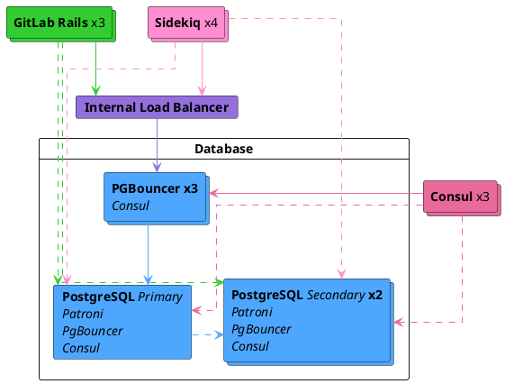



- プラン: Premium、Ultimate
- 提供形態: GitLab Self-Managed



Free版のGitLab Self-Managedユーザーの場合は、クラウドホスト型ソリューションの使用を検討してください。本ドキュメントでは、セルフコンパイルインストールは対象外です。

レプリケーションとフェイルオーバーによるセットアップがご希望のものでない場合は、Linuxパッケージの[データベース設定ドキュメント](https://docs.gitlab.com/omnibus/settings/database/)を参照してください。

GitLab向けにPostgreSQLをレプリケーションとフェイルオーバーで設定する前に、このドキュメントをすべて読むことをお勧めします。

## オペレーティングシステムのアップグレード {#operating-system-upgrades}

異なるオペレーティングシステムのシステムにフェイルオーバーする場合は、[PostgreSQLのオペレーティングシステムアップグレードに関するドキュメント](upgrading_os.md)を読んでください。オペレーティングシステムのアップグレードに伴うローカルな変更を考慮しないと、データ破損につながる可能性があります。

## アーキテクチャ {#architecture}

レプリケーションフェイルオーバーを伴うPostgreSQLクラスター向けのLinuxパッケージ推奨設定には、以下が必要です:

- 最小3つのPostgreSQLノード。
- 最小3つのConsulサーバーノード。
- プライマリデータベースの読み取りと書き込みを追跡および処理する、最小3つのPgBouncerノード。
  - PgBouncerノード間のリクエストを分散するための内部ロードバランサー（TCP)。
- 有効な[データベースロードバランシング](database_load_balancing.md)。
  - 各PostgreSQLノードで設定されたローカルなPgBouncerサービス。これは、プライマリを追跡するメインPgBouncerクラスターとは異なります。



また、すべてのデータベースとGitLabインスタンス間で冗長な接続が確保され、ネットワークが単一障害点とならないように、基盤となるネットワーキングトポロジーを考慮する必要があります。

### データベースノード {#database-node}

各データベースノードは4つのサービスを実行します:

- `PostgreSQL`: データベースそのもの。
- `Patroni`: クラスター内の他のPatroniサービスと通信し、リーダーサーバーで問題が発生した場合のフェイルオーバーを処理します。フェイルオーバー手順は以下で構成されます:
  - クラスターの新しいリーダーを選択します。
  - 新しいノードをリーダーに昇格させます。
  - 残りのサーバーに新しいリーダーノードに従うよう指示します。
- `PgBouncer`: ノード用のローカルプーラー。_読み取り_クエリで、[データベースロードバランシング](database_load_balancing.md)の一部として使用されます。
- `Consul`エージェント: 現在のPatroni状態を保存するConsulクラスターと通信するため。このエージェントは、データベースクラスター内の各ノードのステータスを監視し、Consulクラスター上のサービス定義でその健全性を追跡します。

### Consulサーバーノード {#consul-server-node}

ConsulサーバーノードはConsulサーバーサービスを実行します。これらのノードは、Patroniクラスターのブートストラップ前にクォーラムに達し、リーダーを選出している必要があります。そうでない場合、データベースノードはConsulリーダーが選出されるまで待機します。

### PgBouncerノード {#pgbouncer-node}

各PgBouncerノードは2つのサービスを実行します:

- `PgBouncer`: データベース接続プールプーラーそのもの。
- `Consul`エージェント: Consulクラスター上のPostgreSQLサービス定義のステータスを監視します。そのステータスが変更された場合、Consulはスクリプトを実行し、PgBouncerの設定を新しいPostgreSQLリーダーノードを指すように更新し、PgBouncerサービスをリロードします。

### 接続フロー {#connection-flow}

パッケージ内の各サービスには、一連の[デフォルトポート](../package_information/defaults.md#ports)が付属しています。以下に示す接続のために、特定のファイアウォールルールを作成する必要がある場合があります:

このセットアップにはいくつかの接続フローがあります:

- [プライマリ](#primary)
- [データベースロードバランシング](#database-load-balancing)
- [レプリケーション](#replication)

#### プライマリ {#primary}

- アプリケーションサーバーは、PgBouncerにその[デフォルトポート](../package_information/defaults.md)を介して直接接続するか、複数のPgBouncerを提供する設定済み内部ロードバランサー（TCP）を介して接続します。
- PgBouncerは、プライマリデータベースサーバーの[PostgreSQLデフォルトポート](../package_information/defaults.md)に接続します。

#### データベースロードバランシング {#database-load-balancing}

最近変更されておらず、すべてのデータベースノードで最新のデータに対する読み取りクエリの場合:

- アプリケーションサーバーは、各データベースノード上のローカルPgBouncerサービスに、ラウンドロビン方式でその[デフォルトポート](../package_information/defaults.md)を介して接続します。
- ローカルPgBouncerは、ローカルデータベースサーバーの[PostgreSQLデフォルトポート](../package_information/defaults.md)に接続します。

#### レプリケーション {#replication}

- Patroniは、実行中のPostgreSQLプロセスと設定をアクティブに管理します。
- PostgreSQLセカンダリは、プライマリデータベースサーバーの[PostgreSQLデフォルトポート](../package_information/defaults.md)に接続します。
- Consulサーバーとエージェントは、互いの[Consulデフォルトポート](../package_information/defaults.md)に接続します。

## セットアップ {#setting-it-up}

### 必要な情報 {#required-information}

設定を進める前に、必要なすべての情報を収集する必要があります。

#### ネットワーク情報 {#network-information}

PostgreSQLはデフォルトではどのネットワークインターフェースでもリッスンしません。他のサービスからアクセスできるように、リッスンするIPアドレスを知る必要があります。同様に、PostgreSQLへのアクセスはネットワークソースに基づいて制御されます。

そのため、以下が必要です:

- 各ノードのネットワークインターフェースのIPアドレス。これはすべてのインターフェースでリッスンするように`0.0.0.0`に設定できます。ループバックアドレス`127.0.0.1`に設定することはできません。
- ネットワークアドレス。これは、サブネット（つまり、`192.168.0.0/255.255.255.0`）またはクラスレスドメイン間ルーティング（CIDR)（`192.168.0.0/24`）形式にすることができます。

#### Consul情報 {#consul-information}

デフォルトのセットアップを使用する場合、最小限の設定には以下が必要です:

- `CONSUL_USERNAME`。Linuxパッケージインストールのデフォルトユーザー名は`gitlab-consul`です。
- `CONSUL_DATABASE_PASSWORD`。データベースユーザーのパスワード。
- `CONSUL_PASSWORD_HASH`。これはConsulユーザー名/パスワードのペアから生成されたハッシュです。以下で生成できます:

  ```shell
  sudo gitlab-ctl pg-password-md5 CONSUL_USERNAME
  ```

- `CONSUL_SERVER_NODES`。ConsulサーバーノードのIPアドレスまたはDNSレコード。

サービス自体の注意事項をいくつか示します:

- このサービスはシステムアカウントで実行されます。デフォルトは`gitlab-consul`です。
- 別のユーザー名を使用している場合は、`CONSUL_USERNAME`変数を通じてそれを指定する必要があります。
- パスワードは以下の場所に保存されます:
  - `/etc/gitlab/gitlab.rb`: ハッシュ化されています。
  - `/var/opt/gitlab/pgbouncer/pg_auth`: ハッシュ化されています。
  - `/var/opt/gitlab/consul/.pgpass`: プレーンテキスト

#### PostgreSQL情報 {#postgresql-information}

PostgreSQLを設定する際には、以下のことを行います:

- データベースノード数の2倍に`max_replication_slots`を設定します。Patroniはレプリケーションを開始する際、ノードごとに1つ余分なスロットを使用します。
- `max_wal_senders`を、クラスター内の割り当てられたレプリケーションスロット数より1つ多く設定します。これにより、レプリケーションが利用可能なすべてのデータベース接続を使い果たすことを防ぎます。

このドキュメントでは3つのデータベースノードを想定しており、その設定は以下のようになります:

```ruby
patroni['postgresql']['max_replication_slots'] = 6
patroni['postgresql']['max_wal_senders'] = 7
```

前述のとおり、データベースと認証するために許可が必要なネットワークサブネットを準備します。また、ConsulサーバーノードのIPアドレスまたはDNSレコードを手元に用意しておく必要があります。

アプリケーションのデータベースユーザーには、以下のパスワード情報が必要です:

- `POSTGRESQL_USERNAME`。Linuxパッケージインストールのデフォルトユーザー名は`gitlab`です。
- `POSTGRESQL_USER_PASSWORD`。データベースユーザーのパスワード
- `POSTGRESQL_PASSWORD_HASH`。これはユーザー名/パスワードのペアから生成されたハッシュです。以下で生成できます:

  ```shell
  sudo gitlab-ctl pg-password-md5 POSTGRESQL_USERNAME
  ```

#### Patroni情報 {#patroni-information}

Patroni APIには、以下のパスワード情報が必要です:

- `PATRONI_API_USERNAME`。APIへのBasic認証用のユーザー名
- `PATRONI_API_PASSWORD`。APIへのBasic認証用のパスワード

#### PgBouncer情報 {#pgbouncer-information}

デフォルトのセットアップを使用する場合、最小限の設定には以下が必要です:

- `PGBOUNCER_USERNAME`。Linuxパッケージインストールのデフォルトユーザー名は`pgbouncer`です。
- `PGBOUNCER_PASSWORD`。これはPgBouncerサービスのパスワードです。
- `PGBOUNCER_PASSWORD_HASH`。これはPgBouncerのユーザー名/パスワードのペアから生成されたハッシュです。以下で生成できます:

  ```shell
  sudo gitlab-ctl pg-password-md5 PGBOUNCER_USERNAME
  ```

- `PGBOUNCER_NODE`は、PgBouncerを実行しているノードのIPアドレスまたはFQDNです。

サービス自体に関して覚えておくべき事項をいくつか示します:

- このサービスは、データベースと同じシステムアカウントで実行されます。パッケージでは、デフォルトで`gitlab-psql`です。
- PgBouncerサービスに非デフォルトのユーザー名アカウント（デフォルトは`pgbouncer`）を使用する場合は、このユーザー名を指定する必要があります。
- パスワードは以下の場所に保存されます:
  - `/etc/gitlab/gitlab.rb`: ハッシュ化され、プレーンテキストで保存されます。
  - `/var/opt/gitlab/pgbouncer/pg_auth`: ハッシュ化されています。

### Linuxパッケージのインストール {#installing-the-linux-package}

まず、各ノードに[Linuxパッケージをダウンロードしてインストール](https://about.gitlab.com/install/)してください。

ステップ1から必要な依存関係をインストールし、ステップ2からGitLabパッケージリポジトリを追加してください。GitLabパッケージをインストールする際は、`EXTERNAL_URL`の値を指定しないでください。

### データベースノードの設定 {#configuring-the-database-nodes}

1. [Consulノードを設定](../consul.md)してください。
1. 次のステップを実行する前に、[`CONSUL_SERVER_NODES`](#consul-information) 、[`PGBOUNCER_PASSWORD_HASH`](#pgbouncer-information) 、[`POSTGRESQL_PASSWORD_HASH`](#postgresql-information) 、[データベースノードの数](#postgresql-information) 、および[ネットワークアドレス](#network-information)をすべて収集していることを確認してください。

#### Patroniクラスターの設定 {#configuring-patroni-cluster}

Patroniを使用できるように、明示的に有効にする必要があります（`patroni['enable'] = true`を使用)。

レプリケーションを制御するPostgreSQLの設定項目（たとえば、`wal_level`、`max_wal_senders`など）は、Patroniによって厳密に制御されます。これらの設定は、`postgresql[...]`の設定キーで行う元の設定をオーバーライドします。そのため、これらはすべて分離され、`patroni['postgresql'][...]`の下に配置されます。この動作はレプリケーションに限定されます。Patroniは、`postgresql[...]`の設定キーで行われた他のPostgreSQL設定を尊重します。たとえば、`max_wal_senders`はデフォルトで`5`に設定されています。これを変更する場合は、`patroni['postgresql']['max_wal_senders']`の設定キーで設定する必要があります。

例を次に示します:

```ruby
# Disable all components except Patroni, PgBouncer and Consul
roles(['patroni_role', 'pgbouncer_role'])

# PostgreSQL configuration
postgresql['listen_address'] = '0.0.0.0'

# Disable automatic database migrations
gitlab_rails['auto_migrate'] = false

# Configure the Consul agent
consul['services'] = %w(postgresql)

# START user configuration
#  Set the real values as explained in Required Information section
#
# Replace PGBOUNCER_PASSWORD_HASH with a generated md5 value
postgresql['pgbouncer_user_password'] = 'PGBOUNCER_PASSWORD_HASH'
# Replace POSTGRESQL_REPLICATION_PASSWORD_HASH with a generated md5 value
postgresql['sql_replication_password'] = 'POSTGRESQL_REPLICATION_PASSWORD_HASH'
# Replace POSTGRESQL_PASSWORD_HASH with a generated md5 value
postgresql['sql_user_password'] = 'POSTGRESQL_PASSWORD_HASH'

# Replace PATRONI_API_USERNAME with a username for Patroni Rest API calls (use the same username in all nodes)
patroni['username'] = 'PATRONI_API_USERNAME'
# Replace PATRONI_API_PASSWORD with a password for Patroni Rest API calls (use the same password in all nodes)
patroni['password'] = 'PATRONI_API_PASSWORD'

# Sets `max_replication_slots` to double the number of database nodes.
# Patroni uses one extra slot per node when initiating the replication.
patroni['postgresql']['max_replication_slots'] = X

# Set `max_wal_senders` to one more than the number of replication slots in the cluster.
# This is used to prevent replication from using up all of the
# available database connections.
patroni['postgresql']['max_wal_senders'] = X+1

# Replace XXX.XXX.XXX.XXX/YY with Network Addresses for your other patroni nodes
patroni['allowlist'] = %w(XXX.XXX.XXX.XXX/YY 127.0.0.1/32)

# Replace XXX.XXX.XXX.XXX/YY with Network Address
postgresql['trust_auth_cidr_addresses'] = %w(XXX.XXX.XXX.XXX/YY 127.0.0.1/32)

# Local PgBouncer service for Database Load Balancing
pgbouncer['databases'] = {
  gitlabhq_production: {
    host: "127.0.0.1",
    user: "PGBOUNCER_USERNAME",
    password: 'PGBOUNCER_PASSWORD_HASH'
  }
}

# Replace placeholders:
#
# Y.Y.Y.Y consul1.gitlab.example.com Z.Z.Z.Z
# with the addresses gathered for CONSUL_SERVER_NODES
consul['configuration'] = {
  retry_join: %w(Y.Y.Y.Y consul1.gitlab.example.com Z.Z.Z.Z)
}
#
# END user configuration
```

すべてのデータベースノードは同じ設定を使用します。リーダーノードは設定で決定されず、リーダーノードとレプリカノードのどちらにも追加または異なる設定はありません。

ノードの設定が完了したら、変更を有効にするために各ノードで[GitLabを再設定](../restart_gitlab.md#reconfigure-a-linux-package-installation)する必要があります。

通常、Consulクラスターの準備が完了すると、最初に[再設定](../restart_gitlab.md#reconfigure-a-linux-package-installation)するノードがリーダーになります。ノードの再設定の順序付けは必要ありません。それらを並行して、または任意の順序で実行できます。任意の順序を選択した場合、事前に決定されたリーダーはありません。

#### モニタリングを有効にする {#enable-monitoring}

モニタリングを有効にする場合、すべてのデータベースサーバーで有効にする必要があります。

1. `/etc/gitlab/gitlab.rb`を作成/編集し、次の設定を追加します:

   ```ruby
   # Enable service discovery for Prometheus
   consul['monitoring_service_discovery'] = true

   # Set the network addresses that the exporters must listen on
   node_exporter['listen_address'] = '0.0.0.0:9100'
   postgres_exporter['listen_address'] = '0.0.0.0:9187'
   ```

1. `sudo gitlab-ctl reconfigure`を実行して設定をコンパイルします。

#### Patroni APIのTLSサポートを有効にする {#enable-tls-support-for-the-patroni-api}

デフォルトでは、Patroni [REST API](https://patroni.readthedocs.io/en/latest/rest_api.html#rest-api)はHTTP経由で提供されます。TLSを有効にし、同じ[ポート](../package_information/defaults.md)経由でHTTPSを使用するオプションがあります。

TLSを有効にするには、PEM形式の証明書ファイルと秘密鍵ファイルが必要です。両方のファイルは、PostgreSQLユーザー（デフォルトで`gitlab-psql`、または`postgresql['username']`で設定されたユーザー）によって読み取り可能である必要があります:

```ruby
patroni['tls_certificate_file'] = '/path/to/server/certificate.pem'
patroni['tls_key_file'] = '/path/to/server/key.pem'
```

サーバーの秘密鍵が暗号化されたものである場合は、それを復号化するためのパスワードを指定します:

```ruby
patroni['tls_key_password'] = 'private-key-password' # This is the plain-text password.
```

自己署名証明書または内部CAを使用している場合は、TLS検証を無効にするか、内部CAの証明書を渡す必要があります。そうしないと、`gitlab-ctl patroni ....`コマンドを使用する際に予期せぬエラーが発生する可能性があります。Linuxパッケージは、Patroni APIクライアントがこの設定を尊重することを保証します。

TLS証明書検証はデフォルトで有効になっています。無効にするには、次の手順に従います: 

```ruby
patroni['tls_verify'] = false
```

または、内部CAのPEM形式証明書を渡すこともできます。繰り返しになりますが、ファイルはPostgreSQLユーザーによって読み取り可能である必要があります:

```ruby
patroni['tls_ca_file'] = '/path/to/ca.pem'
```

TLSが有効な場合、APIサーバーとクライアントの相互TLS認証がすべてのエンドポイントで可能となり、その範囲は`patroni['tls_client_mode']`属性によって異なります:

- `none`（デフォルト）: APIはクライアント証明書をチェックしません。
- `optional`: すべての[安全でない](https://patroni.readthedocs.io/en/latest/security.html#protecting-the-rest-api)APIコールにはクライアント証明書が必要です。
- `required`: すべてのAPIコールにはクライアント証明書が必要です。

クライアント証明書は、`patroni['tls_ca_file']`属性で指定されたCA証明書に対して検証されます。したがって、この属性は相互TLS認証に必要です。また、PEM形式のクライアント証明書ファイルと秘密鍵ファイルを指定する必要があります。両方のファイルはPostgreSQLユーザーによって読み取り可能である必要があります:

```ruby
patroni['tls_client_mode'] = 'required'
patroni['tls_ca_file'] = '/path/to/ca.pem'

patroni['tls_client_certificate_file'] = '/path/to/client/certificate.pem'
patroni['tls_client_key_file'] = '/path/to/client/key.pem'
```

検証可能である限り、異なるPatroniノードでAPIサーバーとクライアントの両方に異なる証明書とキーを使用できます。ただし、CA証明書（`patroni['tls_ca_file']`)、TLS証明書検証（`patroni['tls_verify']`)、およびクライアントTLS認証モード（`patroni['tls_client_mode']`）は、すべてのノードで同じ値である必要があります。

### PgBouncerノードの設定 {#configure-pgbouncer-nodes}

1. 次のステップを実行する前に、[`CONSUL_SERVER_NODES`](#consul-information) 、[`CONSUL_PASSWORD_HASH`](#consul-information) 、および[`PGBOUNCER_PASSWORD_HASH`](#pgbouncer-information)を収集していることを確認してください。

1. 各ノードで、`/etc/gitlab/gitlab.rb`設定ファイルを編集し、`# START user configuration`セクションに記載されている値を以下のように置き換えます:

   ```ruby
   # Disable all components except PgBouncer and Consul agent
   roles(['pgbouncer_role'])

   # Configure PgBouncer
   pgbouncer['admin_users'] = %w(pgbouncer gitlab-consul)

   # Configure Consul agent
   consul['watchers'] = %w(postgresql)

   # START user configuration
   # Set the real values as explained in Required Information section
   # Replace CONSUL_PASSWORD_HASH with a generated md5 value
   # Replace PGBOUNCER_PASSWORD_HASH with a generated md5 value
   pgbouncer['users'] = {
     'gitlab-consul': {
       password: 'CONSUL_PASSWORD_HASH'
     },
     'pgbouncer': {
       password: 'PGBOUNCER_PASSWORD_HASH'
     }
   }
   # Replace placeholders:
   #
   # Y.Y.Y.Y consul1.gitlab.example.com Z.Z.Z.Z
   # with the addresses gathered for CONSUL_SERVER_NODES
   consul['configuration'] = {
     retry_join: %w(Y.Y.Y.Y consul1.gitlab.example.com Z.Z.Z.Z)
   }
   #
   # END user configuration
   ```

1. `gitlab-ctl reconfigure` を実行

1. `.pgpass`ファイルを作成して、ConsulがPgBouncerを再読み込みできるようにします。求められたら、`PGBOUNCER_PASSWORD`を2回入力します:

   ```shell
   gitlab-ctl write-pgpass --host 127.0.0.1 --database pgbouncer --user pgbouncer --hostuser gitlab-consul
   ```

1. [モニタリングを有効にする](pgbouncer.md#enable-monitoring)

#### PgBouncerチェックポイント {#pgbouncer-checkpoint}

1. 各ノードが現在のノードリーダーと通信していることを確認します:

   ```shell
   gitlab-ctl pgb-console # Supply PGBOUNCER_PASSWORD when prompted
   ```

   パスワードを入力した後にエラー`psql: ERROR:  Auth failed`が発生する場合は、正しい形式でMD5パスワードハッシュを以前に生成していることを確認してください。正しい形式は、パスワードとユーザー名が連結したものです: `PASSWORDUSERNAME`。たとえば、`Sup3rS3cr3tpgbouncer`は、`pgbouncer`ユーザーのMD5パスワードハッシュを生成するために必要なテキストになります。

1. コンソールプロンプトが利用可能になったら、次のクエリを実行します:

   ```shell
   show databases ; show clients ;
   ```

   出力は次のようになります。

   ```plaintext
           name         |  host       | port |      database       | force_user | pool_size | reserve_pool | pool_mode | max_connections | current_connections
   ---------------------+-------------+------+---------------------+------------+-----------+--------------+-----------+-----------------+---------------------
    gitlabhq_production | MASTER_HOST | 5432 | gitlabhq_production |            |        20 |            0 |           |               0 |                   0
    pgbouncer           |             | 6432 | pgbouncer           | pgbouncer  |         2 |            0 | statement |               0 |                   0
   (2 rows)

    type |   user    |      database       |  state  |   addr         | port  | local_addr | local_port |    connect_time     |    request_time     |    ptr    | link | remote_pid | tls
   ------+-----------+---------------------+---------+----------------+-------+------------+------------+---------------------+---------------------+-----------+------+------------+-----
    C    | pgbouncer | pgbouncer           | active  | 127.0.0.1      | 56846 | 127.0.0.1  |       6432 | 2017-08-21 18:09:59 | 2017-08-21 18:10:48 | 0x22b3880 |      |          0 |
   (2 rows)
   ```

#### 内部ロードバランサーを設定する {#configure-the-internal-load-balancer}

推奨されているように複数のPgBouncerノードを実行している場合は、それぞれに正しくサービスを提供するためにTCP内部ロードバランサーを設定する必要があります。これは、信頼できるTCPロードバランサーで実現できます。

例として、[HAProxy](https://www.haproxy.org/)でこれを行う方法を次に示します:

```plaintext
global
    log /dev/log local0
    log localhost local1 notice
    log stdout format raw local0

defaults
    log global
    default-server inter 10s fall 3 rise 2
    balance leastconn

frontend internal-pgbouncer-tcp-in
    bind *:6432
    mode tcp
    option tcplog

    default_backend pgbouncer

backend pgbouncer
    mode tcp
    option tcp-check

    server pgbouncer1 <ip>:6432 check
    server pgbouncer2 <ip>:6432 check
    server pgbouncer3 <ip>:6432 check
```

詳細なガイダンスについては、選択したロードバランサーのドキュメントを参照してください。

### アプリケーションノードの設定 {#configuring-the-application-nodes}

アプリケーションノードは`gitlab-rails`サービスを実行します。他の属性が設定されている場合がありますが、以下を設定する必要があります。

1. `/etc/gitlab/gitlab.rb`を編集します。

   ```ruby
   # Disable PostgreSQL on the application node
   postgresql['enable'] = false

   gitlab_rails['db_host'] = 'PGBOUNCER_NODE' or 'INTERNAL_LOAD_BALANCER'
   gitlab_rails['db_port'] = 6432
   gitlab_rails['db_password'] = 'POSTGRESQL_USER_PASSWORD'
   gitlab_rails['auto_migrate'] = false
   gitlab_rails['db_load_balancing'] = { 'hosts' => ['POSTGRESQL_NODE_1', 'POSTGRESQL_NODE_2', 'POSTGRESQL_NODE_3'] }
   ```

1. 変更を有効にするため、[GitLabを再設定](../restart_gitlab.md#reconfigure-a-linux-package-installation)します。

#### アプリケーションノードのポスト設定 {#application-node-post-configuration}

すべての移行が実行されたことを確認します。

```shell
gitlab-rake gitlab:db:configure
```

> [!note] 
> 
> `rake aborted!`エラーが発生し、PgBouncerがPostgreSQLへの接続に失敗していることを示している場合、PgBouncerノードのIPアドレスがデータベースノード上の`gitlab.rb`内のPostgreSQLの`trust_auth_cidr_addresses`から欠落している可能性があります。続行する前に、[PgBouncerエラー`ERROR:  pgbouncer cannot connect to server`](replication_and_failover_troubleshooting.md#pgbouncer-error-error-pgbouncer-cannot-connect-to-server)を参照してください。

### バックアップ {#backups}

PgBouncer接続を介してGitLabをバックアップまたは復元することはしないでください。これによりGitLabの停止が発生します。

[これとバックアップの再設定方法について詳しく読む](../backup_restore/backup_gitlab.md#back-up-and-restore-for-installations-using-pgbouncer)。

### GitLabが実行中であることを確認する {#ensure-gitlab-is-running}

この時点で、GitLabインスタンスは稼働しているはずです。サインインして、イシューとマージリクエストを作成できることを確認してください。詳細については、[レプリケーションとフェイルオーバーのトラブルシューティング](replication_and_failover_troubleshooting.md)を参照してください。

## 設定例 {#example-configuration}

このセクションでは、完全に展開されたいくつかの例の設定について説明します。

### 推奨設定例 {#example-recommended-setup}

この例では、3台のConsulサーバー、3台のPgBouncerサーバー（関連する内部ロードバランサーを含む)、3台のPostgreSQLサーバー、および1台のアプリケーションノードを使用します。

このセットアップでは、すべてのサーバーが同じ`10.6.0.0/16`プライベートネットワーク範囲を共有します。サーバーはこれらのアドレスを介して自由に通信します。

異なるネットワーキング設定を使用することもできますが、クラスター全体で同期レプリケーションが発生するようにすることをお勧めします。一般に、2ミリ秒未満のレイテンシーは、レプリケーション操作のパフォーマンスを保証します。

GitLab[リファレンスアーキテクチャ](../reference_architectures/_index.md)は、アプリケーションデータベースクエリが3つのノードすべてで共有されることを前提としてサイズ設定されています。2ミリ秒を超える通信レイテンシーは、データベースロックを引き起こし、レプリカが読み取り専用クエリをタイムリーに処理する能力に影響を与える可能性があります。

- `10.6.0.22`: PgBouncer 2
- `10.6.0.23`: PgBouncer 3
- `10.6.0.31`: PostgreSQL 1
- `10.6.0.32`: PostgreSQL 2
- `10.6.0.33`: PostgreSQL 3
- `10.6.0.41`: GitLabアプリケーション

すべてのパスワードは`toomanysecrets`に設定されています。このパスワードまたは派生したハッシュを使用しないでください。GitLabの`external_url`は`http://gitlab.example.com`です。

最初の設定後、フェイルオーバーが発生した場合、PostgreSQLリーダーノードは、元の状態に戻されるまで、利用可能なセカンダリのいずれかに変更されます。

#### Consulサーバー向けの推奨設定例 {#example-recommended-setup-for-consul-servers}

各サーバーで`/etc/gitlab/gitlab.rb`を編集します:

```ruby
# Disable all components except Consul
roles(['consul_role'])

consul['configuration'] = {
  server: true,
  retry_join: %w(10.6.0.11 10.6.0.12 10.6.0.13)
}
consul['monitoring_service_discovery'] =  true
```

変更を有効にするため、[GitLabを再設定](../restart_gitlab.md#reconfigure-a-linux-package-installation)します。

#### PgBouncerサーバー向けの推奨設定例 {#example-recommended-setup-for-pgbouncer-servers}

各サーバーで`/etc/gitlab/gitlab.rb`を編集します:

```ruby
# Disable all components except Pgbouncer and Consul agent
roles(['pgbouncer_role'])

# Configure PgBouncer
pgbouncer['admin_users'] = %w(pgbouncer gitlab-consul)

pgbouncer['users'] = {
  'gitlab-consul': {
    password: '5e0e3263571e3704ad655076301d6ebe'
  },
  'pgbouncer': {
    password: '771a8625958a529132abe6f1a4acb19c'
  }
}

consul['watchers'] = %w(postgresql)
consul['configuration'] = {
  retry_join: %w(10.6.0.11 10.6.0.12 10.6.0.13)
}
consul['monitoring_service_discovery'] =  true
```

変更を有効にするため、[GitLabを再設定](../restart_gitlab.md#reconfigure-a-linux-package-installation)します。

#### 内部ロードバランサーのセットアップ {#internal-load-balancer-setup}

各PgBouncerノード（この例ではIP `10.6.0.20`上）にサービスを提供するには、内部ロードバランサー（TCP）をセットアップする必要があります。これを行う方法の例は、[PgBouncer内部ロードバランサーの設定](#configure-the-internal-load-balancer)セクションを参照してください。

#### PostgreSQLサーバー向けの推奨設定例 {#example-recommended-setup-for-postgresql-servers}

データベースノードで`/etc/gitlab/gitlab.rb`を編集します:

```ruby
# Disable all components except Patroni, PgBouncer and Consul
roles(['patroni_role', 'pgbouncer_role'])

# PostgreSQL configuration
postgresql['listen_address'] = '0.0.0.0'
postgresql['hot_standby'] = 'on'
postgresql['wal_level'] = 'replica'

# Disable automatic database migrations
gitlab_rails['auto_migrate'] = false

postgresql['pgbouncer_user_password'] = '771a8625958a529132abe6f1a4acb19c'
postgresql['sql_user_password'] = '450409b85a0223a214b5fb1484f34d0f'
patroni['username'] = 'PATRONI_API_USERNAME'
patroni['password'] = 'PATRONI_API_PASSWORD'
patroni['postgresql']['max_replication_slots'] = 6
patroni['postgresql']['max_wal_senders'] = 7

patroni['allowlist'] = = %w(10.6.0.0/16 127.0.0.1/32)
postgresql['trust_auth_cidr_addresses'] = %w(10.6.0.0/16 127.0.0.1/32)

# Local PgBouncer service for Database Load Balancing
pgbouncer['databases'] = {
  gitlabhq_production: {
    host: "127.0.0.1",
    user: "pgbouncer",
    password: '771a8625958a529132abe6f1a4acb19c'
  }
}

# Configure the Consul agent
consul['services'] = %w(postgresql)
consul['configuration'] = {
  retry_join: %w(10.6.0.11 10.6.0.12 10.6.0.13)
}
consul['monitoring_service_discovery'] =  true
```

変更を有効にするため、[GitLabを再設定](../restart_gitlab.md#reconfigure-a-linux-package-installation)します。

#### 推奨される設定の手動手順の例 {#example-recommended-setup-manual-steps}

設定をデプロイしたら、次の手順に従ってください:

1. プライマリデータベースノードを見つけます:

   ```shell
   gitlab-ctl get-postgresql-primary
   ```

1. `10.6.0.41`（当社のアプリケーションサーバー）で:

   `gitlab-consul`ユーザーのPgBouncerパスワードを`toomanysecrets`に設定します:

   ```shell
   gitlab-ctl write-pgpass --host 127.0.0.1 --database pgbouncer --user pgbouncer --hostuser gitlab-consul
   ```

   データベース移行を実行します:

   ```shell
   gitlab-rake gitlab:db:configure
   ```

## Patroni {#patroni}

PatroniはPostgreSQLの高可用性に対する独自のソリューションです。これはPostgreSQLの制御を引き継ぎ、その設定をオーバーライドし、ライフサイクル（起動、停止、再起動）を管理します。Patroniは、PostgreSQL 12+のクラスタリングとGeoデプロイメントのカスケードレプリケーションにとって唯一の選択肢です。

基本的な[アーキテクチャ](#example-recommended-setup-manual-steps)はPatroniでは変更されません。データベースノードをプロビジョニングする際に、Patroniについて特別な考慮事項は必要ありません。Patroniは、クラスターの状態を保存し、リーダーを選出するためにConsulに大きく依存しています。Consulクラスターとそのリーダー選出におけるいかなる失敗も、Patroniクラスターにも伝播します。

Patroniはクラスターを監視し、フェイルオーバーを処理します。プライマリノードが失敗すると、Consulと連携してPgBouncerに通知します。失敗すると、Patroniは古いプライマリをレプリカに移行させ、自動的にクラスターに再結合させます。

Patroniでは、接続フローがわずかに異なります。各ノード上のPatroniは、Consulエージェントに接続してクラスターに参加します。この時点になって初めて、ノードがプライマリであるかレプリカであるかが決定されます。この決定に基づき、Unixソケットを介して直接通信するPostgreSQLを設定し、起動します。これは、Consulクラスターが機能しないか、リーダーを持っていない場合、Patroni、ひいてはPostgreSQLが起動しないことを意味します。Patroniは、各ノードの[デフォルトポート](../package_information/defaults.md)経由でアクセスできるREST APIも公開しています。

### レプリケーションステータスの確認 {#check-replication-status}

クラスターのステータスの概要をPatroniにクエリするには、`gitlab-ctl patroni members`を実行します:

```plaintext
+ Cluster: postgresql-ha (6970678148837286213) ------+---------+---------+----+-----------+
| Member                              | Host         | Role    | State   | TL | Lag in MB |
+-------------------------------------+--------------+---------+---------+----+-----------+
| gitlab-database-1.example.com       | 172.18.0.111 | Replica | running |  5 |         0 |
| gitlab-database-2.example.com       | 172.18.0.112 | Replica | running |  5 |       100 |
| gitlab-database-3.example.com       | 172.18.0.113 | Leader  | running |  5 |           |
+-------------------------------------+--------------+---------+---------+----+-----------+
```

レプリケーションのステータスを確認するには:

```shell
echo -e 'select * from pg_stat_wal_receiver\x\g\x \n select * from pg_stat_replication\x\g\x' | gitlab-psql
```

同じコマンドを3台すべてのデータベースサーバーで実行できます。サーバーが実行しているロールに応じて、利用可能なレプリケーションに関する情報を返します。

リーダーはレプリカごとに1つのレコードを返すはずです:

```sql
-[ RECORD 1 ]----+------------------------------
pid              | 371
usesysid         | 16384
usename          | gitlab_replicator
application_name | gitlab-database-1.example.com
client_addr      | 172.18.0.111
client_hostname  |
client_port      | 42900
backend_start    | 2021-06-14 08:01:59.580341+00
backend_xmin     |
state            | streaming
sent_lsn         | 0/EA13220
write_lsn        | 0/EA13220
flush_lsn        | 0/EA13220
replay_lsn       | 0/EA13220
write_lag        |
flush_lag        |
replay_lag       |
sync_priority    | 0
sync_state       | async
reply_time       | 2021-06-18 19:17:14.915419+00
```

以下の場合にさらに調査してください:

- レコードが不足しているか、余分なレコードがある。
- `reply_time`が最新ではない。

`lsn`フィールドは、どのライトアヘッドログセグメントがレプリケーションされたかに関連します。現在のログシーケンス番号（LSN）を確認するには、リーダーで以下を実行します:

```shell
echo 'SELECT pg_current_wal_lsn();' | gitlab-psql
```

もしレプリカが同期していない場合、`gitlab-ctl patroni members`は不足しているデータ量を示し、`lag`フィールドは経過時間を示します。

リーダーによって返されるデータ、および`state`フィールドの他の値については、[PostgreSQLドキュメント](https://www.postgresql.org/docs/16/monitoring-stats.html#PG-STAT-REPLICATION-VIEW)で詳しく読むことができます。

レプリカは以下を返します:

```sql
-[ RECORD 1 ]---------+-------------------------------------------------------------------------------------------------
pid                   | 391
status                | streaming
receive_start_lsn     | 0/D000000
receive_start_tli     | 5
received_lsn          | 0/EA13220
received_tli          | 5
last_msg_send_time    | 2021-06-18 19:16:54.807375+00
last_msg_receipt_time | 2021-06-18 19:16:54.807512+00
latest_end_lsn        | 0/EA13220
latest_end_time       | 2021-06-18 19:07:23.844879+00
slot_name             | gitlab-database-1.example.com
sender_host           | 172.18.0.113
sender_port           | 5432
conninfo              | user=gitlab_replicator host=172.18.0.113 port=5432 application_name=gitlab-database-1.example.com
```

レプリカによって返されるデータについては、[PostgreSQLドキュメント](https://www.postgresql.org/docs/16/monitoring-stats.html#PG-STAT-WAL-RECEIVER-VIEW)で詳しく読むことができます。

### 適切なPatroniレプリケーション方法の選択 {#selecting-the-appropriate-patroni-replication-method}

オプションの中には完全に理解されていない場合、潜在的なデータ損失のリスクを伴うものがあるため、変更を行う前に[Patroniドキュメントを注意深く確認してください](https://patroni.readthedocs.io/en/latest/yaml_configuration.html#postgresql)。[レプリケーションモード](https://patroni.readthedocs.io/en/latest/replication_modes.html)の設定により、許容されるデータ損失量が決まります。

> [!warning]
> 
> レプリケーションはバックアップ戦略ではありません！十分に検討されテストされたバックアップソリューションの代替はありません。

Linuxパッケージインストールでは、[`synchronous_commit`](https://www.postgresql.org/docs/16/runtime-config-wal.html#GUC-SYNCHRONOUS-COMMIT)はデフォルトで`on`に設定されます。

```ruby
postgresql['synchronous_commit'] = 'on'
gitlab['geo-postgresql']['synchronous_commit'] = 'on'
```

#### Patroniのフェイルオーバー動作のカスタマイズ {#customizing-patroni-failover-behavior}

Linuxパッケージインストールでは、[Patroniリカバリープロセス](#recovering-the-patroni-cluster)をより詳細に制御できるいくつかのオプションが公開されています。

各オプションは、`/etc/gitlab/gitlab.rb`におけるデフォルト値とともに以下に示されています。

```ruby
patroni['use_pg_rewind'] = true
patroni['remove_data_directory_on_rewind_failure'] = false
patroni['remove_data_directory_on_diverged_timelines'] = false
```

[アップストリームドキュメントは常に最新](https://patroni.readthedocs.io/en/latest/patroni_configuration.html)ですが、以下の表は機能の最小限の概要を提供します。

| 設定                                       | 概要 |
|-----------------------------------------------|----------|
| `use_pg_rewind`                               | データベースクラスターに再結合する前に、以前のクラスターリーダーで`pg_rewind`を実行してみてください。 |
| `remove_data_directory_on_rewind_failure`     | `pg_rewind`が失敗した場合、ローカルのPostgreSQLデータディレクトリを削除し、現在のクラスターリーダーから再レプリケーションします。 |
| `remove_data_directory_on_diverged_timelines` | `pg_rewind`が使用できない場合、および以前のリーダーのタイムラインが現在のものから分岐している場合は、ローカルデータディレクトリを削除し、現在のクラスターリーダーから再レプリケーションします。 |

### Patroniのデータベース認可 {#database-authorization-for-patroni}

PatroniはUnixソケットを使用してPostgreSQLインスタンスを管理します。したがって、`local`ソケットからの接続は信頼される必要があります。

レプリカは、レプリケーションユーザー（デフォルトで`gitlab_replicator`）を使用してリーダーと通信します。このユーザーの場合、`trust`と`md5`の認証を選択できます。`postgresql['sql_replication_password']`を設定すると、Patroniは`md5`認証を使用し、設定しない場合は`trust`にフォールバックします。

選択した認証に基づいて、`postgresql['md5_auth_cidr_addresses']`または`postgresql['trust_auth_cidr_addresses']`の設定でクラスターCIDRを指定する必要があります。

### Patroniクラスターとの対話 {#interacting-with-patroni-cluster}

`gitlab-ctl patroni members`を使用して、クラスターメンバーのステータスを確認できます。各ノードのステータスを確認するために、`gitlab-ctl patroni`は、ノードがプライマリかレプリカかを示す2つの追加サブコマンド`check-leader`と`check-replica`を提供します。

Patroniが有効な場合、PostgreSQLの起動、シャットダウン、再起動を排他的に制御します。これは、特定のノードでPostgreSQLをシャットダウンするには、同じノードでPatroniを以下のようにシャットダウンする必要があることを意味します:

```shell
sudo gitlab-ctl stop patroni
```

リーダーノードでPatroniサービスを停止または再起動すると、自動フェイルオーバーがトリガーされます。Patroniがフェイルオーバーをトリガーすることなく設定をリロードしたり、PostgreSQLプロセスを再起動したりする必要がある場合は、代わりに`gitlab-ctl patroni`の`reload`または`restart`サブコマンドを使用する必要があります。これら2つのサブコマンドは、同じ`patronictl`コマンドのラッパーです。

### Patroniの手動フェイルオーバー手順 {#manual-failover-procedure-for-patroni}

> [!warning] 
> 
> GitLab 16.5およびそれ以前では、PgBouncerノードはPatroniノードと並行して自動的にフェイルオーバーしません。正常なスイッチオーバーのためには、PgBouncerサービスを[手動で再起動する](replication_and_failover_troubleshooting.md#pgbouncer-error-error-pgbouncer-cannot-connect-to-server)必要があります。

Patroniは自動フェイルオーバーをサポートしていますが、手動で実行することもでき、2つのわずかに異なるオプションがあります:

- フェイルオーバー: 正常なノードがない場合に手動フェイルオーバーを実行できます。任意のPostgreSQLノードでこのアクションを実行できます:

  ```shell
  sudo gitlab-ctl patroni failover
  ```

- スイッチオーバー: クラスターが正常な場合にのみ機能し、スイッチオーバーをスケジュールできます（すぐに発生する可能性があります)。任意のPostgreSQLノードでこのアクションを実行できます:

  ```shell
  sudo gitlab-ctl patroni switchover
  ```

この件に関する詳細については、[Patroniドキュメント](https://patroni.readthedocs.io/en/latest/rest_api.html#switchover-and-failover-endpoints)を参照してください。

#### Geoセカンダリサイトの考慮事項 {#geo-secondary-site-considerations}

Geoセカンダリサイトが`Patroni`と`PgBouncer`を使用するプライマリサイトからレプリケートする場合、PgBouncerを介したレプリケーションはサポートされていません。サポートを追加するための機能リクエストがあります。[イシュー #8832](https://gitlab.com/gitlab-org/omnibus-gitlab/-/issues/8832)を参照してください。

推奨。`Patroni`クラスターにおけるフェイルオーバーを自動的に処理するために、プライマリサイトにロードバランサーを導入します。詳細については、[ステップ2: プライマリサイトで内部ロードバランサーを設定](../geo/setup/database.md#step-2-configure-the-internal-load-balancer-on-the-primary-site)を参照してください。

##### リーダーノードから直接レプリケートする場合のPatroniフェイルオーバーの処理 {#handling-patroni-failover-when-replicating-directly-from-the-leader-node}

セカンダリサイトが`Patroni`クラスター内のリーダーノードから直接レプリケートするように設定されている場合、元のノードがフォロワーノードとして再追加されたとしても、`Patroni`クラスターでのフェイルオーバーはセカンダリサイトへのレプリケーションを停止します。

そのシナリオでは、`Patroni`クラスターでのフェイルオーバー後、セカンダリサイトが新しいリーダーからレプリケートするように手動で設定する必要があります:

```shell
sudo gitlab-ctl replicate-geo-database --host=<new_leader_ip> --replication-slot=<slot_name>
```

これにより、セカンダリサイトデータベースが再同期され、同期するデータ量によっては非常に長い時間がかかる場合があります。再同期後にレプリケーションがまだ機能しない場合は、`gitlab-ctl reconfigure`を実行する必要があるかもしれません。

### Patroniクラスターのリカバリー {#recovering-the-patroni-cluster}

古いプライマリをリカバリーし、レプリカとしてクラスターに再結合するには、Patroniを以下のように起動します:

```shell
sudo gitlab-ctl start patroni
```

それ以上の設定や介入は不要です。

### Patroniのメンテナンス手順 {#maintenance-procedure-for-patroni}

Patroniが有効な場合、ノードで計画的なメンテナンスを実行できます。Patroniを使用せずに1つのノードでメンテナンスを実行するには、以下のようにメンテナンスモードにします:

```shell
sudo gitlab-ctl patroni pause
```

Patroniが一時停止モードで実行されている場合、PostgreSQLの状態は変更されません。完了したら、Patroniを再開できます:

```shell
sudo gitlab-ctl patroni resume
```

詳細については、[この件に関するPatroniドキュメント](https://patroni.readthedocs.io/en/latest/pause.html)を参照してください。

### Patroniクラスター内のPostgreSQLメジャーバージョンのアップグレード {#upgrading-postgresql-major-version-in-a-patroni-cluster}

バンドルされているPostgreSQLのバージョンと、各リリースのデフォルトバージョンのリストについては、[LinuxパッケージのPostgreSQLバージョン](../package_information/postgresql_versions.md)を参照してください。

PostgreSQLをアップグレードする前に考慮すべきいくつかの重要な事実を次に示します:

- 主な点は、Patroniクラスターをシャットダウンする必要があることです。これは、データベースアップグレードの期間中、または少なくともリーダーノードがアップグレードされている間は、GitLabデプロイが停止することを意味します。これは、データベースのサイズによってはかなりのダウンタイムになる可能性があります。

- PostgreSQLのアップグレードは、新しい制御データを持つ新しいデータディレクトリを作成します。Patroniの観点からは、これは再度ブートストラップする必要がある新しいクラスターです。したがって、アップグレード手順の一環として、クラスターの状態（Consulに保存されている）は削除されます。アップグレードが完了すると、Patroniは新しいクラスターをブートストラップします。これにより、クラスターIDが変更されます。

- リーダーとレプリカのアップグレード手順は同じではありません。そのため、各ノードで適切な手順を使用することが重要です。

- レプリカノードをアップグレードすると、データディレクトリが削除され、設定されたレプリケーション方法（`pg_basebackup`が唯一利用可能なオプション）を使用してリーダーから再同期されます。データベースのサイズによっては、レプリカがリーダーに追いつくまでに時間がかかる場合があります。

- アップグレード手順の概要は、[Patroniドキュメント](https://patroni.readthedocs.io/en/latest/existing_data.html#major-upgrade-of-postgresql-version)に記載されています。いくつかの調整を加えてこの手順を実装する`gitlab-ctl pg-upgrade`をまだ使用できます。

これらを考慮して、PostgreSQLのアップグレードを慎重に計画する必要があります:

1. どのノードがリーダーで、どのノードがレプリカであるかを調べます:

   ```shell
   gitlab-ctl patroni members
   ```

   > [!note] 
   > 
   > Geoセカンダリサイトでは、Patroniリーダーノードは`standby leader`と呼ばれます。

1. レプリカのみでPatroniを停止します。

   ```shell
   sudo gitlab-ctl stop patroni
   ```

1. アプリケーションノードでメンテナンスモードを有効にします:

   ```shell
   sudo gitlab-ctl deploy-page up
   ```

1. リーダーノードでPostgreSQLをアップグレードし、アップグレードが正常に完了したことを確認します:

   ```shell
   # Default command timeout is 600s, configurable with '--timeout'
   sudo gitlab-ctl pg-upgrade
   ```

   > [!note] 
   > 
   > `gitlab-ctl pg-upgrade`はノードのロールを検出しようとします。自動検出が何らかの理由で機能しない場合、またはロールを正しく検出していないと思われる場合は、`--leader`または`--replica`引数を使用して手動でオーバーライドできます。利用可能なオプションの詳細については、`gitlab-ctl pg-upgrade --help`を使用してください。

1. リーダーとクラスターのステータスを確認します。正常なリーダーがいる場合にのみ続行できます:

   ```shell
   gitlab-ctl patroni check-leader

   # OR

   gitlab-ctl patroni members
   ```

1. アプリケーションノードのメンテナンスモードを無効にすることができます:

   ```shell
   sudo gitlab-ctl deploy-page down
   ```

1. レプリカでPostgreSQLをアップグレードします（すべてで並行して実行できます):

   ```shell
   sudo gitlab-ctl pg-upgrade
   ```

1. バックアップまたは復元を実行する際のバージョンの不一致エラーを回避するために、GitLab Railsインスタンスで互換性のある`pg_dump`および`pg_restore`のバージョンが使用されていることを確認してください。Railsインスタンス上の`/etc/gitlab/gitlab.rb`でPostgreSQLバージョンを指定することで、これを行うことができます:

   ```shell
   postgresql['version'] = 16
   ```

レプリカのアップグレード中にイシューが発生した場合、解決策となる可能性のある[トラブルシューティングセクション](replication_and_failover_troubleshooting.md#postgresql-major-version-upgrade-fails-on-a-patroni-replica)があります。

> [!note] 
> 
> `gitlab-ctl revert-pg-upgrade`を使用したPostgreSQLアップグレードのロールバックには、`gitlab-ctl pg-upgrade`と同じ考慮事項があります。まずレプリカを停止し、次にリーダーをロールバックし、最後にレプリカをロールバックするという同じ手順に従う必要があります。

### PatroniクラスターにおけるPostgreSQLのニアゼロダウンタイムアップグレード {#near-zero-downtime-upgrade-of-postgresql-in-a-patroni-cluster}



- ステータス: 実験的機能



Patroniを使用すると、クラスターをシャットダウンせずにPostgreSQLのメジャーアップグレードを実行できます。ただし、これにはアップグレードされたPostgreSQLを持つ新しいPatroniノードをホストするための追加リソースが必要です。実際には、この手順では次のことを行います:

- 新しいPostgreSQLバージョンを持つ新しいPatroniクラスターを作成します。
- 既存のクラスターからデータを移行します。

この手順は非侵襲的であり、既存のクラスターを停止する前に影響を与えることはありません。ただし、時間とリソースの両方を消費する可能性があります。可用性とのトレードオフを考慮してください。

手順は以下のとおりです:

1. [新しいクラスターのリソースをプロビジョニングする](#provision-resources-for-the-new-cluster)。
1. [プリフライトチェック](#preflight-check)。
1. [新しいクラスターのリーダーを設定](#configure-the-leader-of-the-new-cluster)。
1. [既存のリーダーでパブリッシャーを起動する](#start-publisher-on-the-existing-leader)。
1. [既存のクラスターからデータをコピーする](#copy-the-data-from-the-existing-cluster)。
1. [既存のクラスターからデータをレプリケートする](#replicate-data-from-the-existing-cluster)。
1. [新しいクラスターを成長させる](#grow-the-new-cluster)。
1. [アプリケーションを新しいクラスターを使用するように切り替える](#switch-the-application-to-use-the-new-cluster)。
1. [クリーンアップする](#clean-up)。

#### 新しいクラスターのリソースをプロビジョニングする {#provision-resources-for-the-new-cluster}

Patroniノード用の新しいリソースセットが必要です。新しいPatroniクラスターは、既存のクラスターとまったく同じ数のノードを必要としません。要件に基づいて異なる数のノードを選択できます。新しいクラスターは、既存のConsulクラスター（`patroni['scope']`が異なる）とPgBouncerノードを使用します。

既存のクラスターのリーダーノードが、新しいクラスターのノードからアクセス可能であることを確認してください。

#### プリフライトチェック {#preflight-check}

Patroniクラスターのニアゼロダウンタイムアップグレードをサポートするために、PostgreSQLの[論理レプリケーション](https://www.postgresql.org/docs/16/logical-replication.html)に依存しています。[論理レプリケーションの要件](https://www.postgresql.org/docs/16/logical-replication-restrictions.html)を満たす必要があります。特に、`wal_level`は`logical`である必要があります。`wal_level`を確認するには、既存のクラスターの任意のノードで`gitlab-psql`を使って次のコマンドを実行します:

```sql
SHOW wal_level;
```

デフォルトでは、Patroniは`wal_level`を`replica`に設定します。これを`logical`に増やす必要があります。`wal_level`の変更にはPostgreSQLの再起動が必要なため、このステップでは短いダウンタイムが発生します（したがってニアゼロダウンタイム)。Patroniリーダーノードでこれを行うには:

1. `gitlab.rb`を編集して以下を設定します:

   ```ruby
   patroni['postgresql']['wal_level'] = 'logical'
   ```

1. `gitlab-ctl reconfigure`を実行します。これは設定を書き込みますが、PostgreSQLサービスは再起動しません。
1. フェイルオーバーをトリガーすることなくPostgreSQLを再起動し、新しい`wal_level`を適用するには`gitlab-ctl patroni restart`を実行します。再起動サイクルの間、クラスターリーダーは利用できません。
1. `gitlab-psql`を使用して`SHOW wal_level`を実行して変更を確認します。

#### 新しいクラスターのリーダーを設定 {#configure-the-leader-of-the-new-cluster}

新しいクラスターの最初のノードを設定します。それが新しいクラスターのリーダーになります。新しいPostgreSQLバージョンと互換性がある場合は、既存のクラスターの設定を使用できます。[Patroniクラスターの設定](#configuring-patroni-cluster)に関するドキュメントを参照してください。

一般的な設定に加えて、`gitlab.rb`で以下を適用する必要があります:

1. 新しいPatroniクラスターが異なるスコープを使用することを確認してください。スコープは、ConsulでPatroniの設定をネームスペース化するために使用され、既存のクラスターと新しいクラスターの両方に同じConsulクラスターを使用することを可能にします。

   ```ruby
   patroni['scope'] = 'postgresql_new-ha'
   ```

1. Consulエージェントが、既存のPatroniクラスターと新しいPatroniクラスターが提供するPostgreSQLサービスを混同しないようにしてください。この目的のために、内部属性を使用する必要があります:

   ```ruby
   consul['internal']['postgresql_service_name'] = 'postgresql_new'
   ```

#### 既存のリーダーでパブリッシャーを起動する {#start-publisher-on-the-existing-leader}

既存のリーダーで、`gitlab-psql`を使用してこのSQLステートメントを実行し、論理レプリケーションパブリッシャーを起動します:

```sql
CREATE PUBLICATION patroni_upgrade FOR ALL TABLES;
```

#### 既存のクラスターからデータをコピーする {#copy-the-data-from-the-existing-cluster}

既存のクラスターから現在のデータベースをダンプするには、新しいクラスターのリーダーでこれらのコマンドを実行します:

1. （オプション）オプション。グローバルデータベースオブジェクトをコピーします:

   ```shell
   pg_dumpall -h ${EXISTING_CLUSTER_LEADER} -U gitlab-psql -g | gitlab-psql
   ```

   ロールなどの既存のデータベースオブジェクトに関するエラーは無視できます。それらはノードが最初に設定されたときに作成されます。

1. 現在のデータベースをコピーします:

   ```shell
   pg_dump -h ${EXISTING_CLUSTER_LEADER} -U gitlab-psql -d gitlabhq_production -s | gitlab-psql
   ```

   データベースのサイズによっては、このコマンドの完了に時間がかかる場合があります。

`pg_dump`と`pg_dumpall`コマンドは`/opt/gitlab/embedded/bin`にあります。これらのコマンドでは、`EXISTING_CLUSTER_LEADER`は既存のクラスターのリーダーノードのホストアドレスです。

> [!note] 
> 
> `gitlab-psql`ユーザーは、新しいリーダーノードから既存のリーダーを認証することができる必要があります。

#### 既存のクラスターからデータをレプリケートする {#replicate-data-from-the-existing-cluster}

最初のデータダンプを取得した後、新しいリーダーを既存のクラスターの最新の変更と同期させておく必要があります。新しいリーダーで、`gitlab-psql`を使用してこのSQLステートメントを実行し、既存のリーダーのパブリケーションをサブスクライブします:

```sql
CREATE SUBSCRIPTION patroni_upgrade
  CONNECTION 'host=EXISTING_CLUSTER_LEADER dbname=gitlabhq_production user=gitlab-psql'
  PUBLICATION patroni_upgrade;
```

このステートメントでは、`EXISTING_CLUSTER_LEADER`は既存のクラスターのリーダーノードのホストアドレスです。接続文字列を変更するために、[他のパラメータ](https://www.postgresql.org/docs/16/libpq-connect.html#LIBPQ-PARAMKEYWORDS)を使用することもできます。たとえば、認証パスワードを渡すことができます。

レプリケーションのステータスを確認するには、次のクエリを実行します:

- 既存のリーダー（パブリッシャー）で`SELECT * FROM pg_replication_slots WHERE slot_name = 'patroni_upgrade'`。
- 新しいリーダー（サブスクライバー）で`SELECT * FROM pg_stat_subscription`。

#### 新しいクラスターを成長させる {#grow-the-new-cluster}

新しいクラスターの他のノードを、[リーダーを設定](#configure-the-leader-of-the-new-cluster)した方法で設定します。同じ`patroni['scope']`と`consul['internal']['postgresql_service_name']`を使用していることを確認してください。

ここで発生すること:

- アプリケーションは、引き続き既存のリーダーをデータベースバックエンドとして使用します。
- 論理レプリケーションにより、新しいリーダーは同期を維持します。
- 新しいクラスターに他のノードが追加されると、Patroniはそれらのノードへのレプリケーションを処理します。

新しいクラスターのレプリカノードが初期化され、レプリケーションラグに追いつくまで待つことをお勧めします。

#### アプリケーションを新しいクラスターを使用するように切り替える {#switch-the-application-to-use-the-new-cluster}

この時点までは、既存のクラスターのデータを失うことなくアップグレード手順を停止できます。アプリケーションのデータベースバックエンドを切り替えて新しいクラスターを指すようにすると、古いクラスターは新しい更新を受け取りません。それは新しいクラスターに遅れをとります。この時点以降のリカバリーはすべて、新しいクラスターのノードから行う必要があります。

すべてのPgBouncerノードで切り替えを行うには:

1. `gitlab.rb`を編集して以下を設定します:

   ```ruby
   consul['watchers'] = %w(postgresql_new)
   consul['internal']['postgresql_service_name'] = 'postgresql_new'
   ```

1. `gitlab-ctl reconfigure`を実行します。

#### クリーンアップ {#clean-up}

これらのステップを完了した後、古いPatroniクラスターのリソースをクリーンアップできます。それらはもはや必要ありません。ただし、リソースを削除する前に、`gitlab-psql`を使用して`DROP SUBSCRIPTION patroni_upgrade`を実行して、新しいリーダー上の論理レプリケーションサブスクリプションを削除してください。
