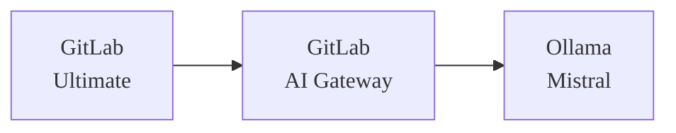



- プラン: Ultimate
- アドオン: GitLab Duo ProまたはEnterprise
- 提供形態: GitLab Self-Managed



このドキュメントでは、GitLabとGitLab DuoをOllama上でMistralモデルを実行するセルフホストモデルの大規模言語モデル（LLM）と統合する方法について説明します。このガイドでは、3台の異なる仮想マシンを使用したセットアップについて説明しており、AWSまたはGCPで実行できます。もちろん、このプロセスは異なるデプロイプラットフォームにも適用可能です。

このガイドは、目的のセットアップを機能させるための、包括的なエンドツーエンドの指示書です。GitLabドキュメントの多くの領域への参照が、最終的な設定の作成をサポートするために使用されました。参照されているドキュメントは、特定のシナリオに合わせて実装を調整するためにより詳細な背景情報が必要な場合に重要です。
<!-- TOC -->

- GitLab Duo Self-Hosted:Ollamaインテグレーション対応のAWS/Google Cloudデプロイ完全ガイド
  - [前提条件](#prerequisites)
    - [仮想マシン](#virtual-machines)
      - [リソースとオペレーティングシステム](#resources--operating-system)
      - [ネットワーキング](#networking)
    - [GitLab](#gitlab)
      - [ライセンス](#licensing)
      - [SSL](#ssltls)/TLS
- [はじめに](#introduction)
  - [インストール](#installation)
    - [AIゲートウェイ](#ai-gateway)
    - [Ollama](#ollama)
      - [インストール](#installation)
      - [モデルのデプロイ](#model-deployment)
  - [インテグレーション](#integration)
    - [ルートユーザー向けのGitLab Duoの有効化](#enable-gitlab-duo-for-root-user)
    - [GitLabでセルフホストモデルを設定](#configure-gitlab-duo-self-hosted-in-gitlab)
  - [検証](#verification)

<!-- /TOC -->

## 前提条件 {#prerequisites}

### 仮想マシン {#virtual-machines}

#### リソースとオペレーティングシステム {#resources--operating-system}

GitLab、GitLab AIゲートウェイ、Ollamaをそれぞれ別々の仮想マシンにインストールします。このガイドではUbuntu 24.0xを使用していますが、組織の要件と好みに合わせてUnixベースのオペレーティングシステムを柔軟に選択できます。ただし、このセットアップでは、Unixベースのオペレーティングシステムの使用が必須です。これにより、必要なソフトウェアスタックとのシステムの安定性、セキュリティ、および互換性が確保されます。このセットアップは、テストおよび評価フェーズにおいてコストとパフォーマンスのバランスが良好ですが、使用要件やチーム規模に応じて、本番環境に移行する際にはGPUインスタンスタイプのアップグレードが必要になる場合があります。

|                | **GCP**       | **AWS**     | **OS**    | **Disk** |
|----------------|---------------|-------------|-----------|----------|
| **GitLab**     | c2-standard-4 | c6xlarge    | Ubuntu 24 | 50 GB    |
| **AIゲートウェイ** | e2-medium     | t2.medium   | Ubuntu 24 | 20 GB    |
| **Ollama**     | n1-standard-4 | g4dn.xlarge | Ubuntu 24 | 50 GB    |

コンポーネントとその目的の詳細については、[AIゲートウェイ](../../administration/gitlab_duo/gateway.md)を参照してください。



これらのコンポーネントは連携してSelf-Hosted AI機能を実現します。このガイドでは、LLMサーバーとしてOllamaを使用し、完全なセルフホストAI環境を構築するための詳細な手順を説明します。

> [!note]
> 完全な本番環境では、[公式ドキュメント](../../administration/gitlab_duo_self_hosted/supported_models_and_hardware_requirements.md)で1x NVIDIA A100（40 GB）のようなより強力なGPUインスタンスが推奨されていますが、g4dn.xlargeインスタンスタイプは、少人数のユーザーチームでの評価目的には十分です。

#### ネットワーキング {#networking}

GitLabへのアクセスを有効にするには、静的なパブリックIPアドレス（AWSのElastic IPやGoogle CloudのExternal IPなど）が必要です。その他のすべてのコンポーネントは、内部通信のために静的な内部IPアドレスを使用できますし、使用すべきです。すべての仮想マシンが同じネットワーク上にあり、直接通信できるものとします。

|                | **Public IP** | **Private IP** |
|----------------|---------------|----------------|
| **GitLab**     | はい           | はい            |
| **AIゲートウェイ** | いいえ            | はい            |
| **Ollama**     | いいえ            | はい            |

内部IPを使用する理由

- 内部IPは、AWS/Google Cloudでのインスタンスのライフタイム全体で静的です。
- GitLabサーバーのみが外部アクセスを必要とし、Ollamaのような他のコンポーネントは内部通信に依存しています。
- このアプローチは、パブリックIPアドレスの料金を回避することでコストを削減し、LLMサーバーをインターネットからアクセスできないようにすることでセキュリティを強化します。

### GitLab {#gitlab}

このガイドの残りの部分では、以下の要件を満たすGitLabのインスタンスがすでに稼働していることを前提としています:

#### ライセンス {#licensing}

GitLab Duo Self-Hostedを運用するには、GitLab UltimateライセンスとGitLab Duo Enterpriseライセンスの両方が必要です。GitLab Ultimateライセンスは、オンラインライセンスオプションまたはオフラインライセンスオプションのいずれでも機能します。このドキュメントは、両方のライセンスが以前に取得されており、実装に利用可能であることを前提としています。


#### SSL/TLS {#ssltls}

有効なSSL証明書（Let's Encryptなど）がGitLabのインスタンス用に設定されている必要があります。これは単なるセキュリティのベストプラクティスではなく、次のような技術要件でもあります:

- AIゲートウェイシステム（2025年1月現在）は、GitLabと通信する際に適切なSSL検証を厳密に要求します。
- AIゲートウェイは自己署名証明書を受け付けません
- SSL以外の接続（HTTP）もサポートされていません。

GitLabは、便利な自動SSLセットアッププロセスを提供します:

- GitLabのインストール時に、URLを"https://"プレフィックスで指定するだけです。
- GitLabは自動的に以下を実行します:
  - Let's Encrypt SSL証明書を取得する
  - 証明書をインストールする
  - HTTPSを設定する
- 手動でのSSL証明書管理は不要です。

GitLabのインストール中、手順は次のようになります:

1. パブリックおよび静的IPアドレスをGitLabインスタンスに割り当てて関連付けます。
1. そのアドレスを指すようにDNSレコードを設定します。
1. GitLabのインストール時に、HTTPS URL（例: `https://gitlab.yourdomain.com`）を使用します。
1. GitLabにSSL証明書のセットアップを自動的に処理させます。

詳細については、[ドキュメント](https://docs.gitlab.com/omnibus/settings/ssl/)ページを参照してください。

## はじめに {#introduction}

GitLab Duo Self-Hostedをセットアップする前に、人工知能の仕組みを理解することが重要です。AIモデルは、データでトレーニングされたAIの頭脳です。この頭脳は、LLM提供プラットフォーム、または単に「提供プラットフォーム」と呼ばれるフレームワークを必要とします。AWSでは「Amazon Bedrock」、Azureでは「Azure OpenAI Service」、ChatGPTの場合はそのプラットフォームです。Anthropicの場合、「Claude」です。セルフホスト型モデルには、Ollamaが一般的な選択肢です。

例: 

- AWSでは、提供プラットフォームはAmazon Bedrockです。
- Azureでは、Azure OpenAI Serviceです。
- ChatGPTの場合、OpenAI独自のプラットフォームです。
- Anthropicの場合、提供プラットフォームはClaudeです。

AIモデルを自分でホストする場合、提供プラットフォームを選択する必要もあります。セルフホストモデルの一般的なオプションはOllamaです。

このアナロジーでは、ChatGPTの頭脳部分はGPT-4モデルであり、AnthropicのエコシステムではClaude 3.7 Sonnetモデルです。提供プラットフォームは、頭脳を世界と接続し、「思考」して効果的に相互作用することを可能にする重要なフレームワークとして機能します。

サポートされている提供プラットフォームとモデルの詳細については、[LLM提供プラットフォーム](../../administration/gitlab_duo_self_hosted/supported_llm_serving_platforms.md)および[モデル](../../administration/gitlab_duo_self_hosted/supported_models_and_hardware_requirements.md)を参照してください。

**What is Ollama**?

Ollamaは、ローカル環境で大規模言語モデル（LLM）を実行するための、合理化されたオープンソースフレームワークです。これは、AIモデルをデプロイする従来の複雑なプロセスを簡素化し、効率的で柔軟かつスケーラブルなAIソリューションを求める個人と組織の両方にとって利用しやすくします。

主なハイライト:

1. **Simplified Deployment**: ユーザーフレンドリーなコマンドラインインターフェースにより、迅速なセットアップと手間のかからないインストールが保証されます。
1. **Wide Model Support**: Llama 2、Mistral、Code Llamaなどの一般的なオープンソースモデルと互換性があります。
1. **Optimized Performance**: GPU環境とCPU環境の両方でシームレスに動作し、リソースの効率性を実現します。
1. **Integration-Ready**: 既存のツールやワークフローとの容易なインテグレーションを可能にするOpenAI互換のAPIを備えています。
1. **No Containers Needed**: ホストシステム上で直接実行され、Dockerやコンテナ化された環境の必要がありません。
1. **Versatile Hosting Options**: ローカルマシン、オンプレミスサーバー、またはクラウドGPUインスタンスにデプロイ可能です。

シンプルさとパフォーマンスを追求して設計されたOllamaは、従来のAIインフラストラクチャの複雑さなしに、ユーザーがLLMの能力を活用できるようにします。セットアップとサポートされているモデルに関する詳細については、ドキュメントで以降で説明します。

- [Ollamaモデルサポート](https://ollama.com/search)

## インストール {#installation}

### AIゲートウェイ {#ai-gateway}

公式のインストールガイドは[GitLab AIゲートウェイのインストール](../../install/install_ai_gateway.md)で入手できますが、ここではAIゲートウェイをセットアップするための合理化されたアプローチを紹介します。2025年1月現在、イメージ`gitlab/model-gateway:self-hosted-v17.6.0-ee`はGitLab 17.7で動作することが確認されています。

1. 以下を確認してください...

   - APIゲートウェイVMへのTCPポート5052が許可されている（セキュリティグループの設定を確認してください）
   - 次のコードスニペットで、`GITLAB_DOMAIN`をYOUR GitLabインスタンスのドメイン名に置き換えてください:

1. GitLab AIゲートウェイを起動するには、次のコマンドを実行します:

   ```shell
   GITLAB_DOMAIN="gitlab.yourdomain.com"
   docker run -p 5052:5052 \
     -e AIGW_GITLAB_URL=$GITLAB_DOMAIN \
     -e AIGW_GITLAB_API_URL=https://${GITLAB_DOMAIN}/api/v4/ \
     -e AIGW_AUTH__BYPASS_EXTERNAL=true \
     gitlab/model-gateway:self-hosted-v17.6.0-ee
   ```

次の表は、主要な環境変数と、インスタンスのセットアップにおけるそれらの役割を説明しています:

| **変数**                 | **説明** |
|------------------------------|-----------------|
| `AIGW_GITLAB_URL`            | GitLabインスタンスのドメイン。 |
| `AIGW_GITLAB_API_URL`        | GitLabインスタンスのAPIエンドポイント。 |
| `AIGW_AUTH__BYPASS_EXTERNAL` | 認証を処理するための設定。 |

初期セットアップおよびテストフェーズ中は、AIGW_AUTH__BYPASS_EXTERNAL=trueを設定して、認証をバイパスして問題を回避できます。ただし、この設定は、本番環境またはインターネットに公開されているサーバーでは決して使用しないでください。

### Ollama {#ollama}

#### インストール {#installation-1}

1. 公式のインストールスクリプトを使用してOllamaをインストールします:

   ```shell
   curl --fail --silent --show-error --location "https://ollama.com/install.sh" | sh
   ```

1. 起動設定に`OLLAMA_HOST`環境変数を追加して、Ollamaが内部IPでリッスンするように設定します。

   ```shell
   systemctl edit ollama.service
   ```

   ```ini
   [Service]
   Environment="OLLAMA_HOST=172.31.11.27"
   ```

   > [!note]
   > IPアドレスを実際のサーバーの内部IPアドレスに置き換えてください。

1. サービスをリロードして再起動します:

   ```shell
   systemctl daemon-reload
   systemctl restart ollama
   ```

#### モデルのデプロイ {#model-deployment}

1. 環境変数を設定します:

   ```shell
   export OLLAMA_HOST=172.31.11.27
   ```

1. Mistral Instructモデルをインストールします:

   ```shell
   ollama pull mistral:instruct
   ```

   `mistral:instruct`モデルには約4.1 GBのストレージスペースが必要で、接続速度によってダウンロードに時間がかかります。

1. モデルのインストールを検証します:

   ```shell
   ollama list
   ```

   コマンドはインストールされたモデルをリストに表示するはずです。

## インテグレーション {#integration}

### ルートユーザー向けのGitLab Duoを有効にする {#enable-gitlab-duo-for-root-user}

1. GitLab Webインターフェースにアクセスします。

   - 管理者ユーザーとしてログインします。
   - 管理者エリア（レンチアイコン）に移動します。

1. Duoライセンスを設定する

   - 左側のサイドバーにある「サブスクリプション」セクションに移動します。
   - 「使用シート数: 1/5」と表示されます。これは利用可能なDuoシート数を示しています
   - 注: ルートユーザーには1シートのみが必要です。

1. Duoライセンスをルートに割り当てる

   - 「管理者エリア」>「GitLab Duo」>「シート使用状況」に移動します。
   - ユーザーリストでルートユーザー（管理者）を見つけます。
   - 「GitLab Duo Enterprise」列の切替スイッチを切り替えて、ルートユーザーに対してDuoを有効にします。
   - 有効にすると、切替ボタンが青色に変わります。


> [!note]
> ルートユーザーに対してDuoを有効にするだけで、初期設定とテストには十分です。必要に応じて、シートライセンスの制限内で、追加のユーザーにDuoアクセスを以降に許可できます。

### GitLabでGitLab Duo Self-Hostedを設定する {#configure-gitlab-duo-self-hosted-in-gitlab}

1. GitLab Duo Self-Hostedの設定にアクセスします。

   - 管理者エリア > GitLab Duo > 「GitLab Duo Self-hostedの設定」に移動します。
   - 「セルフホストモデルの追加」ボタンをクリックします。

   

1. モデル設定を設定する

   - **デプロイ名**: 説明的な名前を選択します（例: `Mistral-7B-Instruct-v0.3 on AWS Tokyo`）
   - **モデルファミリー**: ドロップダウンリストから「Mistral」を選択します。
   - **エンドポイント**: OllamaサーバーのURLを次の形式で入力します:

     ```plaintext
     http://[Internal-IP]:11434/v1
     ```

     例: `http://172.31.11.27:11434/v1`

   - **モデル識別子**: `custom_openai/mistral:instruct`と入力します
   - **API Key**: このフィールドは空白のままにできないため、プレースホルダーテキスト（例: `test`）を入力します。


1. AI機能を有効にする

   - 「AIネイティブ機能」タブに移動します。
   - 設定されたモデルを以下の機能に割り当てます:
     - コード提案 > コード生成
     - コード提案 > コード補完
     - GitLab Duo Chat > 一般チャット
   - 各機能のドロップダウンリストから、デプロイされたモデルを選択します。


これらの設定により、GitLabインスタンスとセルフホストモデルのOllamaがAIゲートウェイを介して接続され、GitLab内でAIネイティブ機能が有効になります。

## 検証 {#verification}

1. GitLabでテストグループを作成します。
1. 右上隅にGitLab Duo Chatアイコンが表示されるはずです。
1. これは、GitLabとAIゲートウェイ間のインテグレーションが成功したことを示します。


