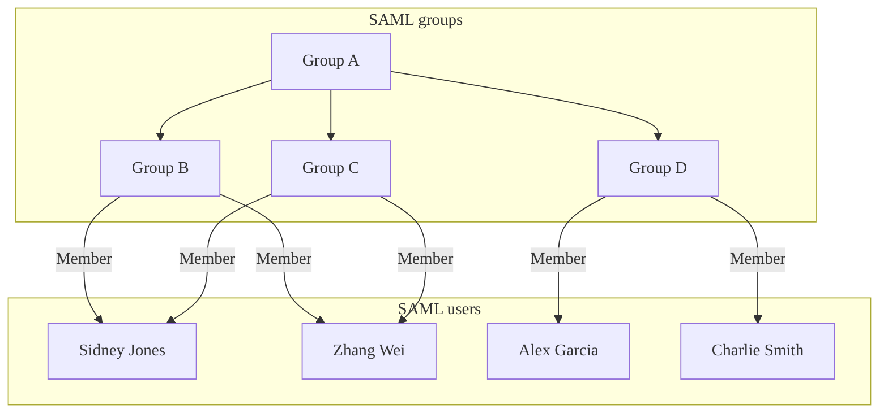
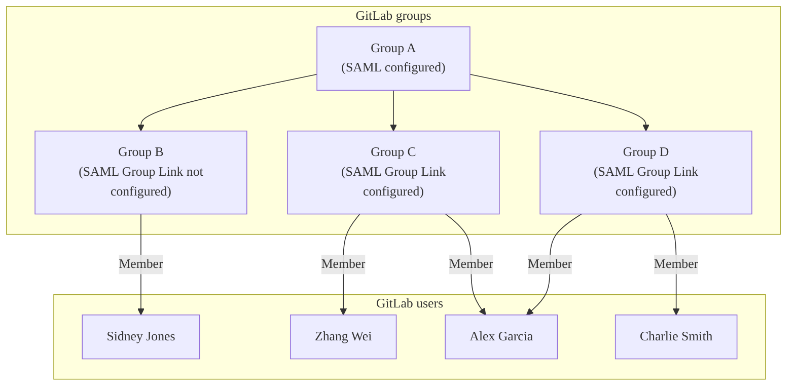
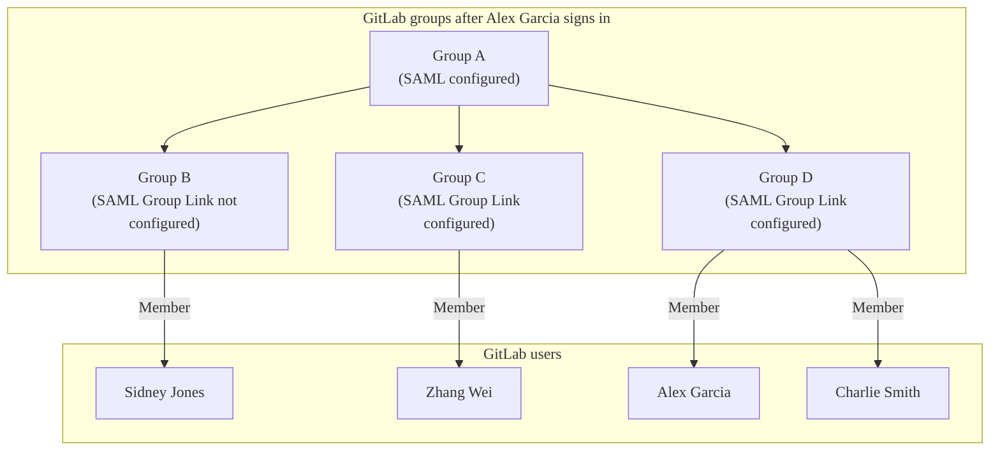



- プラン: Premium、Ultimate
- 提供形態: GitLab.com、GitLab Self-Managed、GitLab Dedicated





- GitLab Self-ManagedのGitLab 15.1で[導入](https://gitlab.com/gitlab-org/gitlab/-/issues/363084)されました。



SAMLグループ同期を使用して、SAML Identity Provider (IdP) でのユーザーのグループ割り当てに基づいて、特定の役割を持つユーザーを既存のGitLabグループに割り当てます。SAMLグループ同期を使用すると、SAML IdPグループとGitLabグループ間の多対多のマッピングを作成できます。

たとえば、ユーザー`@amelia`がSAML IdPの`security`グループに割り当てられている場合、SAMLグループ同期を使用して、`@amelia`をメンテナー役割を持つ`security-gitlab`グループに、そしてレポーター役割を持つ`vulnerability`グループに割り当てることができます。

SAMLグループ同期ではグループは作成されません。まず[グループを作成](../_index.md#create-a-group)し、次にマッピングを作成する必要があります。

GitLab.comでは、SAMLグループ同期はデフォルトで設定されています。GitLab Self-Managedでは、手動で設定する必要があります。

## 役割の優先順位 {#role-prioritization}

グループ同期は、マップされたグループ内のユーザーの役割とメンバーシップタイプを決定します。

### 複数のSAML IdP {#multiple-saml-idps}



- 提供形態: GitLab Self-Managed



ユーザーがサインインすると、GitLabは次のことを行います:

- 設定されているすべてのSAMLグループリンクをチェックします。
- そのユーザーが異なるIdPで所属しているSAMLグループに基づいて、対応するGitLabグループにそのユーザーを追加します。

GitLabのグループリンクマッピングは特定のIdPに紐付けられていないため、すべてのSAML IdPでSAML応答にグループ属性が含まれるように設定する必要があります。これは、サインインに使用されたIdPに関係なく、GitLabがSAML応答内のグループを照合できることを意味します。

例として、2つのIdP (`SAML1`と`SAML2`) があるとします。

GitLabで、特定のグループに2つのグループリンクを設定しています:

- `gtlb-owner => Owner role`。
- `gtlb-dev => Developer role`。

`SAML1`では、ユーザーは`gtlb-owner`のメンバーですが、`gtlb-dev`のメンバーではありません。

`SAML2`では、ユーザーは`gtlb-dev`のメンバーですが、`gtlb-owner`のメンバーではありません。

ユーザーが`SAML1`を使用してグループにサインインすると、SAML応答はユーザーが`gtlb-owner`のメンバーであることを示し、GitLabはそのグループでのユーザーの役割を`Owner`に設定します。

ユーザーはその後サインアウトし、`SAML2`を使用して再度グループにサインインします。SAML応答はユーザーが`gtlb-dev`のメンバーであることを示し、GitLabはそのグループでのユーザーの役割を`Developer`に設定します。

では、ユーザーが`SAML2`で`gtlb-owner`または`gtlb-dev`のいずれのメンバーでもないように、前の例を変更してみましょう。

- ユーザーが`SAML1`を使用してグループにサインインすると、そのグループで`Owner`の役割がユーザーに与えられます。
- ユーザーが`SAML2`でサインインすると、設定されているいずれのグループリンクのメンバーでもないため、グループから削除されます。

### 複数のSAMLグループ {#multiple-saml-groups}

ユーザーが同じGitLabグループにマップされる複数のSAMLグループのメンバーである場合、ユーザーはそれらのSAMLグループのいずれかから最も高い役割を割り当てられます。

たとえば、ユーザーがあるグループでゲスト役割を持ち、別のグループでメンテナー役割を持っている場合、メンテナー役割が割り当てられます。

### メンバーシップの種類 {#membership-types}

SAMLグループにおけるユーザーの役割が、そのサブグループのいずれかにおける役割よりも高い場合、マップされたGitLabグループにおけるユーザーの[メンバーシップ](../../project/members/_index.md#display-direct-members)は、マップされたグループで割り当てられた役割に基づいて異なります。

グループ同期を通じてユーザーが割り当てられた場合:

- より高い役割の場合、そのグループの直接メンバーになります。
- 同じか低い役割の場合、そのグループの継承されたメンバーになります。

## 自動メンバー削除 {#automatic-member-removal}

グループ同期後、マップされたSAMLグループのメンバーではないユーザーはグループから削除されます。GitLab.comでは、トップレベルグループのユーザーは、削除される代わりにデフォルトロールのメンバーシップ役割を割り当てられます。

たとえば、次の図について説明します。

- Alex GarciaがGitLabにサインインすると、SAML Group Cに所属していないため、GitLab Group Cから削除されます。
- Sidney JonesはSAML Group Cに所属していますが、まだサインインしていないため、GitLab Group Cに追加されません。







## SAMLグループ同期 {#configure-saml-group-sync}

グループ同期の設定を追加または変更すると、グループ名がSAML応答にリストされている`groups`と一致しない場合、マップされたGitLabグループからユーザーが削除される可能性があります。ユーザーが削除されるのを防ぐため、グループ同期を設定する前に、次のいずれかを確認してください:

- SAML応答に`groups`属性が含まれ、`AttributeValue`の値がGitLabの**SAMLグループ名**と一致すること。
- すべてのグループがGitLabから削除され、グループ同期が無効になっていること。

SAMLグループ同期を使用しており、分散アーキテクチャや高可用性アーキテクチャのように複数のGitLabノードがある場合は、Railsアプリケーションノードに加えて、すべてのSidekiqノードにSAMLの設定ブロックを含める必要があります。





SAMLグループ同期を設定するには:

1. [GitLab.comグループのSAML SSO](_index.md)を参照してください。
1. お使いのSAML Identity Providerが、`Groups`または`groups`という名前の属性ステートメントを送信していることを確認してください。





SAMLグループ同期を設定するには:

1. [SAML OmniAuthプロバイダー](../../../integration/saml.md)を設定します。
1. お使いのSAML Identity Providerが、`groups_attribute`設定の値と同じ名前の属性ステートメントを送信していることを確認してください。この属性は大文字と小文字が区別されます。`/etc/gitlab/gitlab.rb`におけるプロバイダー設定の例を参照してください:

   ```ruby
   gitlab_rails['omniauth_providers'] = [
     {
       name: "saml",
       label: "Provider name", # optional label for login button, defaults to "Saml",
       groups_attribute: 'Groups',
       args: {
         assertion_consumer_service_url: "https://gitlab.example.com/users/auth/saml/callback",
         idp_cert_fingerprint: "43:51:43:a1:b5:fc:8b:b7:0a:3a:a9:b1:0f:66:73:a8",
         idp_sso_target_url: "https://login.example.com/idp",
         issuer: "https://gitlab.example.com",
         name_identifier_format: "urn:oasis:names:tc:SAML:2.0:nameid-format:persistent"
       }
     }
   ]
   ```





SAML応答における`Groups`または`groups`の値は、グループ名またはIDのいずれかである場合があります。たとえば、Azure ADは名前の代わりにAzureグループオブジェクトIDを送信します。[SAMLグループのリンク](#configure-saml-group-links)を設定する際に、ID値を使用します。

```xml
<saml:AttributeStatement>
  <saml:Attribute Name="Groups">
    <saml:AttributeValue xsi:type="xs:string">Developers</saml:AttributeValue>
    <saml:AttributeValue xsi:type="xs:string">Product Managers</saml:AttributeValue>
  </saml:Attribute>
</saml:AttributeStatement>
```

`http://schemas.microsoft.com/ws/2008/06/identity/claims/groups`のような他の属性名は、グループのソースとして受け入れられません。

SAML Identity Providerの設定で必須のグループ属性名を設定する方法の詳細については、[Azure AD](example_saml_config.md#group-sync)と[Okta](example_saml_config.md#group-sync-1)の設定例を参照してください。

## SAMLグループリンクを設定する {#configure-saml-group-links}

SAMLグループ同期は、そのグループが1つ以上のSAMLグループリンクを持っている場合にのみグループを管理します。

前提条件: 

- お使いのGitLab Self-Managedインスタンスは、SAMLグループ同期が設定されている必要があります。

SAMLが有効になっている場合、オーナー役割を持つユーザーは、グループの**設定** > **SAMLグループのリンク**に新しいメニュー項目が表示されます。

- 1つ以上の**SAMLグループのリンク**を設定して、SAML IdPグループ名をGitLabの役割にマップすることができます。
- SAML IdPグループのメンバーは、次回のSAMLサインイン時にGitLabグループのメンバーとして追加されます。
- グループメンバーシップは、ユーザーがSAMLを使用してサインインするたびに評価されます。
- SAMLグループリンクは、トップレベルグループまたは任意のサブグループに対して設定できます。
- SAMLグループリンクが作成されてから削除された場合で、次の条件に該当する場合:
  - 他のSAMLグループリンクが設定されている場合、削除されたグループリンクにいたユーザーは、同期中にグループから自動的に削除されます。
  - 他のSAMLグループリンクが設定されていない場合、ユーザーは同期中にグループに残ります。これらのユーザーは手動でグループから削除する必要があります。

SAMLグループをリンクするには:

1. **SAMLグループ名**に、関連する`saml:AttributeValue`の値を入力します。ここに入力された値は、SAML応答で送信された値と正確に一致する必要があります。一部のIdPでは、これはフレンドリーなグループ名の代わりにグループIDまたはオブジェクトID (Azure AD) である場合があります。
1. **Access Level**で[デフォルトロール](../../permissions.md)または[カスタムロール](../../custom_roles/_index.md)を選択します。
1. **Save**を選択します。
1. 必要に応じて、追加のグループリンクを追加するには繰り返します。

## GitLab Duoシート割り当ての管理 {#manage-gitlab-duo-seat-assignment}



- 提供形態: GitLab.com、GitLab Self-Managed





- GitLab.comのGitLab 17.8で[導入](https://gitlab.com/gitlab-org/gitlab/-/issues/480766)され、`saml_groups_duo_pro_add_on_assignment`という名前の[フラグ付き](../../../administration/feature_flags/_index.md)です。デフォルトでは無効になっています。
- GitLab Self-ManagedのGitLab 18.0で[導入](https://gitlab.com/gitlab-org/gitlab/-/issues/512141)されました。



前提条件: 

- アクティブな[GitLab Duoアドオンサブスクリプション](../../../subscriptions/subscription-add-ons.md)

SAMLグループ同期は、IdPグループメンバーシップに基づいてGitLab Duoシートの割り当てと削除を管理できます。シートは、サブスクリプションに残りがある場合にのみ割り当てられます。





GitLab.comの設定方法:

1. [SAMLグループリンクを設定する](#configure-saml-group-links)際に、**このグループのユーザーにGitLab Duoのライセンスをアサインします**チェックボックスを選択します。
1. **Save**を選択します。
1. GitLab Duo ProまたはGitLab Duo Enterpriseシートを割り当てる必要があるすべてのSAMLユーザーに対して、追加のグループリンクを追加するには繰り返します。この設定が有効なグループリンクと一致しないIdentity Providerグループメンバーシップを持つユーザーには、GitLab Duoシートは割り当て解除されます。

アクティブなGitLab Duoアドオンサブスクリプションがないグループの場合、このチェックボックスは表示されません。





Self-Managedを設定するには:

1. [SAML OmniAuthプロバイダー](../../../integration/saml.md)を設定します。
1. お使いの設定に`groups_attribute`と`duo_add_on_groups`が含まれていることを確認してください。`duo_add_on_groups`の1つ以上のメンバーであるユーザーには、利用可能なシートがある場合、GitLab Duoシートが割り当てられます。`/etc/gitlab/gitlab.rb`におけるプロバイダー設定の例を参照してください:

   ```ruby
   gitlab_rails['omniauth_providers'] = [
     {
       name: "saml",
       label: "Provider name",
       groups_attribute: 'Groups',
       duo_add_on_groups: ['Developers', 'Freelancers'],
       args: {
         assertion_consumer_service_url: "https://gitlab.example.com/users/auth/saml/callback",
         idp_cert_fingerprint: "43:51:43:a1:b5:fc:8b:b7:0a:3a:a9:b1:0f:66:73:a8",
         idp_sso_target_url: "https://login.example.com/idp",
         issuer: "https://gitlab.example.com",
         name_identifier_format: "urn:oasis:names:tc:SAML:2.0:nameid-format:persistent"
       }
     }
   ]
   ```





## Microsoft Azure Active Directoryインテグレーション {#microsoft-azure-active-directory-integration}



- GitLab 16.3で[導入](https://gitlab.com/groups/gitlab-org/-/epics/10507)されました。



> [!note]
> Microsoftは、Azure Active Directory (AD) がEntra IDに名称変更されることを[発表しました](https://azure.microsoft.com/en-us/updates/azure-ad-is-becoming-microsoft-entra-id/)。

<i class="fa-youtube-play" aria-hidden="true"></i> Microsoft Azureを使用したグループ同期のデモについては、[デモ: SAMLグループ同期](https://youtu.be/Iqvo2tJfXjg)。

Azure ADは、`groups`クレームで最大150のグループを送信します。Azure ADをSAMLグループ同期で使用している場合、組織内のユーザーが150を超えるグループのメンバーであると、Azure ADは[グループ超過](https://learn.microsoft.com/en-us/security/zero-trust/develop/configure-tokens-group-claims-app-roles#group-overages)のためにSAML応答で`groups`クレーム属性を送信し、ユーザーがグループから自動的に削除される可能性があります。

この問題を避けるために、次の機能を持つAzure ADインテグレーションを使用できます:

- 150グループに限定されません。
- Microsoft Graph APIを使用してすべてのユーザーのメンバーシップを取得します。The [Graph APIエンドポイント](https://learn.microsoft.com/en-us/graph/api/user-list-transitivememberof?view=graph-rest-1.0&tabs=http#http-request)は、[Azureが設定した](_index.md#azure)固有識別子 (名前識別子) 属性として、[ユーザーオブジェクトID](https://learn.microsoft.com/en-us/partner-center/find-ids-and-domain-names#find-the-user-object-id)または[userPrincipalName](https://learn.microsoft.com/en-us/entra/identity/hybrid/connect/plan-connect-userprincipalname#what-is-userprincipalname)のみを受け入れます。
- グループ同期を処理する際、グループ識別子 (例: `12345678-9abc-def0-1234-56789abcde`) で設定されたグループリンクのみをサポートします。

または、[グループクレーム](https://learn.microsoft.com/en-us/entra/identity/hybrid/connect/how-to-connect-fed-group-claims)を変更して、**Groups assigned to the application**オプションを使用することもできます。

### Azure ADを設定する {#configure-azure-ad}

このインテグレーションの一環として、GitLabがMicrosoft Graph APIと通信することを許可する必要があります。

<!-- vale gitlab_base.SentenceSpacing = NO -->

Azure ADを設定するには:

1. [Azure Portal](https://portal.azure.com)で、**Microsoft Entra ID** > **App registrations** > **All applications**に移動し、お使いのGitLab SAMLアプリケーションを選択します。
1. **Essentials**の下に、**Application (client) ID**と**Directory (tenant) ID**の値が表示されます。これらの値はGitLabの設定に必要となるため、コピーしてください。
1. 左側のナビゲーションで、**Certificates & secrets**を選択します。
1. **Client secrets**タブで、**New client secret**を選択します。
   1. **説明**テキストボックスに説明を追加します。
   1. **有効期限**ドロップダウンリストで、認証情報の有効期限を設定します。シークレットが期限切れになると、認証情報が更新されるまでGitLabインテグレーションは機能しなくなります。
   1. 認証情報を生成するには、**追加**を選択します。
   1. 資格情報の**値**をコピーします。この値は一度だけ表示され、GitLabの設定に必要です。
1. 左側のナビゲーションで、**API permissions**を選択します。
1. **Microsoft Graph** > **Application permissions**を選択します。
1. **GroupMember.Read.All**と**User.Read.All**チェックボックスを選択します。
1. 保存するには、**Add permissions**を選択します。
1. **Grant admin consent for**を選択し、その後の確認ダイアログで**可能**を選択します。両方の権限について、**ステータス**列が**Granted for**の緑色のチェックマークに変わるはずです。

<!-- vale gitlab_base.SentenceSpacing = YES -->

### GitLabを設定する {#configure-gitlab}

Azure ADを設定したら、GitLabがAzure ADと通信するようにGitLabを設定する必要があります。

この設定により、ユーザーがSAMLでサインインし、Azureが応答で`group`クレームを送信すると、GitLabはグループ同期ジョブを開始してMicrosoft Graph APIを呼び出し、ユーザーのグループメンバーシップを取得します。その後、GitLabグループメンバーシップはSAMLグループリンクに従って更新されます。

以下の表に、GitLabの設定と、この設定に対応するAzure ADフィールドを示します:

| GitLab設定 | Azureフィールド                                |
| -------------- | ------------------------------------------ |
| テナントID      | Directory (tenant) ID                      |
| Client ID      | Application (client) ID                    |
| クライアントシークレット  | 値 (on **Certificates & secrets**ページ上) |





GitLab.comグループのAzure ADを設定するには:

1. 上部のバーで、**検索または移動先**を選択して、グループを見つけます。このグループはトップレベルにある必要があります。
1. **設定** > **SAML SSO**を選択します。
1. グループの[SAML SSO](_index.md)を設定します。
1. **Microsoft Azure integration**セクションで、**Enable Microsoft Azure integration for this group**チェックボックスを選択します。このセクションは、グループに対してSAML SSOが設定され、有効になっている場合にのみ表示されます。
1. Azure PortalでAzure Active Directoryを設定した際に取得した**テナントID**、**クライアントID**、および**クライアントシークレット**を入力します。
1. オプション。US Government向けAzure ADまたはAzure AD Chinaを使用している場合は、適切な**ログインAPIエンドポイント**と**Graph APIエンドポイント**を入力します。デフォルト値はほとんどの組織で機能します。
1. **変更を保存**を選択します。





前提条件: 

- 管理者アクセス権が必要です。

GitLab Self-Managedを設定するには:

1. [インスタンスのSAML SSO](../../../integration/saml.md)を設定します。
1. 右上隅で、**管理者**を選択します。
1. **設定** > **一般**を選択します。
1. **Microsoft Azure integration**セクションで、**Enable Microsoft Azure integration for this group**チェックボックスを選択します。
1. Azure PortalでAzure Active Directoryを設定した際に取得した**テナントID**、**クライアントID**、および**クライアントシークレット**を入力します。
1. オプション。US Government向けAzure ADまたはAzure AD Chinaを使用している場合は、適切な**ログインAPIエンドポイント**と**Graph APIエンドポイント**を入力します。デフォルト値はほとんどの組織で機能します。
1. **変更を保存**を選択します。





## グローバルSAMLグループメンバーシップロック {#global-saml-group-memberships-lock}



- 提供形態: GitLab Self-Managed、GitLab Dedicated





- GitLab 15.10で[導入](https://gitlab.com/gitlab-org/gitlab/-/issues/386390)されました。



SAMLグループメンバーシップに対するグローバルロックを強制できます。このロックは、メンバーシップがSAMLグループリンクと同期されているサブグループに新しいメンバーを招待できるユーザーを制限します。

グローバルグループメンバーシップのロックが有効になっている場合:

- グループまたはサブグループを[コードオーナー](../../project/codeowners/_index.md)として設定することはできません。詳細については、[グローバルグループメンバーシップロックとの非互換性](../../project/codeowners/troubleshooting.md#incompatibility-with-global-group-memberships-locks)を参照してください。
- 管理者のみがグループメンバーを管理し、そのアクセスレベルを変更できます。
- グループメンバーは次のことをできません:
  - 他のグループとプロジェクトを共有します。
  - グループで作成されたプロジェクトにメンバーを招待します。
  - SAMLグループリンク同期用に設定されたトップレベルグループのメンバーシップを変更します。

### グループメンバーシップをロックする {#lock-group-memberships}

前提条件: 

- [GitLab Self-ManagedのSAML SSO](../../../integration/saml.md)が設定されていること。
- 管理者アクセス権が必要です。

SAMLグループリンク同期へのメンバーシップをロックするには:

1. 右上隅で、**管理者**を選択します。
1. **設定** > **一般**を選択します。
1. **表示レベルとアクセス制御**セクションを展開します。
1. **メンバーシップをSAMLグループリンク同期に限定**チェックボックスを選択します。
