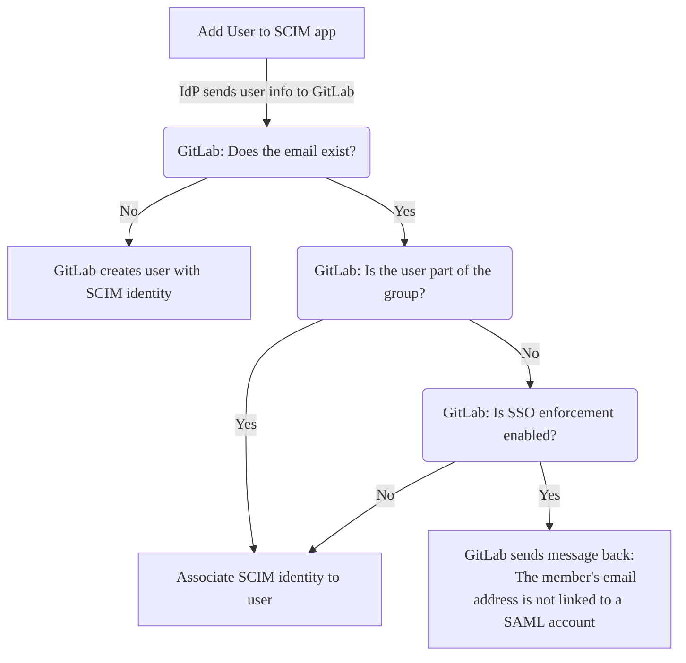
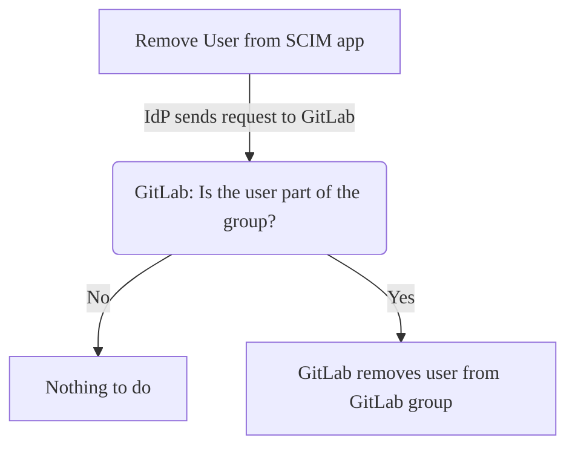



- プラン: Premium、Ultimate
- 提供形態: GitLab.com



オープンスタンダードのSystem for Cross-domain Identity Management（SCIM）を使用して、以下を自動的に実行できます:

- ユーザーを作成します。
- ユーザーを削除します（SCIMアイデンティティを無効化）。
- ユーザーを再追加します（SCIMアイデンティティを再アクティブ化）。

GitLab SAML SSO SCIMは、ユーザーの更新をサポートしていません。

SCIMがGitLabグループで有効になっている場合、そのグループのグループメンバーシップは、GitLabとIdentity Provider間で同期されます。

[内部GitLabグループSCIM API](../../../development/internal_api/_index.md#group-scim-api)は、[RFC7644プロトコル](https://www.rfc-editor.org/rfc/rfc7644)の一部を実装しています。Identity Providerは、[内部GitLabグループSCIM API](../../../development/internal_api/_index.md#group-scim-api)を使用してSCIMアプリを開発できます。

GitLab Self-ManagedでSCIMをセットアップするには、[GitLab Self-ManagedのSCIMを設定](../../../administration/settings/scim_setup.md)を参照してください。

## GitLabを設定する {#configure-gitlab}

前提条件: 

- [グループシングルサインオン](_index.md)を設定する必要があります。

GitLab SAML SSO SCIMを設定するには:

1. 上部のバーで、**検索または移動先**を選択して、グループを見つけます。
1. **設定** > **SAML SSO**を選択します。
1. **SCIMトークンを生成**を選択します。
1. Identity Providerの設定については、以下を保存します:
   - **あなたのSCIMトークン**フィールドからトークン。
   - **SCIM APIエンドポイントのURL**フィールドからURL。

## Identity Providerを設定する {#configure-an-identity-provider}

次のいずれかをIdentity Providerとして設定できます:

- [Azure Active Directory](#configure-microsoft-entra-id-formerly-azure-active-directory)。
- [Okta](#configure-okta)。

> [!note]
> その他のプロバイダーもGitLabで動作する可能性がありますが、テストされておらずサポートされていません。サポートについては、プロバイダーに連絡してください。GitLabサポートは、関連するログエントリをレビューして支援できます。

### Microsoft Entra ID（以前のAzure Active Directory）を設定する {#configure-microsoft-entra-id-formerly-azure-active-directory}



- GitLab 16.10でMicrosoft Entra IDの用語に[変更](https://gitlab.com/gitlab-org/gitlab/-/merge_requests/143146)されました。



前提条件: 

- [GitLabが設定されています](#configure-gitlab)。
- [グループシングルサインオン](_index.md)が設定されています。

[シングルサインオン](_index.md)のセットアップ中に作成された[Azure Active Directory](https://learn.microsoft.com/en-us/entra/identity/enterprise-apps/view-applications-portal)用のSAMLアプリケーションは、SCIM用に設定する必要があります。例については、[設定例](example_saml_config.md#scim-mapping)を参照してください。

> [!note]
> SCIMプロビジョニングは、次の手順に詳しく記載されているとおりに設定する必要があります。設定が誤っている場合、ユーザープロビジョニングやサインインで問題が発生し、その解決には多大な労力が必要です。いずれかの手順で問題や質問がある場合は、GitLabサポートに連絡してください。

Microsoft Entra IDのSCIMを設定するには:

1. アプリで、**Provisioning**タブに移動し、**始めましょう**を選択します。
1. **Provisioning Mode**を**Automatic**に設定します。
1. **Admin Credentials**を次の値を使用して完了します:
   - **Tenant URL**フィールドについては、GitLabの**SCIM APIエンドポイントのURL**。
   - **Secret Token**フィールドについては、GitLabの**あなたのSCIMトークン**。
1. **Test Connection**を選択します。テストが成功した場合は、続行する前に設定を保存するか、[トラブルシューティング](troubleshooting.md)情報を参照してください。
1. **Save**を選択します。

保存後、**Mappings**と**設定**セクションが表示されます。

#### マッピングを設定する {#configure-mappings}

**Mappings**セクションで、まずグループをプロビジョニングします:

1. **Provision Microsoft Entra ID Groups**を選択します。
1. 属性マッピングページで、**有効**切替をオフにします。SCIMグループプロビジョニングはGitLabではサポートされていません。グループプロビジョニングを有効のままにしてもSCIMユーザープロビジョニングが中断されることはありませんが、Entra ID SCIMプロビジョニングログで混乱や誤解を招くようなエラーが発生する可能性があります。

   > [!note]
   > **Provision Microsoft Entra ID Groups**が無効になっている場合でも、マッピングセクションには「有効: 可能」と表示される場合があります。この動作は、安全に無視できる表示バグです。

1. **Save**を選択します。

次に、ユーザーをプロビジョニングします:

1. **Provision Microsoft Entra ID Users**を選択します。
1. **有効**切替が**可能**に設定されていることを確認します。
1. すべての**Target Object Actions**が有効になっていることを確認します。
1. **Attribute Mappings**で、[設定済みの属性マッピング](#configure-attribute-mappings)と一致するようにマッピングを設定します:
   1. オプション。オプション。**customappsso Attribute**カラムで`externalId`を見つけて削除します。
   1. 最初の属性を次のように編集します:
      - **source attribute**は`objectId`
      - **target attribute**は`externalId`
      - **matching precedence**は`1`
   1. 既存の**customappsso**属性を[設定済みの属性マッピング](#configure-attribute-mappings)と一致するように更新します。
   1. 次の表に記載されていない追加の属性をすべて削除します。削除しなくても問題は発生しませんが、GitLabはこれらの属性を使用しません。
1. マッピングリストで、**Show advanced options**チェックボックスを選択します。
1. **Edit attribute list for customappsso**リンクを選択します。
1. `id`がプライマリで必須フィールドであり、`externalId`も必須であることを確認します。
1. **保存**を選択すると、属性マッピング設定ページに戻ります。
1. **Attribute Mapping**設定ページを閉じるには、右上隅の`X`を選択します。

#### 設定を設定する {#configure-settings}

**設定**セクションで:

1. オプション。オプション。必要に応じて、**Send an email notification when a failure occurs**チェックボックスを選択します。
1. オプション。オプション。必要に応じて、**Prevent accidental deletion**チェックボックスを選択します。
1. 必要な場合は、すべての変更が保存されていることを確認するために**保存**を選択します。

マッピングと設定を設定したら、アプリの概要ページに戻り、**Start provisioning**を選択して、GitLabでのユーザーの自動SCIMプロビジョニングを開始します。

> [!warning]
> 一度同期されると、`id`と`externalId`にマップされたフィールドを変更するとエラーが発生する可能性があります。これにはプロビジョニングエラー、重複ユーザーが含まれ、既存のユーザーがGitLabグループにアクセスするのを妨げる可能性があります。

#### 属性マッピングを設定する {#configure-attribute-mappings}

> [!note]
> MicrosoftがAzure Active DirectoryからEntra IDへの命名スキームに移行している間、ユーザーインターフェースに一貫性のない点が見られる場合があります。問題が発生した場合は、このドキュメントの古いバージョンを表示するか、GitLabサポートに連絡してください。

[Entra IDのSCIMを設定](#configure-microsoft-entra-id-formerly-azure-active-directory)する際に、属性マッピングを設定します。例については、[設定例](example_saml_config.md#scim-mapping)を参照してください。

次の表は、GitLabに必要な属性マッピングを示しています。

| ソース属性                                                           | ターゲット属性               | 照合の優先順位 |
|:---------------------------------------------------------------------------|:-------------------------------|:--------------------|
| `objectId`                                                                 | `externalId`                   | 1                   |
| `userPrincipalName`または`mail` 1                                 | `emails[type eq "work"].value` |                     |
| `mailNickname`                                                             | `userName`                     |                     |
| `displayName`または`Join(" ", [givenName], [surname])` 2          | `name.formatted`               |                     |
| `Switch([IsSoftDeleted], , "False", "True", "True", "False")` 3 | `active`                       |                     |

1. `userPrincipalName`がメールアドレスではないか、配信可能ではない場合は、`mail`をソース属性として使用します。
1. `displayName`が`Firstname Lastname`の形式と一致しない場合は、`Join`式を使用します。
1. これは式マッピングタイプであり、直接マッピングではありません。**Mapping type**ドロップダウンリストで`Expression`を選択します。

各属性マッピングには以下があります:

- **customappsso Attribute**は、**target attribute**に対応します。
- **Microsoft Entra ID Attribute**は、**source attribute**に対応します。
- 照合の優先順位。

各属性について:

1. 既存の属性を編集するか、新しい属性を追加します。
1. ドロップダウンリストから、必要なソースとターゲット属性マッピングを選択します。
1. **OK**を選択します。
1. **Save**を選択します。

SAML設定が[推奨されるSAML設定](_index.md#azure)と異なる場合は、マッピング属性を選択し、それに応じて変更します。`externalId`ターゲット属性にマップするソース属性は、SAML `NameID`に使用される属性と一致する必要があります。

マッピングがリストにない場合は、Microsoft Entra IDのデフォルトを使用します。必須属性のリストについては、[内部グループSCIM API](../../../development/internal_api/_index.md#group-scim-api)ドキュメントを参照してください。

### Oktaを設定する {#configure-okta}

[シングルサインオン](_index.md)のセットアップ中に作成されたOkta用のSAMLアプリケーションは、SCIM用に設定する必要があります。

前提条件: 

- Okta [Lifecycle Management](https://www.okta.com/products/lifecycle-management/)製品を使用する必要があります。この製品ティアは、OktaでSCIMを使用するために必要です。
- [GitLabが設定されています](#configure-gitlab)。
- [Oktaのセットアップノート](_index.md#okta)に記載されているとおりに設定された[Okta](https://developer.okta.com/docs/guides/build-sso-integration/saml2/main/)用のSAMLアプリケーション。
- OktaのSAMLセットアップは、[設定手順](_index.md)、特にNameID設定と完全に一致します。

OktaのSCIMを設定するには:

1. Oktaにサインインします。
1. 右上隅で、**管理者**を選択します。ボタンは**管理者**エリアからは表示されません。
1. **Application**タブで、**Browse App Catalog**を選択します。
1. **GitLab**を検索し、**GitLab**アプリケーションを見つけて選択します。
1. GitLabアプリケーションの概要ページで、**追加**を選択します。
1. **Application Visibility**で両方のチェックボックスを選択します。現在、GitLabアプリケーションはSAML認証をサポートしていないため、アイコンはユーザーに表示されるべきではありません。
1. **完了**を選択して、アプリケーションの追加を完了します。
1. **Provisioning**タブで、**Configure API integration**を選択します。
1. **Enable API integration**を選択します。
   - **Base URL**には、GitLab SCIM設定ページで**SCIM APIエンドポイントのURL**からコピーしたURLを貼り付けます。
   - **API Token**には、GitLab SCIM設定ページで**あなたのSCIMトークン**からコピーしたSCIMトークンを貼り付けます。
1. 設定を確認するには、**Test API Credentials**を選択します。
1. **Save**を選択します。
1. 保存後、APIインテグレーションの詳細に、新しい設定タブが左側に表示されます。**To App**を選択します。
1. **編集**を選択します。
1. **Create Users**と**Deactivate Users**の両方のチェックボックスで**有効**を選択します。
1. **Save**を選択します。
1. **割り当て**タブでユーザーを割り当てます。割り当てられたユーザーは、GitLabグループで作成および管理されます。

## ユーザーアクセス {#user-access}

同期プロセス中に、すべての新しいユーザーは次のようになります:

- GitLabアカウントを受け取ります。
- 招待メールでグループに歓迎されます。[メール確認を確認済みのドメインでバイパスする](_index.md#bypass-user-email-confirmation-with-verified-domains)ことができます。

### プロビジョニングの動作（制限付きアクセス） {#provisioning-behavior-with-restricted-access}



- GitLab 18.6で`bso_minimal_access_fallback`[フラグ](../../../administration/feature_flags/_index.md)とともに[導入](https://gitlab.com/gitlab-org/gitlab/-/merge_requests/206932)されました。デフォルトでは無効になっています。



> [!flag]
> この機能は機能フラグによって制御されます。詳細については、履歴を参照してください。

[制限付きアクセス](../manage.md#restricted-access)が有効でサブスクリプションシートが利用可能でない場合、SCIMを通じてプロビジョニングされたユーザーには最小アクセスロールが割り当てられます。

これが発生すると、ユーザーはMinimal Access（レスポンス`HTTP 201 Created`）で正常に作成され、ユーザーの`roles`属性にこの割り当てが反映されます。その後のロール更新操作は、シートが利用可能でない場合、失敗する可能性があります。

詳細については、[SAML、SCIM、およびLDAPによるプロビジョニングの動作](../manage.md#provisioning-behavior-with-saml-scim-and-ldap)を参照してください。

次の図は、SCIMアプリにユーザーを追加したときに発生することを説明しています:

プロビジョニング中に:

- GitLabユーザーアカウントが存在するかどうかを確認する際、プライマリとセカンダリの両方のメールが考慮されます。
- ユーザーを作成する際、重複するユーザー名はサフィックス`1`を追加することで処理されます。たとえば、`test_user`がすでに存在する場合、`test_user1`が使用されます。`test_user1`がすでに存在する場合、GitLabは未使用のユーザー名を見つけるためにサフィックスを増分します。4回試行しても未使用のユーザー名が見つからない場合、ランダムな文字列がユーザー名に付加されます。

その後の訪問では、新規および既存のユーザーは次のいずれかの方法でグループにアクセスできます:

- Identity Providerのダッシュボードを介して。
- リンクを直接訪問して。

ロール情報については、[グループSAML](_index.md#user-access-and-management)ページを参照してください。

### GitLabグループのSCIMを通じて作成されたユーザーのパスワード {#passwords-for-users-created-through-scim-for-gitlab-groups}

GitLabはすべてのユーザーアカウントにパスワードを要求します。SCIMプロビジョニングを使用して作成されたユーザーの場合、GitLabは自動的にランダムなパスワードを生成し、ユーザーは最初のサインイン時にパスワードを設定する必要はありません。GitLabグループのSCIMを通じて作成されたユーザーのパスワードをGitLabがどのように生成するかについての詳細は、[統合認証を通じて作成されたユーザーの生成されたパスワード](../../../security/passwords_for_integrated_authentication_methods.md)を参照してください。

### SCIMおよびSAMLアイデンティティをリンクする {#link-scim-and-saml-identities}

[グループSAML](_index.md)が設定されており、既存のGitLab.comアカウントがある場合、ユーザーはSCIMおよびSAMLアイデンティティをリンクできます。同期がオンになる前に、ユーザーはこれを実行する必要があります。これは、同期がアクティブな場合に、既存のユーザーに対してプロビジョニングエラーが発生する可能性があるためです。

SCIMおよびSAMLアイデンティティをリンクするには:

1. GitLab.comユーザーアカウントの[プライマリメール](../../profile/_index.md#change-your-primary-email)アドレスを、Identity Providerのユーザープロファイルメールアドレスと一致するように更新します。
1. [あなたのSAMLアイデンティティをリンク](_index.md#link-saml-to-your-existing-gitlabcom-account)します。

### アクセスを削除する {#remove-access}

Identity Providerでユーザーを削除または無効にすると、そのユーザーの次のものへのアクセスが削除されます:

- トップレベルグループ。
- すべてのサブグループとプロジェクト。

Identity Providerが設定されたスケジュールに基づいて同期を実行すると、ユーザーのメンバーシップは失効するし、アクセスを失います。

SCIMを有効にしても、SAMLアイデンティティを持たない既存のユーザーが自動的に削除されることはありません。

> [!note]
> プロビジョニング解除では、GitLabユーザーアカウントは削除されません。

### アクセスを再アクティブ化する {#reactivate-access}



- GitLab 16.0で`skip_saml_identity_destroy_during_scim_deprovision`[フラグ](../../../administration/feature_flags/list.md)とともに[導入](https://gitlab.com/gitlab-org/gitlab/-/issues/379149)されました。デフォルトでは無効になっています。
- GitLab 16.4で[一般提供](https://gitlab.com/gitlab-org/gitlab/-/merge_requests/121226)になりました。機能フラグ`skip_saml_identity_destroy_during_scim_deprovision`は削除されました。



SCIMを通じてユーザーが削除または無効にされた後、そのユーザーをSCIM Identity Providerに追加することで再アクティブ化できます。

Identity Providerが設定されたスケジュールに基づいて同期を実行すると、ユーザーのSCIMアイデンティティは再アクティブ化され、グループメンバーシップは復元されます。
