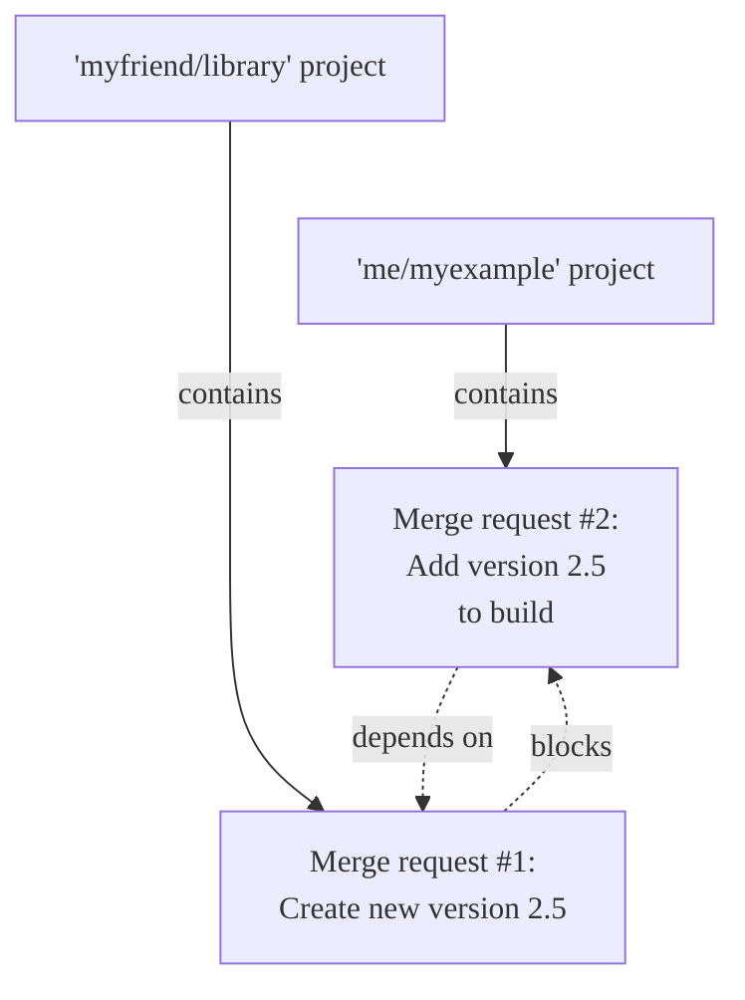
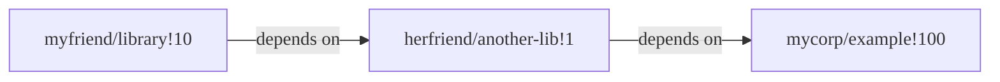



- プラン: Premium、Ultimate
- 提供形態: GitLab.com、GitLab Self-Managed、GitLab Dedicated





- GitLab 16.6で、複雑なマージ依存関係のサポートが[導入](https://gitlab.com/gitlab-org/gitlab/-/issues/11393)され、`remove_mr_blocking_constraints`という名前の[フラグ](../../../administration/feature_flags/_index.md)が追加されました。デフォルトでは無効になっています。
- GitLab 16.7で、複雑なマージ依存関係のサポートが[一般提供](https://gitlab.com/gitlab-org/gitlab/-/merge_requests/136775)されました。機能フラグ`remove_mr_blocking_constraints`は削除されました。



単一の機能が複数のマージリクエストにまたがり、複数のプロジェクトに分散することがあり、作業がマージされる順序は重要になる場合があります。マージリクエスト依存関係を設定すると、**Merge request dependencies must be merged**のマージチェックが満たされるまで、依存するマージリクエストはマージできません。

マージリクエストの依存関係は、以下の点で役立ちます:

- 必須ライブラリへの変更が、そのライブラリをインポートするプロジェクトへの変更よりも先にマージされるようにします。
- ドキュメントのみのマージリクエストが、機能の作業自体がマージされる前にマージされるのを防ぎます。
- 権限マトリックスを更新するマージリクエストをマージするよう要求し、正しい権限をまだ持っていないユーザーからの作業がマージされるのを防ぎます。

プロジェクト`me/myexample`が`myfriend/library`からライブラリをインポートしている場合、`myfriend/library`が新しい機能をリリースしたらプロジェクトを更新する必要があります。`myfriend/library`が新しい機能を追加する前に、`me/myexample`への変更をマージすると、プロジェクトのデフォルトブランチが破損します。マージリクエスト依存関係により、作業が早すぎるタイミングでマージされるのを防ぎます:

`me/myexample`マージリクエストを[ドラフト](drafts.md)としてマークし、コメントでその理由を説明することができます。このアプローチは手動であり、特にマージリクエストが異なるプロジェクトの他のいくつかのマージリクエストに依存している場合、スケールしません。代わりに、次のことを行う必要があります:

- 個々のマージリクエストの準備状況を**ドラフト**または**準備完了**ステータスで追跡する。
- マージリクエスト依存関係を使用して、マージリクエストがマージされる順序を強制します。

マージリクエストの依存関係はGitLab Premiumの機能ですが、GitLabはこの制限を依存するマージリクエストにのみ適用します:

- GitLab Premiumプロジェクトのマージリクエストは、GitLab Freeプロジェクトであっても、他のどのマージリクエストにも依存できます。
- GitLab Freeプロジェクトのマージリクエストは、他のマージリクエストに依存できません。

## ネストされた依存関係 {#nested-dependencies}

GitLabバージョン16.7以降では、間接的なネストされた依存関係がサポートされます。マージリクエストは最大10個のブロッカーを持つことができ、そのマージリクエストは最大10個の他のマージリクエストをブロックできます。この例では、`myfriend/library!10`は`herfriend/another-lib!1`に依存し、それがさらに`mycorp/example!100`に依存しています:

ネストされた依存関係はGitLab UIには表示されませんが、UIサポートは[エピック5308](https://gitlab.com/groups/gitlab-org/-/epics/5308)で提案されています。

> [!note]
> マージリクエストはそれ自体に依存することはできませんが（自己参照）、循環依存関係を作成することは可能です。

## マージリクエストの依存関係を表示する {#view-dependencies-for-a-merge-request}

マージリクエストが別のマージリクエストに依存している場合、マージリクエストのレポートセクションにはその依存関係に関する情報が表示されます:

マージリクエストの依存関係情報を表示するには:

1. 上部のバーで、**検索または移動先**を選択して、プロジェクトを見つけます。
1. 左サイドバーで、**コード** > **マージリクエスト**を選択し、目的のマージリクエストを特定します。
1. マージリクエストレポート領域までスクロールします。依存するマージリクエストには、**マージされる 1 個 のマージリクエストに依存**のように、設定されている依存関係の総数に関する情報が表示されます。
1. **全て展開**を選択して、各依存関係のタイトル、マイルストーン、割り当て先、およびパイプラインステータスを表示します。

マージリクエストの依存関係がすべてマージされるまで、自分のマージリクエストはマージできません。

### クローズされたマージリクエスト {#closed-merge-requests}

クローズされたマージリクエストは、その計画された作業をマージせずにクローズできるため、依然として依存するマージリクエストのマージを妨げます。マージリクエストがクローズされ、その依存関係が関連しなくなった場合、その依存関係を削除して、依存するマージリクエストのブロックを解除します。

## 新しい依存するマージリクエストを作成する {#create-a-new-dependent-merge-request}

新しいマージリクエストを作成する際、他の特定の作業がマージされるまで、そのマージリクエストがマージされるのを防ぐことができます。この依存関係は、マージリクエストが別のプロジェクトにある場合でも機能します。

前提条件: 

- デベロッパー、メンテナー、またはオーナーのロールを持っているか、プロジェクトでマージリクエストを作成する権限を持っている必要があります。
- 依存するマージリクエストは、PremiumまたはUltimateプランのプロジェクトにある必要があります。

新しいマージリクエストを作成し、それを別のマージリクエストに依存するものとしてマークするには:

1. [新しいマージリクエストを作成します](creating_merge_requests.md)。
1. **マージリクエストの依存関係**に、この作業がマージされる前にマージされるべきマージリクエストへの参照または完全なURLを貼り付けます。参照は`path/to/project!merge_request_id`の形式です。
1. **マージリクエストを作成**を選択します。

## マージリクエストを編集して依存関係を追加する {#edit-a-merge-request-to-add-a-dependency}

既存のマージリクエストを編集し、それを別のマージリクエストに依存するものとしてマークすることができます。

前提条件: 

- デベロッパー、メンテナー、またはオーナーのロールを持っているか、プロジェクトでマージリクエストを編集する権限を持っている必要があります。

これを行うには、次の手順を実行します:

1. 上部のバーで、**検索または移動先**を選択して、プロジェクトを見つけます。
1. 左サイドバーで、**コード** > **マージリクエスト**を選択し、目的のマージリクエストを特定します。
1. **編集**を選択します。
1. **マージリクエストの依存関係**に、この作業がマージされる前にマージされるべきマージリクエストへの参照または完全なURLを貼り付けます。参照は`path/to/project!merge_request_id`の形式です。

## マージリクエストから依存関係を削除する {#remove-a-dependency-from-a-merge-request}

依存するマージリクエストを編集し、依存関係を削除することができます。

前提条件: 

- プロジェクトでマージリクエストを編集できるロールを持っている必要があります。

1. 上部のバーで、**検索または移動先**を選択して、プロジェクトを見つけます。
1. 左サイドバーで、**コード** > **マージリクエスト**を選択し、目的のマージリクエストを特定します。
1. **編集**を選択します。
1. **マージリクエストの依存関係**までスクロールし、削除したい各依存関係の参照の横にある**削除**を選択します。

   > [!note]
   > 表示する権限のないマージリクエストの依存関係は **1 inaccessible merge request** として表示されます。依存関係は引き続き削除できます。

1. **変更を保存**を選択します。

## トラブルシューティング {#troubleshooting}

### プロジェクトのインポートまたはエクスポート時の依存関係を保持する {#preserve-dependencies-on-project-import-or-export}

プロジェクトをインポートまたはエクスポートする際、依存関係は保持されません。詳細については、[イシュー #12549](https://gitlab.com/gitlab-org/gitlab/-/issues/12549)を参照してください。
