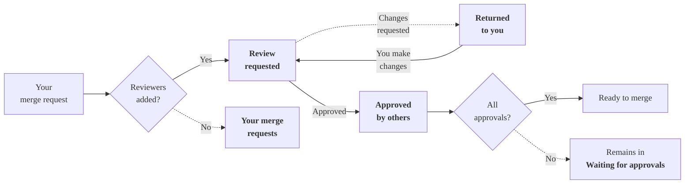



- プラン: Free、Premium、Ultimate
- 提供形態: GitLab.com、GitLab Self-Managed、GitLab Dedicated



マージリクエストの作成者、担当者、またはレビュアーである場合、それはあなたのマージリクエストホームページに表示されます。このページでは、あなたのマージリクエストを**ワークフロー**または**ロール**でソートします。**ワークフロー**ビューには、自分の作業か他人の作業かに関わらず、最初に注意が必要なマージリクエストが表示されます。ワークフロービューは、このレビュープロセスにおけるマージリクエストをそのステージごとにグループ化します:

このレビューフローは、レビュアーが**レビューを開始**および**レビューを送信**機能を使用することを前提としています。

**ロール**ビューは、マージリクエストにおけるあなたのロールによってマージリクエストをソートします。

## あなたのマージリクエストホームページを見る {#see-your-merge-request-homepage}



- マージリクエストホームページはGitLab 17.9で[導入](https://gitlab.com/groups/gitlab-org/-/epics/13448)され、`merge_request_dashboard`という名前の[フラグ](../../../administration/feature_flags/_index.md)が付いています。デフォルトでは無効になっています。
- 機能フラグ`merge_request_dashboard`は、GitLab 17.9でGitLab.com上で[有効化](https://gitlab.com/gitlab-org/gitlab/-/issues/480854)されました。
- 機能フラグ`mr_dashboard_list_type_toggle`は、GitLab 18.1でGitLab.com向けに[有効化](https://gitlab.com/gitlab-org/gitlab/-/issues/535244)されました。
- 機能フラグ`merge_request_dashboard`は、GitLab 18.2で[デフォルトで有効化](https://gitlab.com/gitlab-org/gitlab/-/merge_requests/194999)されました。



> [!flag]
> この機能の利用可能性は機能フラグによって制御されます。詳細については、履歴を参照してください。

GitLabは、すべてのページ右上隅に**アクティブ**なマージリクエストの合計数を表示します。例えば、このユーザーには以下があります:

このユーザーには以下があります:

- 8件の未解決イシュー ()
- 3件のアクティブなマージリクエスト ()
- 6件のTo-Doアイテム ()

あなたのマージリクエストホームページには、これらのマージリクエストに関する詳細情報が表示されます。これを見るには、次のいずれかの方法を使用します:

- <kbd>Shift</kbd>+<kbd>m</kbd>の[キーボードショートカット](../../shortcuts.md)を使用してください。
- 左サイドバーで、**マージリクエスト** () を選択します。
- トップバーで**検索または移動先**を選択し、ドロップダウンリストから**マージリクエスト**を選択します。

今すぐ注意が必要なものに集中できるように、GitLabはマージリクエストホームページを3つのタブに整理しています:

- **アクティブ**: これらのマージリクエストには、あなたまたはあなたのチームのメンバーからの注意が必要です。
- **マージ済み**: これらのマージリクエストは、過去14日間にマージされました。これらはあなたの作業であるか、あなたからのレビューを含んでいます。
- **検索**: すべてのマージリクエストを検索し、必要に応じてフィルターします。

- **状態**: マージリクエストの現在のステータス。
- **タイトル**: イシューに関する重要なメタデータ。以下を含む:
  - マージリクエストのタイトル。
  - 担当者のアバター。
  - 追加および削除されたファイルと行の数 (`+` / `-`)。
  - マイルストーン。
- **作成者**: 作成者のアバター。
- **レビュアー**: レビュアーのアバター。緑色のチェックマークが付いているレビュアーは、マージリクエストを承認済みです。
- **チェック**: マージ可能性の簡潔な評価。
  - マージコンフリクトが存在する場合の警告 ()。
  - 未解決のスレッド数 (`0 of 3`など)。
  - 現在必要な[承認ステータス](approvals/_index.md#in-the-list-of-merge-requests)。
  - 最新のパイプラインステータス。
  - 最終更新日。

### 表示設定を行う {#set-your-display-preferences}



- **ドラフトを表示**設定はGitLab 18.6で[導入](https://gitlab.com/gitlab-org/gitlab/-/issues/551475)されました。



マージリクエストホームページの右上隅で、**Display preferences** () を選択します:

- 各マージリクエストのラベルを表示または非表示にするには、**ラベルを表示**を切替ます。
- ソート設定: **ワークフロー**または**ロール**。
  - **ワークフロー**は、マージリクエストをそのステータスでグループ化します。あなたが作成者であるかレビュアーであるかに関わらず、GitLabはあなたの注意を最初に必要とするマージリクエストを表示します。
  - **ロール**は、あなたがレビュアーであるか作成者であるかによってマージリクエストをグループ化します。
- **ドラフトを表示**を切替て、**マージリクエスト**リストからドラフトマージリクエストを表示または非表示にします。

アクティブなマージリクエストは、左サイドバーに表示される合計数にカウントされます。GitLabは、**非アクティブ**なマージリクエストをあなたのレビュー数から除外します。

### ワークフロービュー: アクティブなステータス {#workflow-view-active-statuses}

これらのマージリクエストには、あなたの注意が必要です。これらは左サイドバーに表示される合計数にカウントされます:

- **マージリクエスト**: あなたはマージリクエストの作成者または担当者です。レビュアーを追加して、レビュープロセスを開始します。ステータス:
  - **ドラフト**: マージリクエストはドラフトです。
  - **レビュアーが必要**: マージリクエストはドラフトではありませんが、レビュアーがいません。
- **リクエストしたレビュー**: あなたはレビュアーです。マージリクエストをレビューします。フィードバックを提供します。オプションで、承認または変更をリクエストします。ステータス:
  - **変更リクエスト済み**: レビュアーが変更をリクエストしました。変更リクエストはマージリクエストをブロックしますが、[バイパスすることができます](reviews/_index.md#bypass-a-request-for-changes)。
  - **レビュアーがコメント**: レビュアーがコメントを残しましたが、変更はリクエストしていません。
- **返却されました**: レビュアーがフィードバックを提供するか、変更をリクエストしました。レビュアーのコメントに対応し、提案された変更を適用します。ステータス:
  - **変更リクエスト済み**: レビュアーが変更をリクエストしました。
  - **レビュアーがコメント**: レビュアーがコメントを残しましたが、変更はリクエストしていません。

### ワークフロービュー: 非アクティブなステータス {#workflow-view-inactive-statuses}

GitLabは、現在あなたからのアクションが不要であるため、これらのマージリクエストをアクティブな数から除外します:

- **Waiting for assignee**: あなたが作成者の場合、マージリクエストはレビュー待ちです。あなたがレビュアーの場合、変更をリクエストしました。ステータス:
  - **変更をリクエストしました**: あなたはレビューを完了し、変更をリクエストしました。
  - **コメント済み**: あなたはコメントしましたが、レビューは完了していません。
- **承認待ち**: 割り当てられたマージリクエストは承認待ちであり、あなたが変更をリクエストしたレビューも承認待ちです。ステータス:
  - **承認が必要**: 残りの必要な承認数。
  - **承認済み**: あなたが承認したか、またはすべての必要な承認が満たされています。
  - **承認待ち**。
- **あなたにより承認済み**: あなたがレビューし、承認したマージリクエスト。ステータス:
  - **承認済み**: あなたが承認し、必要な承認が満たされています。
  - **承認が必要**: あなたは承認しましたが、必要なすべての承認が満たされていません。
- **他の人により承認済み**: 他のチームメンバーから承認を受けたマージリクエスト。すべての要件が満たされていれば、マージの準備ができています。ステータス:
  - **承認済み**: あなたのマージリクエストは必要な承認を受けました。

### ロールビュー {#role-view}

**ロール**ビューは、あなたが担当者またはレビュアーであるマージリクエストをグループ化します:

- **Reviewer (Active)**: あなたからのレビュー待ち。
- **Reviewer (Inactive)**: あなたによってすでにレビューされました。
- **Your merge requests (Active)**
- **Your merge requests (Inactive)**

**アクティブ**リストのマージリクエストは、左サイドバーに表示される合計数にカウントされます。

## 関連トピック {#related-topics}

- [マージリクエストのレビュー](reviews/_index.md)
