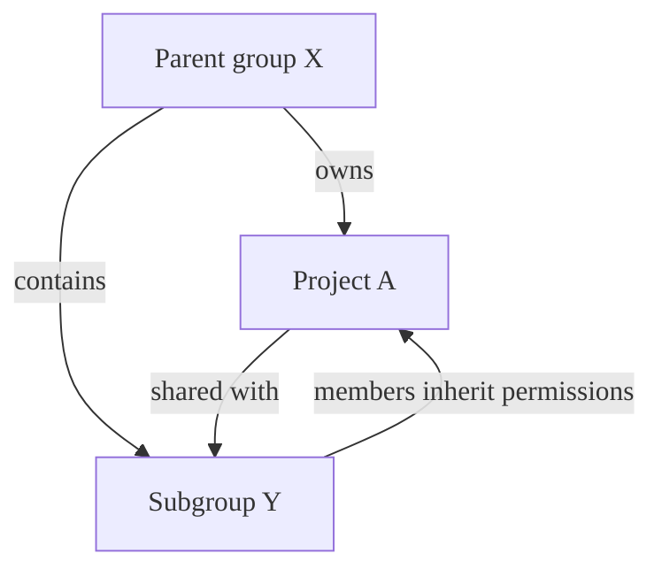
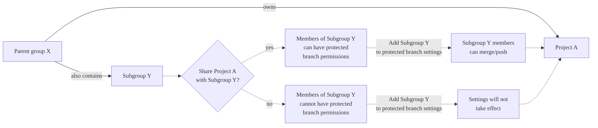



- プラン: Free、Premium、Ultimate
- 提供形態: GitLab.com、GitLab Self-Managed、GitLab Dedicated



> [!note]
> プロジェクトの**保護ブランチ**設定は削除されます。**設定** > **リポジトリ** > **ブランチルール**から保護ブランチを設定してください。

保護ブランチは、GitLabのブランチに特定の権限を適用して、codeコードの安定性と品質を確保します。保護ブランチは次のことを行います。

- コードの変更をマージおよびプッシュできるユーザーを制御します。
- 重要なブランチが誤って削除されないようにします。
- コードレビューと承認プロセスを適用します。
- コードオーナーの承認要件を管理します。
- 強制プッシュ権限を規制して、コミット履歴を維持します。
- UIと保護ブランチAPIの両方でアクセスを制御します。

> [!note]
> リポジトリのデフォルトブランチはデフォルトで保護されています。デフォルトブランチの設定に関する詳細については、[デフォルトブランチ](default.md)を参照してください。

ブランチが複数のルールに一致する場合や、複雑な権限要件を持つ場合の保護ルール動作に関する詳細については、[保護ルール](protection_rules.md)を参照してください。

## ブランチを保護する {#protect-a-branch}

グループ内の個々のプロジェクトまたはすべてのプロジェクトに対して保護ブランチを設定します。

> [!note]
> グループルールはプロジェクト内で変更できませんが、プロジェクトのメンテナーは同じブランチ名に対して個別のルールを作成できます。両方のルールが同じブランチに適用される場合、GitLabはすべての一致するルールをまとめて評価し、ほとんどの設定で最も許容度の高い結果を適用します。詳細については、[グループとプロジェクト間のルール](protection_rules.md#rules-across-groups-and-projects)を参照してください。

### プロジェクト内 {#in-a-project}

前提条件: 

- メンテナーまたはオーナーのロールを持っている必要があります。
- グループに、保護ブランチに対する**マージを許可する**または**プッシュとマージを許可する**権限を付与する際、プロジェクトはアクセス可能であり、グループと共有されている必要があります。詳細については、[共有プロジェクト](../../members/sharing_projects_groups.md)を参照してください。

ブランチを保護するには:

1. 上部のバーで、**検索または移動先**を選択して、プロジェクトを見つけます。
1. **設定** > **リポジトリ**を選択します。
1. **ブランチルール**を展開します。
1. **ブランチルールの追加** > **ブランチ名またはパターン**を選択します。
1. ドロップダウンリストから、保護したいブランチを検索して選択します。
1. **ブランチルールの詳細**ページを表示するには、**ブランチルールの作成**を選択します。
1. **ブランチの保護**セクションから、次のいずれかのオプションを選択します:
   - **マージを許可**から**編集**を選択します。
     1. このブランチにマージできるロールを選択します。
     1. **変更を保存**を選択します。
   - **プッシュとマージを許可**から**編集**を選択します。
     1. このブランチにプッシュできるロールを選択します。
     1. オプション。**デプロイキー**を検索して選択します。
     1. **変更を保存**を選択します。

> [!note]
> PremiumとUltimateでは、グループまたは個々のユーザーを**マージを許可**と**プッシュとマージを許可**に追加することもできます。

### グループ内 {#in-a-group}



- プラン: Premium、Ultimate
- 提供形態: GitLab.com、GitLab Self-Managed、GitLab Dedicated





- GitLab 17.6[で一般提供](https://gitlab.com/gitlab-org/gitlab/-/issues/500250)になりました。機能フラグ`group_protected_branches`は削除されました。



グループオーナーは、グループの保護ブランチを作成できます。これらの設定はグループ内のすべてのプロジェクトに適用され、プロジェクトでは変更できません。

前提条件: 

- グループのオーナーロールを持っている必要があります。
- このグループはトップレベルグループである必要があります。サブグループはサポートされていません。

グループ内のすべてのプロジェクトでブランチを保護するには:

1. 上部のバーで、**検索または移動先**を選択して、グループを見つけます。
1. **設定** > **リポジトリ**を選択します。
1. **保護ブランチ**を展開します。
1. **保護ブランチを追加する**を選択します。
1. **ブランチ**テキストボックスに、ブランチ名または[ワイルドカード](#use-wildcard-rules) (`*`) を入力します。ブランチ名とワイルドカードは、大文字と小文字を区別します。
1. **マージを許可する**リストから、このブランチにマージできるロールを選択します。
1. **プッシュとマージを許可する**リストから、このブランチにプッシュできるロールを選択します。
1. **強制プッシュを許可**と**コードオーナーの承認が必要**の設定を選択します。
1. **保護**を選択します。

## プッシュとマージの権限 {#push-and-merge-permissions}

**マージを許可**と**プッシュとマージを許可**の設定は、ブランチ保護のさまざまな側面を制御します:

| 設定                       | 目的                                                                                                        | デフォルトの動作（未設定） |
|-------------------------------|----------------------------------------------------------------------------------------------------------------|-----------------------------------|
| **マージを許可する**          | マージリクエストを介して変更をマージし、UIとAPIを介して新しい保護ブランチを作成できるユーザーを制御します。 | 誰もマージできません（**プッシュとマージを許可**の権限を持つ場合を除く）。 |
| **プッシュとマージを許可する** | 既存の保護ブランチに直接プッシュし、マージリクエストを介してマージできるユーザーを制御します。                 | 誰もプッシュできません。                  |

> [!note]
> **プッシュとマージを許可**は、プッシュとマージの両方の機能を与えます。この権限を持つユーザーは、**マージを許可**の権限がなくても、マージリクエストを介してマージできます。

**なし**を**マージを許可**または**プッシュとマージを許可**のいずれかに選択すると、UIは他のロール選択をクリアします。この動作は、複数のアクセスレベルを同時に設定できるAPIとは異なります。APIの動作に関する詳細については、[保護ブランチAPI](../../../../api/protected_branches.md)を参照してください。

### ブランチタイプ別の保護戦略 {#protection-strategies-by-branch-types}

異なるブランチタイプは、その目的とセキュリティ要件に基づいて、異なる保護レベルを必要とします。

本番環境にデプロイされるブランチの場合:

- **マージを許可**を**メンテナー**のみに設定します。
- **プッシュとマージを許可**を**なし** （空ではない）に設定します。
- **コードオーナーの承認が必要**を有効にします。
- 複数の承認を要求することを検討します。

この設定では、すべての変更に対してメンテナーの承認を伴うマージリクエストが必要です。

アクティブな開発ブランチの場合:

- **マージを許可**を**デベロッパー + メンテナー**に設定します。
- **プッシュとマージを許可**を**なし** （空ではない）に設定します。

この設定により、デベロッパーは承認されたマージリクエストをマージでき、すべての変更にコードレビューが必要となります。

> [!note]
> **プッシュとマージを許可**が設定されていない場合、プッシュアクセスは制限されません。直接プッシュを防ぐには、**プッシュとマージを許可**を明示的に**なし**に設定する必要があります。

### デベロッパーロールの権限の組み合わせ {#permission-combinations-for-developer-role}

以下の例は、デベロッパーロールを持つユーザーが、さまざまな保護設定で何ができるかを示しています:

| マージを許可する         | プッシュとマージを許可する | 直接プッシュ | MRを介したマージ |
|--------------------------|---------------------------|-------------|------------------|
| なし                   | デベロッパー + メンテナー  |  |       |
| Not configured           | デベロッパー + メンテナー  |  |       |
| デベロッパー + メンテナー | Not configured            |   |       |
| Not configured           | Not configured            |   |        |
| メンテナー              | Not configured            |   |        |
| メンテナー              | メンテナー               |   |        |
| デベロッパー + メンテナー | メンテナー               |   |       |

## デフォルトのブランチ保護設定 {#default-branch-protection-settings}

管理者は、**管理者**エリアで[デフォルトのブランチ保護レベルを設定](default.md#for-all-projects-in-an-instance)できます。

## ワイルドカードルールを使用する {#use-wildcard-rules}

ワイルドカードを使用すると、複数のルールを1つのブランチに適用できます。複数のルールがブランチに適用される場合、最も寛容なルールがブランチの動作を制御します。適切にマージ制御を行うには、**マージを許可する**よりも広範なユーザーセットに対して**プッシュとマージを許可する**を設定します。

前提条件: 

- メンテナーまたはオーナーのロールを持っている必要があります。

複数のブランチを同時に保護するには:

1. 上部のバーで、**検索または移動先**を選択して、プロジェクトを見つけます。
1. **設定** > **リポジトリ**を選択します。
1. **ブランチルール**を展開します。
1. **ブランチルールの追加** > **ブランチ名またはパターン**を選択します。
1. ドロップダウンリストから、ブランチ名とワイルドカード (`*`) を入力します。ブランチ名とワイルドカードは、大文字と小文字を区別します。例: 

   | ワイルドカード保護ブランチ | 一致するブランチ                                      |
   |---------------------------|--------------------------------------------------------|
   | `*-stable`                | `production-stable`、`staging-stable`                  |
   | `production/*`            | `production/app-server`、`production/load-balancer`    |
   | `*gitlab*`                | `gitlab`、`gitlab/staging`、`master/gitlab/production` |

1. **ワイルドカードの作成**を選択します。
1. **ブランチルールの作成**を選択します。**ブランチルールの詳細**ページに移動します。
1. **ブランチの保護**セクションから、次のいずれかのオプションを選択します:
   - **マージを許可**から**編集**を選択します。
     1. このブランチにマージできるロールを選択します。
     1. **変更を保存**を選択します。
   - **プッシュとマージを許可**から**編集**を選択します。
     1. このブランチにマージできるロールを選択します。
     1. 必要に応じて、**デプロイキー**を検索して追加します。
     1. **変更を保存**を選択します。

## 保護オプションを設定する {#configure-protection-options}

さまざまな保護オプションを設定して、ブランチを保護することができます。

### マージリクエストを要求する {#require-merge-requests}

保護ブランチへの直接チェックインを許可するのではなく、すべてのユーザーにマージリクエストの送信を強制できます。

1. 上部のバーで、**検索または移動先**を選択して、プロジェクトを見つけます。
1. **設定** > **リポジトリ**を選択します。
1. **ブランチルール**を展開します。
1. あなたのブランチの隣にある**詳細を表示**を選択します。
1. **マージを許可**セクションから**編集**を選択します。
1. **デベロッパー + メンテナー**を選択します。
1. **変更を保存**を選択します。
1. **プッシュとマージを許可**セクションから**なし**を選択します。
1. **変更を保存**を選択します。

### 直接プッシュを許可する {#allow-direct-push}

書き込みアクセス権を持つ全員が保護ブランチに直接プッシュできるようにすることができます。

1. 上部のバーで、**検索または移動先**を選択して、プロジェクトを見つけます。
1. **設定** > **リポジトリ**を選択します。
1. **ブランチルール**を展開します。
1. あなたのブランチの隣にある**詳細を表示**を選択します。
1. **プッシュとマージを許可**セクションから**デベロッパー + メンテナー**を選択します。
1. **変更を保存**を選択します。

### グループ権限を使用する {#with-group-permissions}



- プラン: Premium、Ultimate
- 提供形態: GitLab.com、GitLab Self-Managed、GitLab Dedicated



保護ブランチに対してグループまたはサブグループのメンバーを**マージを許可する**または**プッシュとマージを許可する**として設定するには:

1. 上部のバーで、**検索または移動先**を選択して、プロジェクトを見つけます。
1. **設定** > **リポジトリ**を選択します。
1. **ブランチルール**を展開します。
1. あなたのブランチの隣にある**詳細を表示**を選択します。
1. **マージを許可**または**プッシュとマージを許可**セクションで**編集**を選択します。
1. **グループ**で、追加するグループを検索します。例: 

   ```plaintext
   # Allow group members to merge into this branch
   Allowed to merge: @group-x

   # Allow group members to push and merge into this branch
   Allowed to push and merge: @group-x/subgroup-y
   ```

1. **変更を保存**を選択します。

> [!note]
> 保護ブランチにグループを割り当てた場合、そのグループの直接メンバーのみが含まれます。親グループのメンバーに保護ブランチへの権限が自動的に付与されることはありません。

#### グループの継承要件 {#group-inheritance-requirements}



この例では:

- 親グループX（`group-x`）はプロジェクトAを所有しています。
- 親グループXには、サブグループ、サブグループY（`group-x/subgroup-y`）も含まれています。
- プロジェクトAはサブグループYと共有されています。

保護ブランチ権限の対象となるグループは、次のようになります。

- プロジェクトA: グループXとサブグループYの両方（プロジェクトAがサブグループYと共有されているため）。

#### グループとプロジェクトを共有する {#share-projects-with-groups}

プロジェクトをグループまたはサブグループと共有して、そのメンバーを保護ブランチ権限の対象にできます。



プロジェクトAのサブグループYメンバーにアクセス権を付与するには、プロジェクトをサブグループと共有する必要があります。サブグループを保護ブランチ設定に直接追加しても効果はなく、サブグループメンバーには適用されません。

> [!note]
> グループが保護ブランチの権限を持つには、プロジェクトがグループと直接共有されている必要があります。親グループから継承されたプロジェクトメンバーシップは、保護ブランチ権限に対して不十分です。

### デプロイキーアクセスを有効にする {#enable-deploy-key-access}

[デプロイキー](../../deploy_keys/_index.md)を使用して保護ブランチにプッシュできます。

前提条件: 

- デプロイキーがプロジェクトに対して有効である必要があります。プロジェクトのデプロイキーは、作成時にデフォルトで有効になっています。ただし、パブリックなデプロイキーには、プロジェクトへのアクセスが許可されている必要があります。
- そのデプロイキーには、プロジェクトリポジトリへの書き込みアクセス権限が必要です。
- デプロイキーのオーナーは、プロジェクトへの読み取りアクセス権以上を持っている必要があります。
- デプロイキーのオーナーはプロジェクトのメンバーでもある必要があります。

デプロイキーが保護ブランチにプッシュできるようにするには:

1. 上部のバーで、**検索または移動先**を選択して、プロジェクトを見つけます。
1. **設定** > **リポジトリ**を選択します。
1. **ブランチルール**を展開します。
1. あなたのブランチの隣にある**詳細を表示**を選択します。
1. **プッシュとマージを許可**セクションから**編集**を選択します。
1. **デプロイキー**で、デプロイキーを検索して追加します。
1. **変更を保存**を選択します。

デプロイキーは、**マージを許可する**ドロップダウンリストにありません。

### 強制プッシュを許可する {#allow-force-push}

保護ブランチへの[強制プッシュ](../../../../topics/git/git_rebase.md#force-push-to-a-remote-branch)を許可できます。

ブランチを保護し、強制プッシュを有効にするには:

1. 上部のバーで、**検索または移動先**を選択して、プロジェクトを見つけます。
1. **設定** > **リポジトリ**を選択します。
1. **ブランチルール**を展開します。
1. **ブランチルールの追加** > **ブランチ名またはパターン**を選択します。
1. ドロップダウンリストから、保護し強制プッシュを有効にしたいブランチを検索して選択します。
1. **ブランチルールの作成**を選択します。**ブランチルールの詳細**ページに移動します。
1. **プッシュとマージを許可**と**マージを許可**セクションから、希望の設定を選択します。
1. **変更を保存**を選択します。
1. プッシュアクセスを持つすべてのユーザーに強制プッシュを許可するには、**強制プッシュを許可する**切替をオンにします。

すでに保護されているブランチで強制プッシュを有効にするには、次の手順に従います。

1. 上部のバーで、**検索または移動先**を選択して、プロジェクトを見つけます。
1. **設定** > **リポジトリ**を選択します。
1. **ブランチルール**を展開します。
1. あなたのブランチの隣にある**詳細を表示**を選択します。
1. **強制プッシュを許可**切替をオンにします。

### コードオーナー承認を要求する {#require-code-owner-approval}



- プラン: Premium、Ultimate
- 提供形態: GitLab.com、GitLab Self-Managed、GitLab Dedicated



保護ブランチの場合、少なくとも1つの[コードオーナー](../../codeowners/_index.md)による承認を要求できます。複数のルールによってブランチが保護されている場合、**Required approval from code owners**が有効であれば、コードオーナーの承認が必要です。

新しいブランチを保護して、コードオーナーの承認を有効にするには:

1. 上部のバーで、**検索または移動先**を選択して、プロジェクトを見つけます。
1. **設定** > **リポジトリ**を選択します。
1. **ブランチルール**を展開します。
1. **ブランチルールの追加** > **ブランチ名またはパターン**を選択します。
1. ドロップダウンリストから、保護し強制プッシュを有効にしたいブランチを検索して選択します。
1. **ブランチルールの作成**を選択します。**ブランチルールの詳細**ページに移動します。
1. **プッシュとマージを許可**と**マージを許可**セクションから、希望の設定を選択します。
1. **変更を保存**を選択します。
1. **コードオーナーの承認が必要**切替をオンにします。

すでに保護されているブランチでコードオーナーの承認を有効にするには:

1. 上部のバーで、**検索または移動先**を選択して、プロジェクトを見つけます。
1. **設定** > **リポジトリ**を選択します。
1. **ブランチルール**を展開します。
1. あなたのブランチの隣にある**詳細を表示**を選択します。
1. **コードオーナーの承認**切替をオンにします。

有効にすると、これらのブランチに対するすべてのマージリクエストで、マージされる前に、一致するルールごとにコードオーナーによる承認が必要になります。さらに、ルールが一致した場合、保護ブランチへの直接プッシュは拒否されます。

`CODEOWNERS`ファイルで指定されていないユーザーは、特に許可されていない限り、指定されたファイルまたはパスの変更をプッシュできません。デベロッパーが保護ブランチに直接プッシュすることを制限する必要はありません。代わりに、コードオーナーによるレビューが必要な特定のファイルへのプッシュは制限できます。

保護ブランチにプッシュすることを許可されたユーザーとグループは、フィーチャーブランチをマージするためにマージリクエストを必要としません。したがって、マージリクエストの承認ルール（コードオーナーを含む）をスキップできます。

### ブランチの保護を解除できるユーザーを制御する {#control-who-can-unprotect-branches}



- プラン: Premium、Ultimate
- 提供形態: GitLab.com、GitLab Self-Managed、GitLab Dedicated



ブランチを保護する場合、後でその保護を解除できるユーザーも制御できます。デフォルトでは、メンテナーまたはオーナーロールを持つユーザーは、保護ブランチの保護を解除できます。

規制またはコンプライアンス要件を持つ組織の場合、これらの権限を特定のユーザー、グループ、またはアクセスレベルに制限できます。

> [!note]
> ブランチの保護設定が永続的にロックされるのを避けるため、少なくとも1人のユーザーまたはグループが常にそのブランチの保護解除権限を保持していることを確認してください。
>
> ユーザーは、自身でブランチの保護を解除できない限り、保護ブランチの設定を作成、変更、または削除することはできません。この安全機構は、設定エラーを防ぐために設けられています。

これらの権限はAPIを介してのみ設定できます。この機能は、次の目的で使用します:

- 規制コンプライアンス: 承認された担当者のみがブランチ保護を変更できることを確認します。
- 大規模組織: 複数のリポジトリ間での誤った保護の削除を防ぎます。
- 自動ガバナンス: 開発チームがオーバーライドできない、管理者専用の保護を作成するスクリプトを有効にします。

保護解除権限に関する有効なアクセスレベルと制約については、[有効なアクセスレベル](../../../../api/protected_branches.md#valid-access-levels)を参照してください。

#### 保護解除権限 {#unprotect-permissions}

以下の表は、設定に基づいてブランチの保護を解除できるユーザーを示しています:

| 設定                     | 保護を解除できるユーザー |
|-----------------------------------|-------------------|
| デフォルトの動作                  | メンテナーまたはオーナーロールを持つユーザー |
| 特定のユーザーが設定         | 指定されたユーザーのみ |
| 特定のグループが設定        | 指定されたグループのメンバーのみ |
| 複数のアクセスレベルが設定 | 設定されたアクセスレベルからの任意のユーザー、グループ、またはロール |

## 保護ブランチでのCI/CD {#cicd-on-protected-branches}

保護ブランチへのマージまたはプッシュの権限により、ユーザーがCI/CDパイプラインを実行し、ジョブでアクションを実行できるかどうかが定義されます。

マージリクエストパイプラインは、ソースブランチまたはソースブランチに基づくマージリクエスト参照で実行されます。ユーザーがソースブランチへのマージまたはプッシュ権限を持っていない場合、パイプラインは作成されません。

保護ブランチ間のマージリクエストの場合、ユーザーがソースとターゲットブランチの両方を更新する権限を持っていれば、保護された変数とRunnerがパイプラインで利用できます。詳細については、[保護された変数とRunnerへのアクセスを制御する](../../../../ci/pipelines/merge_request_pipelines.md#control-access-to-protected-variables-and-runners)を参照してください。

## 保護ブランチを作成する {#create-protected-branches}

前提条件: 

- デベロッパー、メンテナー、またはオーナーロールが必要です。
- 保護ブランチを作成するには、[保護ブランチにマージリクエストを送信することを全員に要求する](#require-merge-requests)ようにブランチ保護を設定する必要があります。

保護付きの新しいブランチを作成するには、次の手順に従います。

1. 上部のバーで、**検索または移動先**を選択して、プロジェクトを見つけます。
1. 左サイドバーで**コード** > **ブランチ**を選択します。
1. **新しいブランチ**を選択します。
1. ブランチ名を入力し、新しいブランチのベースにする既存のブランチ、タグ、またはコミットを選択します。保護ブランチに対してすべてのユーザーにマージリクエストの提出を要求する場合、既存の保護ブランチと、すでに保護ブランチ内にあるコミットのみが受け入れられます。

ブランチを保護して作成するために、ブランチAPIを使用することもできます。

ブランチ保護が[全員が保護ブランチに直接プッシュできるように](#allow-direct-push)設定されている場合、コマンドラインまたはGitクライアントアプリケーションから保護されたブランチを作成することもできます。

## 保護ブランチを削除する {#delete-protected-branches}

メンテナーまたはオーナーロールを持つユーザーは、GitLabのウェブインターフェースを使用して保護ブランチを手動で削除できます:

1. 上部のバーで、**検索または移動先**を選択して、プロジェクトを見つけます。
1. 左サイドバーで**コード** > **ブランチ**を選択します。
1. 削除したいブランチの隣にある**追加のアクション** () を選択します。
1. **保護ブランチを削除**を選択します。
1. 確認ダイアログでブランチ名を入力し、**はい、保護ブランチを削除します**を選択します。ブランチ名では、大文字と小文字が区別されます。

GitLab UIまたはAPIを使用してのみ保護ブランチを削除できます。ローカルのGitコマンドまたはサードパーティのGitクライアントで保護ブランチを削除することはできません。

## ポリシーの実施 {#policy-enforcement}

セキュリティとコンプライアンスのために、[マージリクエスト承認ポリシー](../../../application_security/policies/merge_request_approval_policies.md#approval_settings)を実装する場合があります。この場合、インスタンス、グループ、またはプロジェクトで別途定義されている設定に影響を与える可能性があります。ポリシーは、ユーザーがブランチの保護を解除したり、ブランチを削除したり、プッシュまたは強制プッシュを行ったりすることの可否に影響を与える場合があります。

## 関連トピック {#related-topics}

- [保護ルールと権限](protection_rules.md)
- [保護ブランチAPI](../../../../api/protected_branches.md)
- [ブランチ](_index.md)
- [ブランチAPI](../../../../api/branches.md)
- [コミットAPI](../../../../api/commits.md)
- [コードオーナー](../../codeowners/_index.md#code-owners-and-protected-branches)

## トラブルシューティング {#troubleshooting}

### ブランチ名では大文字と小文字が区別される {#branch-names-are-case-sensitive}

`git`のブランチ名では大文字と小文字が区別されます。保護ブランチまたは[ターゲットブランチのワークフロー](_index.md#configure-workflows-for-target-branches)を設定する場合、`dev`は`DEV`または`Dev`と同じではありません。
