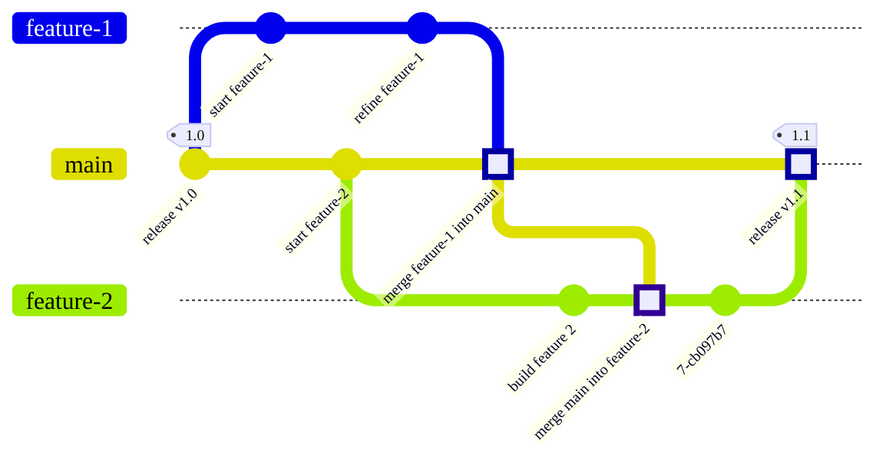
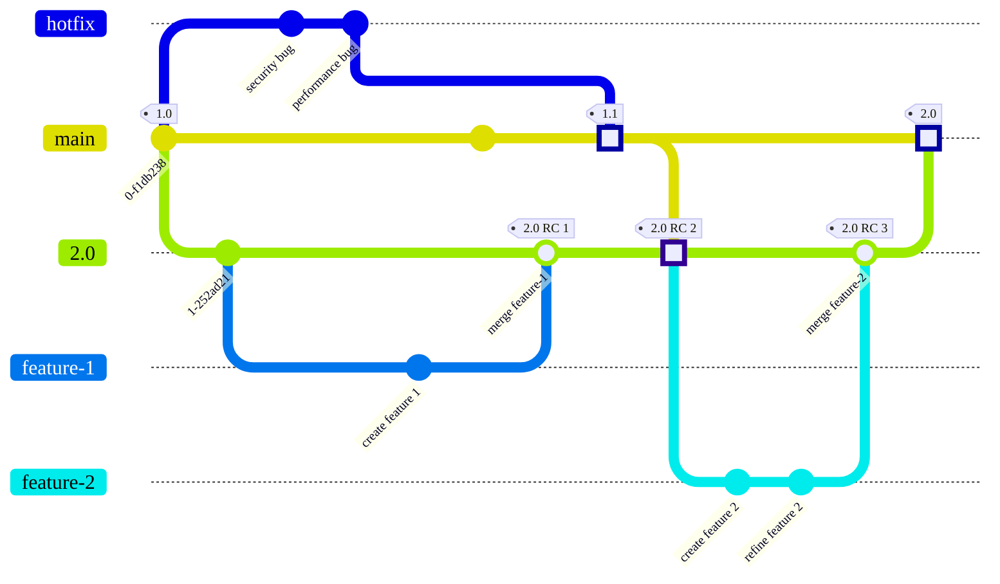
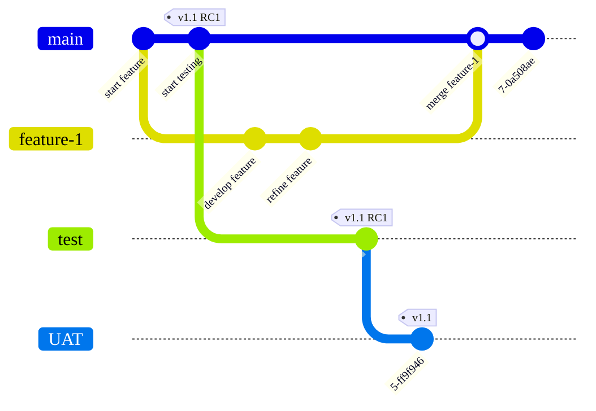

Gitブランチを整理し、マージする方法は、ブランチ戦略と呼ばれます。多くのチームにとって、最もシンプルなアプローチが賢明かつ効果的です:

1. フィーチャーブランチで変更を加えます。
1. フィーチャーブランチを`main`に直接マージします。

ただし、チームに複雑なニーズ（テストやコンプライアンス要件など）がある場合は、別のブランチ戦略を検討することをお勧めします。

以下のセクションでは、利用可能なより一般的な戦略について説明します。誰もがGit（またはバージョン管理）の専門家を常駐させているわけではありません。チームがGitのスキルセットの限界で作業している場合、この情報が役立ちます。

GitLabを使用して複数の異種ツールを置き換える場合、Gitのブランチ戦略について下す決定は重要です。慎重な計画により、以下の間にはっきりとしたつながりを確立できます:

- 最初に受け取るバグレポート。
- チームがそれらのバグを修正するために行うコミット。
- それらの修正を他のバージョンまたは顧客にバックポートするプロセス。
- あなたの修正をユーザーが利用できるようにするデプロイ。

慎重な選択により、GitLabにおける単一のデータストアを最大限に活用できます。

## より複雑なGitブランチ戦略が必要ですか？ {#do-i-need-a-more-complex-git-branching-strategy}

現在のGitブランチ戦略では対応しきれなくなった場合は、以下の可能性があります:

- 継続的デリバリーを使用している。
- 大規模な自動テストを行っている。
- 他の顧客に影響を与えることなく、ある顧客の重大なバグを修正する必要がある。
- 製品の複数の過去のバージョンを保守している。
- 複数のオペレーティングシステムやプラットフォームをサポートしているため、製品に単一の本番環境のブランチがない。
- 製品の各バージョンに異なるデプロイまたは認証要件がある。

製品が必要とするよりも複雑な戦略を実装しないでください。

### プロジェクトを複数のリポジトリに分割するタイミング {#when-to-split-a-project-into-multiple-repositories}

複雑なブランチ構造を持つ単一のGitリポジトリを維持すべきか、または複数のリポジトリにプロジェクトを分割すべきか？唯一の正解はありません。それは、サポートする人員と専門知識があるかどうかに依存します。

GitLabは、あなたのリポジトリが単一の製品用であると想定する自動化を提供しますが、その製品には複数のバージョンが含まれる場合があります。複数のリポジトリを持つべきか、または単一の複雑なリポジトリを持つべきかを判断するには、以下の質問をしてください:

- それは同じ製品ですか？
- すべての要素が同じビルドプロセスを使用していますか？
- 基盤となるcodeコードは似ていますか、それとも同じですか？

何を選択しても（複雑な単一のリポジトリ、または小規模なリポジトリのセット）、メンテナンスにエンジニアリングの時間を費やすことになります。どのような種類のエンジニアリング作業を行う準備ができているかを特定します:

- 単一のリポジトリで複数の製品のコードを維持する場合、GitLabのすべての機能を使用できるように、後でカスタマイズ作業を計画してください。
- 複数のリポジトリにわたる作業のマージは、同じリポジトリ内のブランチを横断するマージよりも複雑です。カスタムリリースプロセスをビルドするためのエンジニアリング時間と、リポジトリを横断するコードとの流れを管理するための時間を計画してください。

> [!note]
> 組織が大規模なモノレポまたはメガレポを使用している場合、GitLabの[Professional Services](https://about.gitlab.com/services/)チームが、ニーズを満たすカスタムブランチソリューションの構築を支援できます。

## 主なブランチ戦略の種類 {#major-types-of-branching-strategies}

ブランチ戦略とコードと管理戦略は、製品のニーズによって異なります。既存の戦略のすべてを網羅することはできませんが、いくつかの主要なカテゴリは次のとおりです:

- [ウェブサービス](#web-services)
- [長期実行リリースブランチ](#long-lived-release-branches)
- [環境ごとのブランチ](#branch-per-environment)

### ウェブサービス {#web-services}

この戦略は標準的なGitの慣行に従います。`main`ブランチはあなたの本番環境のブランチであり、単一のウェブサービスに最適です。これには単一の標準的な本番環境のバージョンがあり、以前の改訂版はサポートされません。

この設定には、[`git-flow`](https://nvie.com/posts/a-successful-git-branching-model/)が適切でしょう。それは標準化されていますし、何も維持する必要はありません。

この例では、`feature-1`は`main`から直接ブランチします。完了すると、`feature-1`は`main`に直接マージされます。このマージコミットは四角で強調表示されています。`feature-2`のような長期実行ブランチは、開発の一部として`main`からの最新の更新を定期的にマージする場合があります。完了すると、`feature-2`は`main`にマージされ、`1.1`リリースがカットされます:

### 長期実行リリースブランチ {#long-lived-release-branches}

このブランチ戦略は、製品に長期間`main`から分離されたままにする必要があるブランチがある場合に適切です。いくつかの例を以下に示します:

- 同じソフトウェアパッケージの複数の本番環境のバージョン。例：現在のバージョンとレガシーバージョン。現在のバージョンはフィーチャーアップデートとホットフィックスを受け取りますが、以前のバージョンはホットフィックスとセキュリティリリースのみを受け取ります。
- 現在の本番環境のバージョンと、長期実行ベータバージョン。主要なソフトウェア依存（ソフトウェア開発キット、またはSDKなど）が破壊的な変更を導入している場合、このアプローチが必要になることがあります。現在の本番環境のバージョンは、フィーチャーアップデートとホットフィックスを受け取ります。ベータバージョンは、それらのフィーチャーアップデートとホットフィックスを受け取ると同時に、チームは今後のSDK変更のサポートもビルドする必要があります。

長期実行ブランチをロックするつもりなら、ホットフィックスプロセスを定義し、それを強制することが重要です。未定義で強制されていない場合、すべての変更がホットフィックスになります。

この例では、`2.0`ブランチは、`1.0`リリースの`main`上のコミットから作成されます。フィーチャーは`2.0`ブランチからブランチし、`2.0`にマージされます。同時に、すべてのホットフィックスブランチは`main`の最新リリース（`1.0`）に基づき、`1.1`リリースとして`main`にマージされます。`2.0`ブランチは`1.1`リリースからの変更をプルし、それらを`2.0`の開発の一部として組み込みます。別のフィーチャー（`feature-2`）が追加された後、`2.0`ブランチは本番環境の準備ができています。それは`main`にマージされ、`2.0`リリースがカットされます:

#### SVNブランチ戦略から移行する {#migrate-from-svn-branching-strategies}

SVNからGitへ移行するレガシープロジェクトは、そのブランチアプローチを再検討する必要があります。Gitにおける一部のSVN中心のブランチアプローチは、GitLabを最大限に活用することを妨げる可能性があります。再検討すべきいくつかのワークフロー:

- あなたは`main`から長期実行ブランチ（`1.0`など）を作成し、`1.0`ブランチをロックして、事前承認されたホットフィックスではない変更をブロックします。
  - GitはSVNよりもマージコンフリクトをうまく処理します。
  - 長期実行ブランチの使用に契約上の義務がない限り、その作成は避けてください。Gitはコンフリクトをうまく処理しますが、長期実行ブランチでは、複数のブランチへの修正をマージするのに時間を費やす必要があります。
- 製品が機能フラグをサポートしていないため、ブランチを使用しています。

### 環境ごとのブランチ {#branch-per-environment}

このブランチ戦略は、異なるチームによってビルドされた複数の相互依存サービスを持つ組織に共通です。これは、ウォーターフォールまたはVモデル開発プロセスでよく使用されます。

この例では、`v1.1 RC1`とマークされたコミットは、`1.1`バージョンのリリース候補として識別されます。フィーチャーは引き続き`main`からブランチし、そこに戻ってマージされます。リリース候補コミットは`test`および`UAT`環境でテストされます。リリースのために検討される各コミットに対して、このプロセスが繰り返されます:

## 関連トピック {#related-topics}

- [保護ブランチ](../protected.md)
- [マージリクエスト承認](../../../merge_requests/approvals/_index.md)
- [マージされた結果のテスト](../../../../../ci/pipelines/merged_results_pipelines.md)
