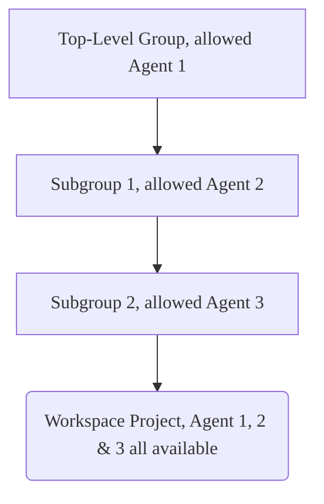



- プラン: Premium、Ultimate
- 提供形態: GitLab.com、GitLab Self-Managed、GitLab Dedicated





- 機能フラグ`remote_development_feature_flag`は、GitLab 16.0の[GitLab.comとGitLab Self-Managedで有効になりました](https://gitlab.com/gitlab-org/gitlab/-/issues/391543)。
- GitLab 16.7で[一般提供](https://gitlab.com/gitlab-org/gitlab/-/merge_requests/136744)になりました。機能フラグ`remote_development_feature_flag`は削除されました。



[ワークスペースインフラストラクチャをセットアップする](configuration.md#set-up-workspace-infrastructure)際に、ワークスペースをサポートするためにKubernetes向けGitLabエージェントを設定する必要があります。このガイドでは、KubernetesクラスターにGitLabエージェントがすでにインストールされていることを前提としています。

前提条件: 

- [Kubernetes向けGitLabエージェントのセットアップチュートリアル](set_up_gitlab_agent_and_proxies.md)の手順を完了する必要があります。
- エージェントの設定で`remote_development`モジュールが有効になっており、このモジュールの必須フィールドが正しく設定されている必要があります。

  > [!note]有効なワークスペースを持つエージェント上で`remote_development`モジュールを無効にすると、それらのワークスペースは使用できなくなります。詳細については、[ワークスペースの設定](settings.md#enabled)を参照してください。
- エージェントは、ワークスペースを作成するためにグループで許可されている必要があります。ワークスペース作成時、ユーザーは、ワークスペースプロジェクトの任意の親グループに関連付けられている許可されたエージェントを選択できます。
- ワークスペースの作成者は、エージェントのプロジェクトに対してデベロッパーロールを持っている必要があります。

## エージェントのワークスペース作成のためのグループ認可 {#agent-authorization-in-a-group-for-creating-workspaces}



- GitLab 17.2で新しい認可戦略が[導入](https://gitlab.com/groups/gitlab-org/-/epics/14025)されました。



新しい認可戦略は、[従来の認可戦略](#legacy-agent-authorization-strategy)に置き換わります。グループのオーナーおよび管理者は、どのクラスターエージェントが自身のグループでワークスペースをホストするかを制御できます。

たとえば、ワークスペースプロジェクトへのパスが`top-level-group/subgroup-1/subgroup-2/workspace-project`の場合、`top-level-group`、`subgroup-1`、または`subgroup-2`グループのいずれかに設定された任意のエージェントを使用できます。

特定のグループ、たとえば`subgroup-1`に対してクラスターエージェントを許可した場合、そのグループ下のすべてのプロジェクトでワークスペースを作成できるようになります。許可されたグループのスコープを慎重に検討してください。それは、クラスターエージェントがワークスペースをホストできる場所を決定するからです。

## グループ内のワークスペースにクラスターエージェントを許可する {#allow-a-cluster-agent-for-workspaces-in-a-group}

前提条件: 

- [ワークスペースのインフラストラクチャをセットアップ](configuration.md#set-up-workspace-infrastructure)する必要があります。
- インスタンスへの管理者アクセス権、またはグループに対するオーナーロールを持っている必要があります。

グループ内のワークスペースにクラスターエージェントを許可するには:

1. 上部のバーで、**検索または移動先**を選択して、グループを見つけます。
1. 左サイドバーで、**設定** > **ワークスペース**を選択します。
1. **グループエージェント**セクションで、**すべてのエージェント**タブを選択します。
1. 利用可能なエージェントのリストから、ステータスが**ブロック済み**のエージェントを見つけて、**許可**を選択します。
1. 確認ダイアログで、**エージェントを許可する**を選択します。

GitLabは、選択したエージェントのステータスを**許可**に更新し、**許可済みのエージェント**タブにエージェントを表示します。

## グループ内のワークスペースに対する許可されたクラスターエージェントを削除する {#remove-an-allowed-cluster-agent-for-workspaces-in-a-group}

前提条件: 

- [ワークスペースのインフラストラクチャをセットアップ](configuration.md#set-up-workspace-infrastructure)する必要があります。
- インスタンスへの管理者アクセス権、またはグループに対するオーナーロールを持っている必要があります。

グループから許可されたクラスターエージェントを削除するには:

1. 上部のバーで、**検索または移動先**を選択して、グループを見つけます。
1. 左サイドバーで、**設定** > **ワークスペース**を選択します。
1. **グループエージェント**セクションで、**許可済みのエージェント**タブを選択します。
1. 許可されたエージェントのリストから、削除したいエージェントを見つけて、**ブロック**を選択します。
1. 確認ダイアログで、**エージェントをブロックする**を選択します。

GitLabは、選択したエージェントのステータスを**ブロック済み**に更新し、**許可済みのエージェント**タブからエージェントを削除します。

> [!note]グループから許可されたクラスターエージェントを削除しても、そのエージェントを使用している実行中のワークスペースはすぐに停止しません。実行中のワークスペースは、自動的に終了されるか手動で停止されたときに停止します。

## インスタンス上のワークスペースにクラスターエージェントを許可する {#allow-a-cluster-agent-for-workspaces-on-the-instance}



- GitLab 18.2で[導入](https://gitlab.com/gitlab-org/gitlab/-/issues/548951)されました。



前提条件: 

- [ワークスペースのインフラストラクチャをセットアップ](configuration.md#set-up-workspace-infrastructure)する必要があります。
- [リモート開発が有効にされている](settings.md#enabled)エージェントを持っている必要があります。
- インスタンスへの管理者アクセス権が必要です。

インスタンス上のワークスペースにクラスターエージェントを許可するには:

1. 右上隅で、**管理者**を選択します。
1. 左側のサイドバーで、**設定** > **一般**を選択します。
1. **ワークスペースの利用可能なエージェント**を展開します。
1. ワークスペースが有効になっているエージェントのリストから、許可したいエージェントを見つけて、可用性切替を選択します。

## インスタンス上のワークスペースに対する許可されたクラスターエージェントを削除する {#remove-an-allowed-cluster-agent-for-workspaces-on-the-instance}



- GitLab 18.2で[導入](https://gitlab.com/gitlab-org/gitlab/-/issues/548951)されました。



前提条件: 

- インスタンスへの管理者アクセス権が必要です。

インスタンスから許可されたクラスターエージェントを削除するには:

1. 右上隅で、**管理者**を選択します。
1. 左側のサイドバーで、**設定** > **一般**を選択します。
1. **ワークスペースの利用可能なエージェント**を展開します。
1. 許可されたエージェントのリストから、削除したいエージェントを見つけて、可用性切替をクリアします。

> [!note]インスタンスから許可されたクラスターエージェントを削除しても、そのエージェントを使用している実行中のワークスペースはすぐに停止しません。実行中のワークスペースは、自動的に終了されるか手動で停止されたときに停止します。

## 従来のエージェント認可戦略 {#legacy-agent-authorization-strategy}

GitLab 17.1以前では、グループ内でのエージェントの利用可能性は、ワークスペースを作成するための前提条件ではありませんでした。以下の両方が当てはまる場合、ワークスペースプロジェクトのトップレベルグループにある任意のエージェントを使用して、ワークスペースを作成できます:

- リモート開発モジュールが有効になっています。
- トップレベルグループに対してデベロッパー、メンテナー、またはオーナーのロールを持っていること。

たとえば、ワークスペースプロジェクトへのパスが`top-level-group/subgroup-1/subgroup-2/workspace-project`の場合、`top-level-group`内およびその任意のサブグループで設定された任意のエージェントを使用できます。

## リモート開発でユーザーアクセスを設定する {#configuring-user-access-with-remote-development}

`user_access`モジュールを設定して、接続されたKubernetesクラスターにGitLabの認証情報でアクセスできます。このモジュールは、`remote_development`モジュールとは独立して設定および実行されます。

同じエージェントで`user_access`と`remote_development`の両方を設定する際には注意してください。`remote_development`クラスターは、ユーザーの認証情報（パーソナルアクセストークンなど）をKubernetes Secretsとして管理します。`user_access`でのいかなる設定ミスも、このプライベートデータがKubernetes APIを介してアクセス可能になる原因となる可能性があります。

`user_access`の設定に関する詳細については、[Kubernetesアクセスを設定する](../clusters/agent/user_access.md#configure-kubernetes-access)を参照してください。

## 関連トピック {#related-topics}

- [チュートリアル: Kubernetes向けGitLabエージェントをセットアップする](set_up_gitlab_agent_and_proxies.md)
- [ワークスペースの設定](settings.md)
- [ワークスペース設定](configuration.md)
- [ワークスペースのトラブルシューティング](workspaces_troubleshooting.md)
