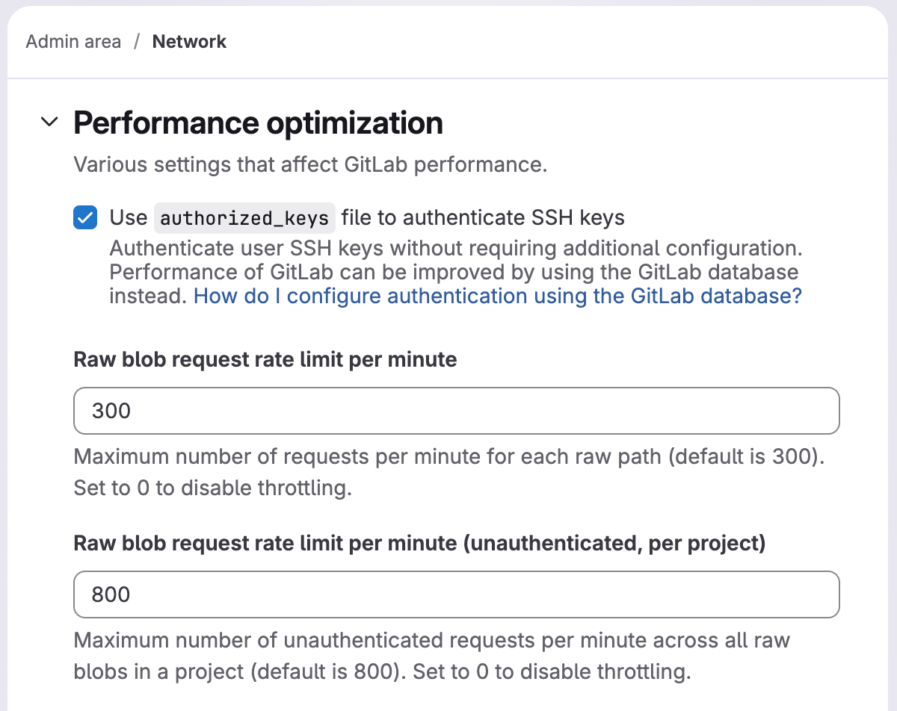



- Tier: Free, Premium, Ultimate
- Offering: GitLab Self-Managed





- Raw blob request rate limit per minute (unauthenticated) [introduced](https://gitlab.com/gitlab-org/gitlab/-/merge_requests/226344) in GitLab 18.10.



Prerequisites:

- Administrator access.

Two rate limit settings control access to raw endpoints:

- **Raw blob request rate limit per minute**: Limits requests for each project and file path. Defaults to `300` requests per minute.
- **Raw blob request rate limit per minute (unauthenticated)**: Limits unauthenticated requests for each project, across all file paths. Defaults to `800` requests per minute.

To configure these settings:

1. In the upper-right corner, select **Admin**.
1. In the left sidebar, select **Settings** > **Network**.
1. Expand **Performance optimization**.

For example, if the path-based limit is `300`, requests over `300` a minute to
`https://gitlab.com/gitlab-org/gitlab-foss/raw/master/app/controllers/application_controller.rb`
are blocked. Access to the raw file is released after 1 minute.

The path-based limit is:

- Applied independently for each project and file path.
- Not applied by IP address or user.
- Active by default. To disable, set the option to `0`.

The unauthenticated project-wide limit is:

- Applied for each project, across all file paths, for unauthenticated requests only.
- Not applied to authenticated users.
- Not applied per IP address.
- Active by default. To disable, set the option to `0`.

Requests over the rate limit are logged into `auth.log`.
