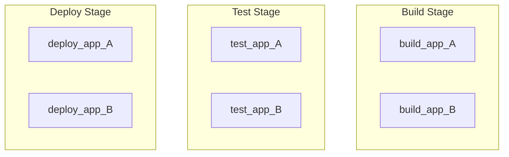
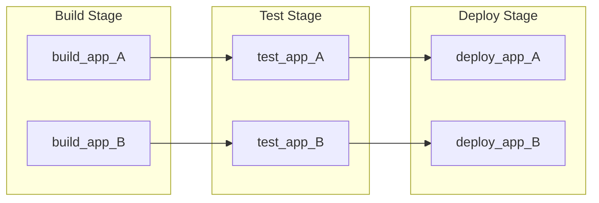
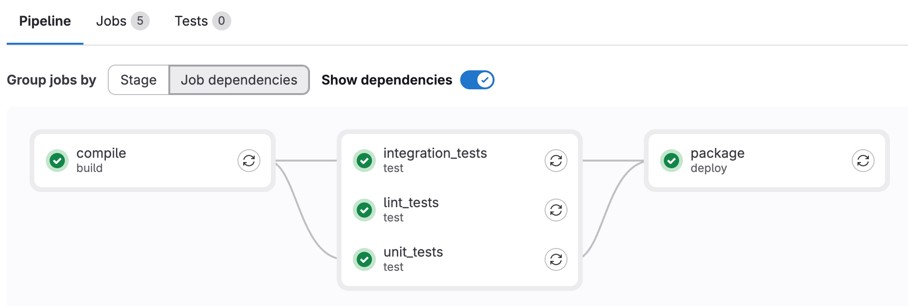
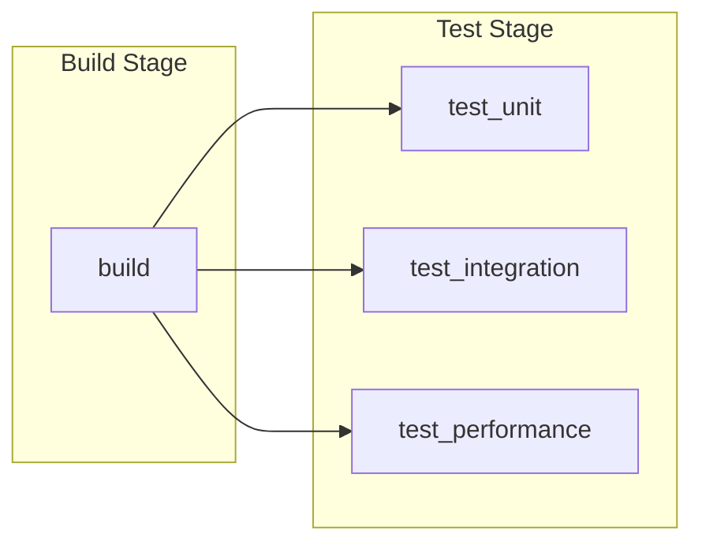
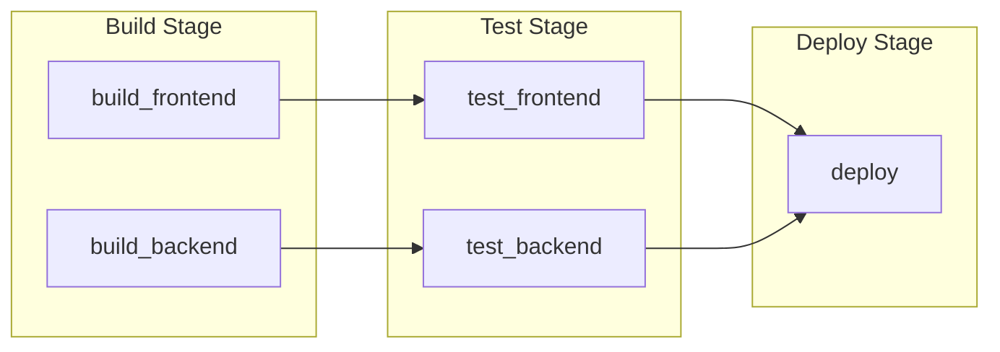
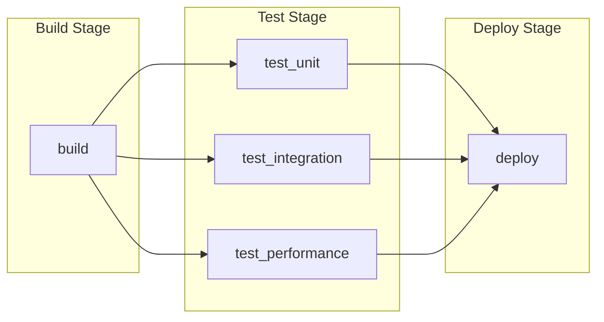
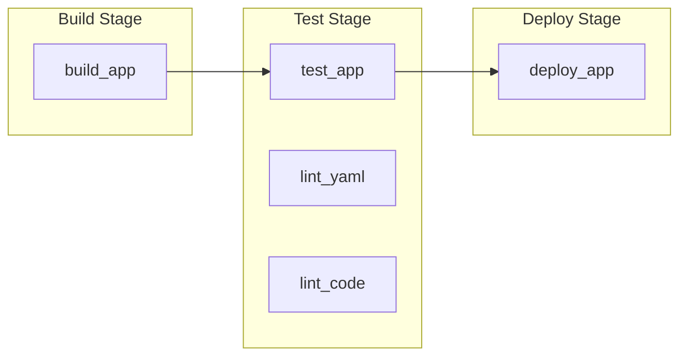
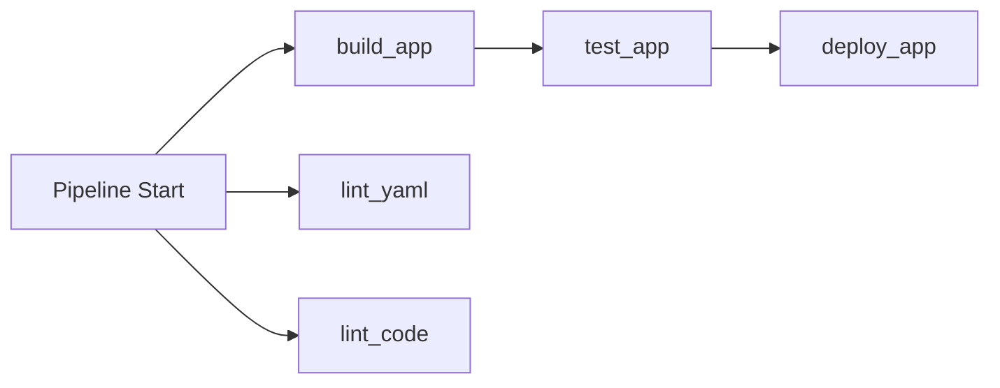



- Tier: Free, Premium, Ultimate
- Offering: GitLab.com, GitLab Self-Managed, GitLab Dedicated



Use the [`needs`](_index.md#needs) keyword to specify job dependencies in your pipeline.
Jobs start as soon as their dependencies finish without waiting for pipeline stages to complete.
This lets you run jobs earlier and avoid unnecessary waiting.

Use cases:

- Monorepos: Build and test independent services in parallel execution paths.
- Multi-platform builds: Compile for different platforms without waiting for all builds to finish.
- Faster feedback: Get test results and errors earlier.

> [!note]
> The `needs: project` and `needs: pipeline` keywords are not used to specify job dependencies.
> Use [`needs: project`](_index.md#needsproject) to fetch artifacts from other pipelines.
> Use [`needs: pipeline`](_index.md#needspipeline) to mirror the pipeline status from an upstream pipeline.

## How `needs` works

By default, jobs run in stages. All jobs in a stage must finish successfully before
any job in a later stage can start. For example, with the default `build`, `test`, and `deploy` stages,
all jobs in `build` must run and finish before any job in `test` can start.

With `needs`, you list specific jobs a job depends on. The job starts immediately after
those dependencies finish, even if other jobs in earlier stages are still running.
This creates a pipeline with a kind of [directed acyclic graph (DAG)](https://en.wikipedia.org/wiki/Directed_acyclic_graph) structure.

You can mix staged jobs and jobs with `needs` dependencies in the same pipeline.

Additionally, you can use `needs: []` to set a job to run immediately without waiting for
earlier jobs or stages to finish. It's common to run lint jobs or scanners immediately
when they can run on the source code and do not depend on build results.

## `needs` compared to staged jobs

To demonstrate the benefits of `needs`, we can compare two pipelines with six jobs.

This pipeline has the six jobs organized in stages. Without `needs`, all jobs in a stage must finish
before the next stage starts, even if some jobs are independent:



```yaml
stages:
  - build
  - test
  - deploy

build_app_A:
  stage: build
  script: echo "Building A..."

build_app_B:
  stage: build
  script: echo "Building B..."

test_app_A:
  stage: test
  script: echo "Testing A..."

test_app_B:
  stage: test
  script: echo "Testing B..."

deploy_app_A:
  stage: deploy
  script: echo "Deploying A..."

deploy_app_B:
  stage: deploy
  script: echo "Deploying B..."
```

In this example, no test or deploy jobs run until all jobs in the `build` stage complete.
If the B jobs take a long time to run, the A test and deploy jobs could be delayed while
waiting for B jobs to complete.

With `needs`, you can define two independent execution paths. Each job depends only on the jobs it actually needs,
allowing parallel execution across the two paths:



```yaml
stages:
  - build
  - test
  - deploy

build_app_A:
  stage: build
  script: echo "Building A..."

build_app_B:
  stage: build
  script: echo "Building B..."

test_app_A:
  stage: test
  needs: ["build_app_A"]
  script: echo "Testing A..."

test_app_B:
  stage: test
  needs: ["build_app_B"]
  script: echo "Testing B..."

deploy_app_A:
  stage: deploy
  needs: ["test_app_A"]
  script: echo "Deploying A..."

deploy_app_B:
  stage: deploy
  needs: ["test_app_B"]
  script: echo "Deploying B..."
```

In this example, `test_app_A` runs as soon as `build_app_A` completes successfully,
even if `build_app_B` is still running. Similarly, `deploy_app_A` could run and deploy
before `build_app_B` completes.

### View dependencies between jobs

You can view the dependencies between jobs on the pipeline graph.

To enable this view, from the pipeline details page:

- Select **Job dependencies**.
- Optional. Toggle **Show dependencies** to display lines that show which jobs are linked together.



## `needs` examples

Use `needs` to create dependencies between jobs and reduce the amount of time jobs are waiting to start.
Patterns can include fan-out, fan-in, and diamond dependencies.

### Fan-out

To create a fan-out job dependency graph, configure multiple jobs to depend on one job.

For example:



```yaml
stages:
  - build
  - test

build:
  stage: build
  script: echo "Building..."

test_unit:
  stage: test
  needs: ["build"]
  script: echo "Unit tests..."

test_integration:
  stage: test
  needs: ["build"]
  script: echo "Integration tests..."

test_performance:
  stage: test
  needs: ["build"]
  script: echo "Performance tests..."
```

### Fan-in

To create a fan-in dependency graph, configure one job to wait for several jobs to finish.

For example:



```yaml
stages:
  - build
  - test
  - deploy

build_frontend:
  stage: build
  script: echo "Building frontend..."

build_backend:
  stage: build
  script: echo "Building backend..."

test_frontend:
  stage: test
  needs: ["build_frontend"]
  script: echo "Testing frontend..."

test_backend:
  stage: test
  needs: ["build_backend"]
  script: echo "Testing backend..."

deploy:
  stage: deploy
  needs: ["test_frontend", "test_backend"]
  script: echo "Deploying..."
```

### Diamond dependency

To create a diamond dependency graph, combine fan-out and fan-in. One job fans out to multiple jobs,
which then fan back in to a single job. For example:



```yaml
stages:
  - build
  - test
  - deploy

build:
  stage: build
  script: echo "Building..."

test_unit:
  stage: test
  needs: ["build"]
  script: echo "Unit tests..."

test_integration:
  stage: test
  needs: ["build"]
  script: echo "Integration tests..."

test_performance:
  stage: test
  needs: ["build"]
  script: echo "Performance tests..."

deploy:
  stage: deploy
  needs: ["test_unit", "test_integration", "test_performance"]
  script: echo "Deploying..."
```

### Immediate start

Use `needs: []` to set a job to start immediately when the pipeline is created, without
waiting for other jobs or stages. Use this for linting or scanning tools that can run immediately
but should appear in a later stage, like `test`.

For example:

```yaml
stages:
  - build
  - test
  - deploy

build_app:
  stage: build
  script: echo "Building app..."

test_app:
  stage: test
  script: echo "Testing app..."

lint_yaml:
  stage: test
  needs: []
  script: echo "Linting YAML..."

lint_code:
  stage: test
  needs: []
  script: echo "Linting code..."

deploy_app:
  stage: deploy
  script: echo "Deploying app..."
```

In this example, `lint_yaml` and `lint_code` start immediately with `needs: []`, without waiting for `build_app`
or the `test` stage to finish. `deploy_app` does not use `needs`, so it waits for all jobs
in earlier stages to finish before starting.

The pipeline view shows the jobs grouped in stages:



The jobs start running as early as possible:



## Stageless pipelines

You can omit the `stage` and `stages` keywords and use only `needs` to define job order.
All jobs without a `stage` keyword run in the default `test` stage:

```yaml
compile:
  script: echo "Compiling..."

unit_tests:
  needs: ["compile"]
  script: echo "Running unit tests..."

integration_tests:
  needs: ["compile"]
  script: echo "Running integration tests..."

package:
  needs: ["unit_tests", "integration_tests"]
  script: echo "Packaging..."
```

To view the structure of this pipeline, [select **Job dependencies**](#view-dependencies-between-jobs)
from the pipeline details page. If you use the default view, all jobs are grouped together in the `test` stage.

## Optional dependencies

Use `optional: true` in `needs` to depend on a job only if it exists in the pipeline.
Use this option to handle jobs that may or may not run when combining `needs` with [`rules`](_index.md#rules).

For example:

```yaml
stages:
  - build
  - test
  - deploy

build:
  stage: build
  script: echo "Building..."

test:
  stage: test
  needs: ["build"]
  script: echo "Testing..."

test_optional:
  stage: test
  rules:
    - if: $RUN_OPTIONAL_TESTS == "true"
  script: echo "Optional tests..."

deploy:
  stage: deploy
  needs:
    - job: "test"
    - job: "test_optional"
      optional: true
  script: echo "Deploying..."
```

In this example:

- `deploy` depends on:
  - `test`, which always exists in the pipeline.
  - `test_optional`, which only exists in the pipeline when `RUN_OPTIONAL_TESTS` is `true`.
- When `RUN_OPTIONAL_TESTS` is:
  - `false`, then `test_optional` doesn't exist in the pipeline and `deploy` runs after `test` finishes.
  - `true`, then `test_optional` exists in the pipeline and `deploy` waits for both `test`
    and `test_optional` to finish.

Without `optional: true`, pipeline creation fails because the `deploy` job
expects `test_optional`, but it doesn't exist in the pipeline.

## Combine `needs` with `parallel:matrix`

The `needs` keyword works with `parallel:matrix` to
[define dependencies that point to parallelized jobs](../jobs/job_control.md#specify-needs-between-parallelized-jobs).

## Troubleshooting

### Error: `'job' does not exist in the pipeline`

When you combine `needs` with `rules`, your pipeline might fail to create and display this error:

```plaintext
'unit_tests' job needs 'compile' job, but 'compile' does not exist in the pipeline.
This might be because of the only, except, or rules keywords. To need a job that
sometimes does not exist in the pipeline, use needs:optional.
```

This error is caused by one job with `needs` set to another job that does not exist in the pipeline.
To fix this issue, you must either:

- Add [`optional: true`](#optional-dependencies) to the job dependency so that the
  needed job is ignored when it doesn't exist in the pipeline.
- Update the `rules` configuration of the needed job to ensure it always runs when needed.

For example:

```yaml
#
# Method 1: Job with rules that may not exist
#
compile:
  stage: build
  rules:
    - if: $COMPILE == "true"
  script: echo "Compiling..."

unit_tests:
  stage: test
  needs:
    - job: "compile"        # If $COMPILE == "false", the `compile` job is not added
      optional: true        # to the pipeline and this needs is ignored.
  script: echo "Running unit tests..."

#
# Method 2: Job with rules that always matches the dependent job
#
build:
  stage: build
  rules:
    - if: $BUILD == "true"
  script: echo "Building..."

test:
  stage: test
  rules:                    # Both jobs have identical `rules`, and will always exist
    - if: $BUILD == "true"  # in the pipeline together.
  needs: ["build"]
  script: echo "Testing..."
```
