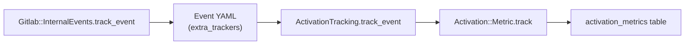

The activation engine tracks user activation milestones (Setup, Aha, Habit)
for personalization experiments on GitLab.com. It integrates with the
[internal events](../internal_analytics/internal_event_instrumentation/_index.md)
system through the `extra_trackers` mechanism, following the same pattern
used by AI tracking (`ee/lib/gitlab/tracking/ai_tracking.rb`) and
contribution analytics tracking (`lib/gitlab/tracking/contribution_analytics_tracking.rb`).

The activation engine is EE-only and gated behind the `activation_tracking`
feature flag (`:wip` type).

## Architecture

When application code calls `Gitlab::InternalEvents.track_event`, the
internal events router reads the event YAML definition. If the definition
includes an `extra_trackers` entry for `Gitlab::Tracking::ActivationTracking`,
the router calls `ActivationTracking.track_event`. That adapter delegates
to `Activation::Metric.track`, which writes a record to the
`activation_metrics` table.



The `activation_metrics` table stores one record per user, per metric,
per namespace. A database-level unique constraint (with `NULLS NOT DISTINCT`)
prevents duplicate records.

| Component | Path | Purpose |
| --- | --- | --- |
| Tracking adapter | `ee/lib/gitlab/tracking/activation_tracking.rb` | Receive events from the Internal Events router and delegate to the model. |
| Event definition | `ee/config/events/merged_mr.yml` | Declare `extra_trackers` to wire an internal event to activation tracking. |
| Model | `ee/app/models/activation/metric.rb` | Record, query, and check activation metrics. |
| Finder | `ee/app/finders/activation/metrics_finder.rb` | Filter metrics by user, namespace, and metric type. |
| Feature flag | `ee/config/feature_flags/wip/activation_tracking.yml` | Controls whether tracking is active. |
| Factory | `ee/spec/factories/activation/metrics.rb` | Test factory for `activation_metric`. |

## Available metric types

Metric types are defined in the `Activation::Metric` enum. Each enum value
corresponds to an internal event name routed through `ActivationTracking`.
For example, the `merged_mr` event defined in
`ee/config/events/merged_mr.yml` maps to the `merged_mr` enum value.

```ruby
enum :metric, {
  merged_mr: 0
}
```

To add a new metric type, see the
[quick start guide](quick_start.md#add-a-new-metric-type).

## Guides

- [Quick start for activation engine tracking](quick_start.md)
