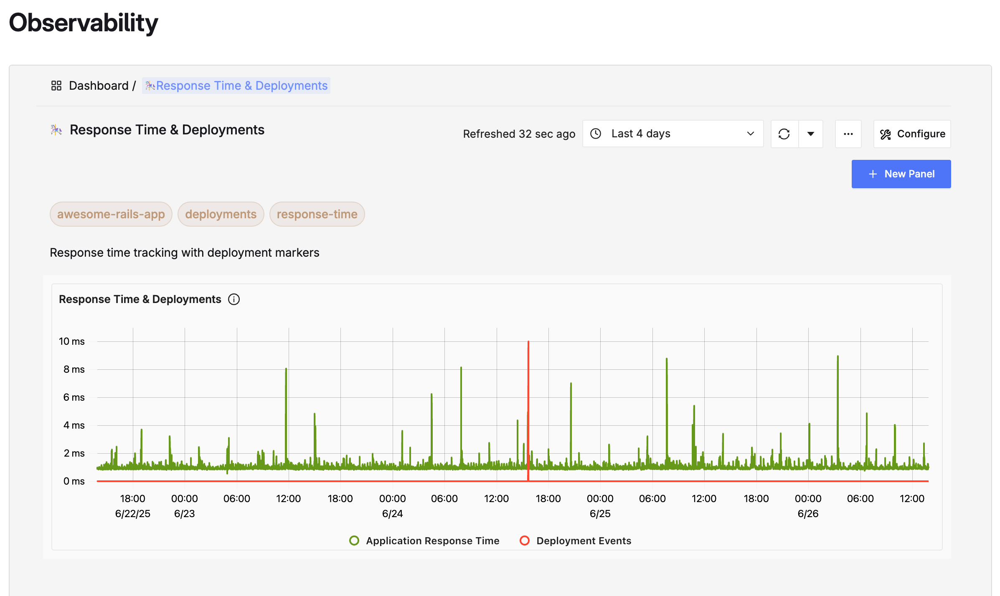



- Tier: Free, Premium, Ultimate
- Offering: GitLab.com, GitLab Self-Managed
- Status: Experiment



After you configure Observability, you can start sending data to GitLab.

To get started, view [CI/CD pipeline data](ci_cd.md), [send test data](#send-test-data),
or [use templates](#gitlab-observability-templates).

## View Observability data

After GitLab Observability is configured:

1. In the top bar, select **Search or go to** and find your group.
1. In the left sidebar, select **Observability** > **Services**.
1. Select the service you want to view details for.



## Instrument your application

To add OpenTelemetry instrumentation to your applications:

1. Add the OpenTelemetry SDK for your language.
1. Configure the OTLP exporter to point to your GitLab Observability instance.
1. Add spans and attributes to track operations and metadata.

Refer to the [OpenTelemetry documentation](https://opentelemetry.io/docs/instrumentation/) for language-specific guidelines.

## Send test data

You can test your GitLab Observability installation by sending sample telemetry data using the OpenTelemetry SDK. This example uses Ruby, but OpenTelemetry has [SDKs for many languages](https://opentelemetry.io/docs/instrumentation/).

### Prerequisites

- Ruby installed on your local machine.
- Required gems:

  ```shell
  gem install opentelemetry-sdk opentelemetry-exporter-otlp
  ```

### Create a basic test script

Create a file named `test_o11y.rb` with the following content:

```ruby
require 'opentelemetry/sdk'
require 'opentelemetry/exporter/otlp'

OpenTelemetry::SDK.configure do |c|
  # Define service information
  resource = OpenTelemetry::SDK::Resources::Resource.create({
    'service.name' => 'test-service',
    'service.version' => '1.0.0',
    'deployment.environment' => 'production'
  })
  c.resource = resource

  # Configure OTLP exporter to send to GitLab Observability
  c.add_span_processor(
    OpenTelemetry::SDK::Trace::Export::BatchSpanProcessor.new(
      OpenTelemetry::Exporter::OTLP::Exporter.new(
        endpoint: 'http://[your-o11y-instance-ip]:4318/v1/traces'
      )
    )
  )
end

# Get tracer and create spans
tracer = OpenTelemetry.tracer_provider.tracer('basic-demo')

# Create parent span
tracer.in_span('parent-operation') do |parent|
  parent.set_attribute('custom.attribute', 'test-value')
  puts "Created parent span: #{parent.context.hex_span_id}"

  # Create child span
  tracer.in_span('child-operation') do |child|
    child.set_attribute('custom.child', 'child-value')
    puts "Created child span: #{child.context.hex_span_id}"
    sleep(1)
  end
end

puts "Waiting for export..."
sleep(5)
puts "Done!"
```

Replace `[your-o11y-instance-ip]` with your GitLab Observability instance's IP address or hostname.

### Run the test

1. Run the script:

   ```shell
   ruby test_o11y.rb
   ```

1. Go to **Observability** > **Services**. Select the `test-service` service to see traces and spans.

## GitLab Observability templates

GitLab provides pre-built dashboard templates to help you get started with observability quickly. These templates are available at [GitLab Observability Templates](https://gitlab.com/gitlab-org/embody-team/experimental-observability/o11y-templates/).

### Available templates

**Standard OpenTelemetry dashboards**: If you instrument your application with standard OpenTelemetry libraries, you can use these plug-and-play dashboard templates:

- Application performance monitoring dashboards
- Service dependency visualizations
- Error rate and latency tracking

**GitLab-specific dashboards**: When you send GitLab OpenTelemetry data to your GitLab Observability instance, use these dashboards for out-of-the-box insights:

- GitLab application performance metrics
- GitLab service health monitoring
- GitLab-specific trace analysis

**CI/CD observability**: The repository includes an example GitLab CI/CD pipeline with OpenTelemetry instrumentation that works with the GitLab Observability CI/CD dashboard template JSON file. This helps you monitor your CI/CD pipeline performance and identify bottlenecks.

### Using the templates

1. Clone or download the templates from the repository.
1. Update the service name in the example application dashboards to match your service name.
1. Import the JSON files into your GitLab Observability instance.
1. Configure your applications to send telemetry data using standard OpenTelemetry libraries as described in the [Instrument your application](#instrument-your-application) section.
1. The dashboards are now available with your application's telemetry data in GitLab Observability.

## Related topics

- [Troubleshooting Observability](troubleshooting.md)
